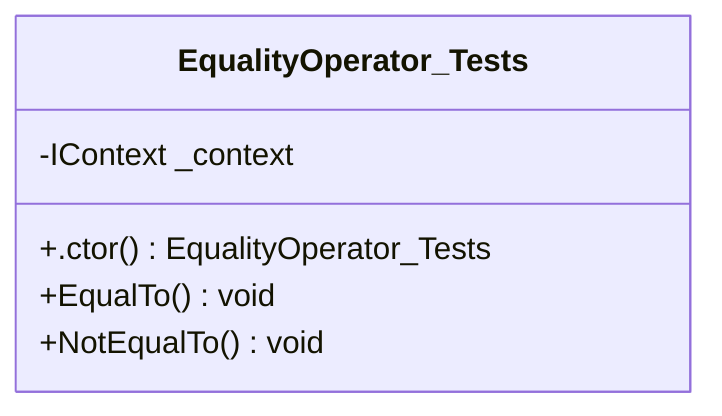
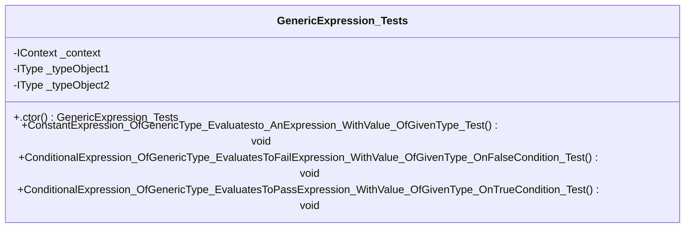
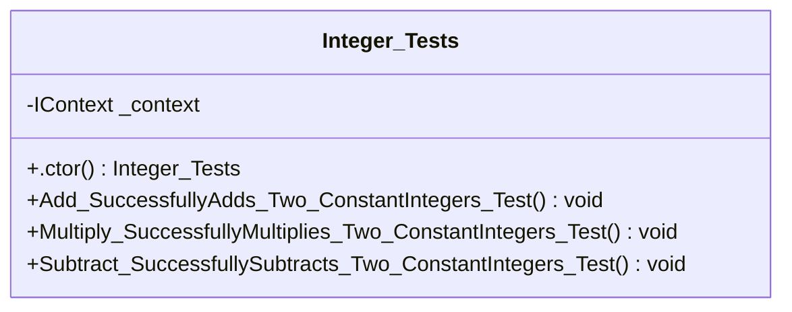
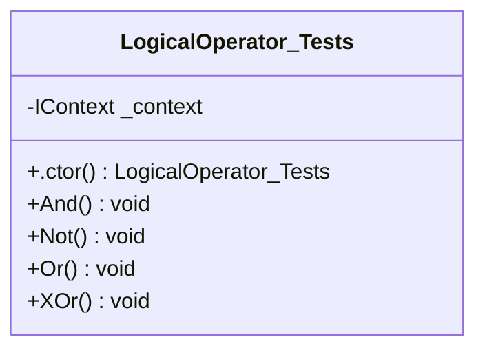
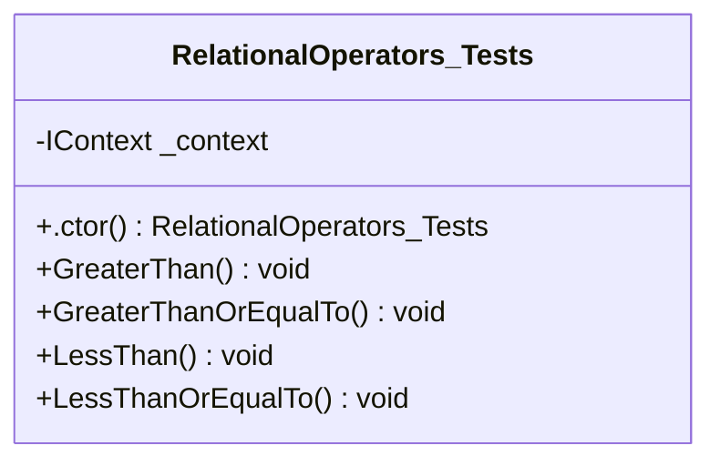
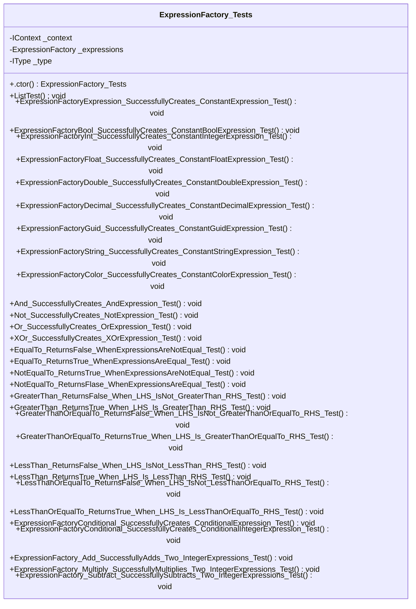
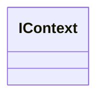
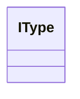
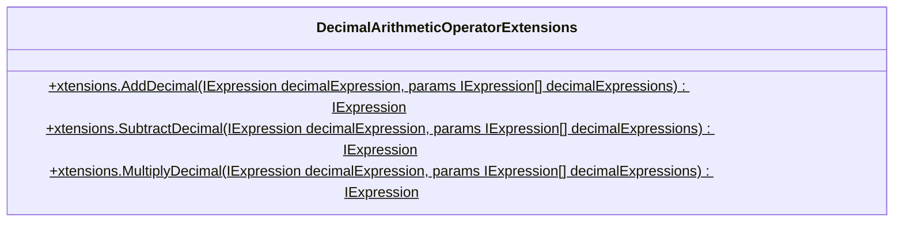
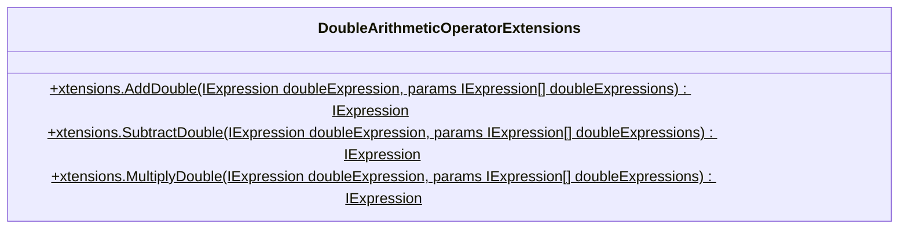

<!-- markdownlint-capture -->
<!-- markdownlint-disable -->

# Code Metrics

This file is dynamically maintained by a bot, *please do not* edit this by hand. It represents various [code metrics](https://aka.ms/dotnet/code-metrics), such as cyclomatic complexity, maintainability index, and so on.

<div id='expressions-tests'></div>

## Expressions.Tests :heavy_check_mark:

The *Expressions.Tests.csproj* project file contains:

- 6 namespaces.
- 8 named types.
- 728 total lines of source code.
- Approximately 213 lines of executable code.
- The highest cyclomatic complexity is 2 :heavy_check_mark:.

<details>
<summary>
  <strong id="expressions-tests-boolean-equalityoperators">
    Expressions.Tests.Boolean.EqualityOperators :heavy_check_mark:
  </strong>
</summary>
<br>

The `Expressions.Tests.Boolean.EqualityOperators` namespace contains 1 named types.

- 1 named types.
- 35 total lines of source code.
- Approximately 7 lines of executable code.
- The highest cyclomatic complexity is 1 :heavy_check_mark:.

<details>
<summary>
  <strong id="equalityoperator_tests">
    EqualityOperator_Tests :heavy_check_mark:
  </strong>
</summary>
<br>

- The `EqualityOperator_Tests` contains 4 members.
- 33 total lines of source code.
- Approximately 7 lines of executable code.
- The highest cyclomatic complexity is 1 :heavy_check_mark:.

| Member kind | Line number | Maintainability index | Cyclomatic complexity | Depth of inheritance | Class coupling | Lines of source / executable code |
| :-: | :-: | :-: | :-: | :-: | :-: | :-: |
| Field | <a href='https://github.com/Aptacode/Expressions/blob/main/Expressions.Tests/Boolean/EqualityOperators/EqualityOperator_Tests.cs#L10' title='IContext EqualityOperator_Tests._context'>10</a> | 100 | 0 :heavy_check_mark: | 0 | 1 | 1 / 0 |
| Method | <a href='https://github.com/Aptacode/Expressions/blob/main/Expressions.Tests/Boolean/EqualityOperators/EqualityOperator_Tests.cs#L12' title='EqualityOperator_Tests.EqualityOperator_Tests()'>12</a> | 100 | 1 :heavy_check_mark: | 0 | 3 | 4 / 1 |
| Method | <a href='https://github.com/Aptacode/Expressions/blob/main/Expressions.Tests/Boolean/EqualityOperators/EqualityOperator_Tests.cs#L18' title='void EqualityOperator_Tests.EqualTo()'>18</a> | 80 | 1 :heavy_check_mark: | 0 | 5 | 11 / 3 |
| Method | <a href='https://github.com/Aptacode/Expressions/blob/main/Expressions.Tests/Boolean/EqualityOperators/EqualityOperator_Tests.cs#L30' title='void EqualityOperator_Tests.NotEqualTo()'>30</a> | 80 | 1 :heavy_check_mark: | 0 | 5 | 11 / 3 |

<a href="#EqualityOperator_Tests-class-diagram">:link: to `EqualityOperator_Tests` class diagram</a>

<a href="#expressions-tests-boolean-equalityoperators">:top: back to Expressions.Tests.Boolean.EqualityOperators</a>

</details>

</details>

<details>
<summary>
  <strong id="expressions-tests-genericexpressions">
    Expressions.Tests.GenericExpressions :heavy_check_mark:
  </strong>
</summary>
<br>

The `Expressions.Tests.GenericExpressions` namespace contains 1 named types.

- 1 named types.
- 55 total lines of source code.
- Approximately 12 lines of executable code.
- The highest cyclomatic complexity is 1 :heavy_check_mark:.

<details>
<summary>
  <strong id="genericexpression_tests">
    GenericExpression_Tests :heavy_check_mark:
  </strong>
</summary>
<br>

- The `GenericExpression_Tests` contains 7 members.
- 53 total lines of source code.
- Approximately 12 lines of executable code.
- The highest cyclomatic complexity is 1 :heavy_check_mark:.

| Member kind | Line number | Maintainability index | Cyclomatic complexity | Depth of inheritance | Class coupling | Lines of source / executable code |
| :-: | :-: | :-: | :-: | :-: | :-: | :-: |
| Field | <a href='https://github.com/Aptacode/Expressions/blob/main/Expressions.Tests/GenericExpressions/GenericExpression_Tests.cs#L10' title='IContext GenericExpression_Tests._context'>10</a> | 100 | 0 :heavy_check_mark: | 0 | 1 | 1 / 0 |
| Field | <a href='https://github.com/Aptacode/Expressions/blob/main/Expressions.Tests/GenericExpressions/GenericExpression_Tests.cs#L11' title='IType GenericExpression_Tests._typeObject1'>11</a> | 100 | 0 :heavy_check_mark: | 0 | 1 | 1 / 0 |
| Field | <a href='https://github.com/Aptacode/Expressions/blob/main/Expressions.Tests/GenericExpressions/GenericExpression_Tests.cs#L12' title='IType GenericExpression_Tests._typeObject2'>12</a> | 100 | 0 :heavy_check_mark: | 0 | 1 | 1 / 0 |
| Method | <a href='https://github.com/Aptacode/Expressions/blob/main/Expressions.Tests/GenericExpressions/GenericExpression_Tests.cs#L14' title='GenericExpression_Tests.GenericExpression_Tests()'>14</a> | 81 | 1 :heavy_check_mark: | 0 | 4 | 6 / 3 |
| Method | <a href='https://github.com/Aptacode/Expressions/blob/main/Expressions.Tests/GenericExpressions/GenericExpression_Tests.cs#L35' title='void GenericExpression_Tests.ConditionalExpression_OfGenericType_EvaluatesToFailExpression_WithValue_OfGivenType_OnFalseCondition_Test()'>35</a> | 78 | 1 :heavy_check_mark: | 0 | 7 | 13 / 3 |
| Method | <a href='https://github.com/Aptacode/Expressions/blob/main/Expressions.Tests/GenericExpressions/GenericExpression_Tests.cs#L49' title='void GenericExpression_Tests.ConditionalExpression_OfGenericType_EvaluatesToPassExpression_WithValue_OfGivenType_OnTrueCondition_Test()'>49</a> | 78 | 1 :heavy_check_mark: | 0 | 7 | 13 / 3 |
| Method | <a href='https://github.com/Aptacode/Expressions/blob/main/Expressions.Tests/GenericExpressions/GenericExpression_Tests.cs#L22' title='void GenericExpression_Tests.ConstantExpression_OfGenericType_Evaluatesto_AnExpression_WithValue_OfGivenType_Test()'>22</a> | 80 | 1 :heavy_check_mark: | 0 | 5 | 11 / 3 |

<a href="#GenericExpression_Tests-class-diagram">:link: to `GenericExpression_Tests` class diagram</a>

<a href="#expressions-tests-genericexpressions">:top: back to Expressions.Tests.GenericExpressions</a>

</details>

</details>

<details>
<summary>
  <strong id="expressions-tests-integer">
    Expressions.Tests.Integer :heavy_check_mark:
  </strong>
</summary>
<br>

The `Expressions.Tests.Integer` namespace contains 1 named types.

- 1 named types.
- 47 total lines of source code.
- Approximately 10 lines of executable code.
- The highest cyclomatic complexity is 1 :heavy_check_mark:.

<details>
<summary>
  <strong id="integer_tests">
    Integer_Tests :heavy_check_mark:
  </strong>
</summary>
<br>

- The `Integer_Tests` contains 5 members.
- 45 total lines of source code.
- Approximately 10 lines of executable code.
- The highest cyclomatic complexity is 1 :heavy_check_mark:.

| Member kind | Line number | Maintainability index | Cyclomatic complexity | Depth of inheritance | Class coupling | Lines of source / executable code |
| :-: | :-: | :-: | :-: | :-: | :-: | :-: |
| Field | <a href='https://github.com/Aptacode/Expressions/blob/main/Expressions.Tests/Integer/Integer_Tests.cs#L10' title='IContext Integer_Tests._context'>10</a> | 100 | 0 :heavy_check_mark: | 0 | 1 | 1 / 0 |
| Method | <a href='https://github.com/Aptacode/Expressions/blob/main/Expressions.Tests/Integer/Integer_Tests.cs#L12' title='Integer_Tests.Integer_Tests()'>12</a> | 100 | 1 :heavy_check_mark: | 0 | 3 | 4 / 1 |
| Method | <a href='https://github.com/Aptacode/Expressions/blob/main/Expressions.Tests/Integer/Integer_Tests.cs#L18' title='void Integer_Tests.Add_SuccessfullyAdds_Two_ConstantIntegers_Test()'>18</a> | 80 | 1 :heavy_check_mark: | 0 | 5 | 11 / 3 |
| Method | <a href='https://github.com/Aptacode/Expressions/blob/main/Expressions.Tests/Integer/Integer_Tests.cs#L30' title='void Integer_Tests.Multiply_SuccessfullyMultiplies_Two_ConstantIntegers_Test()'>30</a> | 80 | 1 :heavy_check_mark: | 0 | 5 | 11 / 3 |
| Method | <a href='https://github.com/Aptacode/Expressions/blob/main/Expressions.Tests/Integer/Integer_Tests.cs#L42' title='void Integer_Tests.Subtract_SuccessfullySubtracts_Two_ConstantIntegers_Test()'>42</a> | 80 | 1 :heavy_check_mark: | 0 | 5 | 11 / 3 |

<a href="#Integer_Tests-class-diagram">:link: to `Integer_Tests` class diagram</a>

<a href="#expressions-tests-integer">:top: back to Expressions.Tests.Integer</a>

</details>

</details>

<details>
<summary>
  <strong id="expressions-tests-boolean-logicaloperators">
    Expressions.Tests.Boolean.LogicalOperators :heavy_check_mark:
  </strong>
</summary>
<br>

The `Expressions.Tests.Boolean.LogicalOperators` namespace contains 1 named types.

- 1 named types.
- 82 total lines of source code.
- Approximately 40 lines of executable code.
- The highest cyclomatic complexity is 1 :heavy_check_mark:.

<details>
<summary>
  <strong id="logicaloperator_tests">
    LogicalOperator_Tests :heavy_check_mark:
  </strong>
</summary>
<br>

- The `LogicalOperator_Tests` contains 6 members.
- 80 total lines of source code.
- Approximately 40 lines of executable code.
- The highest cyclomatic complexity is 1 :heavy_check_mark:.

| Member kind | Line number | Maintainability index | Cyclomatic complexity | Depth of inheritance | Class coupling | Lines of source / executable code |
| :-: | :-: | :-: | :-: | :-: | :-: | :-: |
| Field | <a href='https://github.com/Aptacode/Expressions/blob/main/Expressions.Tests/Boolean/LogicalOperators/LogicalOperator_Tests.cs#L10' title='IContext LogicalOperator_Tests._context'>10</a> | 100 | 0 :heavy_check_mark: | 0 | 1 | 1 / 0 |
| Method | <a href='https://github.com/Aptacode/Expressions/blob/main/Expressions.Tests/Boolean/LogicalOperators/LogicalOperator_Tests.cs#L12' title='LogicalOperator_Tests.LogicalOperator_Tests()'>12</a> | 100 | 1 :heavy_check_mark: | 0 | 3 | 4 / 1 |
| Method | <a href='https://github.com/Aptacode/Expressions/blob/main/Expressions.Tests/Boolean/LogicalOperators/LogicalOperator_Tests.cs#L18' title='void LogicalOperator_Tests.And()'>18</a> | 61 | 1 :heavy_check_mark: | 0 | 5 | 19 / 12 |
| Method | <a href='https://github.com/Aptacode/Expressions/blob/main/Expressions.Tests/Boolean/LogicalOperators/LogicalOperator_Tests.cs#L38' title='void LogicalOperator_Tests.Not()'>38</a> | 81 | 1 :heavy_check_mark: | 0 | 5 | 10 / 3 |
| Method | <a href='https://github.com/Aptacode/Expressions/blob/main/Expressions.Tests/Boolean/LogicalOperators/LogicalOperator_Tests.cs#L49' title='void LogicalOperator_Tests.Or()'>49</a> | 61 | 1 :heavy_check_mark: | 0 | 5 | 19 / 12 |
| Method | <a href='https://github.com/Aptacode/Expressions/blob/main/Expressions.Tests/Boolean/LogicalOperators/LogicalOperator_Tests.cs#L69' title='void LogicalOperator_Tests.XOr()'>69</a> | 61 | 1 :heavy_check_mark: | 0 | 5 | 19 / 12 |

<a href="#LogicalOperator_Tests-class-diagram">:link: to `LogicalOperator_Tests` class diagram</a>

<a href="#expressions-tests-boolean-logicaloperators">:top: back to Expressions.Tests.Boolean.LogicalOperators</a>

</details>

</details>

<details>
<summary>
  <strong id="expressions-tests-boolean-relationaloperators">
    Expressions.Tests.Boolean.RelationalOperators :heavy_check_mark:
  </strong>
</summary>
<br>

The `Expressions.Tests.Boolean.RelationalOperators` namespace contains 1 named types.

- 1 named types.
- 75 total lines of source code.
- Approximately 19 lines of executable code.
- The highest cyclomatic complexity is 1 :heavy_check_mark:.

<details>
<summary>
  <strong id="relationaloperators_tests">
    RelationalOperators_Tests :heavy_check_mark:
  </strong>
</summary>
<br>

- The `RelationalOperators_Tests` contains 6 members.
- 73 total lines of source code.
- Approximately 19 lines of executable code.
- The highest cyclomatic complexity is 1 :heavy_check_mark:.

| Member kind | Line number | Maintainability index | Cyclomatic complexity | Depth of inheritance | Class coupling | Lines of source / executable code |
| :-: | :-: | :-: | :-: | :-: | :-: | :-: |
| Field | <a href='https://github.com/Aptacode/Expressions/blob/main/Expressions.Tests/Boolean/RelationalOperators/RelationalOperator_Tests.cs#L10' title='IContext RelationalOperators_Tests._context'>10</a> | 100 | 0 :heavy_check_mark: | 0 | 1 | 1 / 0 |
| Method | <a href='https://github.com/Aptacode/Expressions/blob/main/Expressions.Tests/Boolean/RelationalOperators/RelationalOperator_Tests.cs#L12' title='RelationalOperators_Tests.RelationalOperators_Tests()'>12</a> | 100 | 1 :heavy_check_mark: | 0 | 3 | 4 / 1 |
| Method | <a href='https://github.com/Aptacode/Expressions/blob/main/Expressions.Tests/Boolean/RelationalOperators/RelationalOperator_Tests.cs#L18' title='void RelationalOperators_Tests.GreaterThan()'>18</a> | 80 | 1 :heavy_check_mark: | 0 | 5 | 11 / 3 |
| Method | <a href='https://github.com/Aptacode/Expressions/blob/main/Expressions.Tests/Boolean/RelationalOperators/RelationalOperator_Tests.cs#L30' title='void RelationalOperators_Tests.GreaterThanOrEqualTo()'>30</a> | 71 | 1 :heavy_check_mark: | 0 | 5 | 19 / 6 |
| Method | <a href='https://github.com/Aptacode/Expressions/blob/main/Expressions.Tests/Boolean/RelationalOperators/RelationalOperator_Tests.cs#L50' title='void RelationalOperators_Tests.LessThan()'>50</a> | 80 | 1 :heavy_check_mark: | 0 | 5 | 11 / 3 |
| Method | <a href='https://github.com/Aptacode/Expressions/blob/main/Expressions.Tests/Boolean/RelationalOperators/RelationalOperator_Tests.cs#L62' title='void RelationalOperators_Tests.LessThanOrEqualTo()'>62</a> | 71 | 1 :heavy_check_mark: | 0 | 5 | 19 / 6 |

<a href="#RelationalOperators_Tests-class-diagram">:link: to `RelationalOperators_Tests` class diagram</a>

<a href="#expressions-tests-boolean-relationaloperators">:top: back to Expressions.Tests.Boolean.RelationalOperators</a>

</details>

</details>

<details>
<summary>
  <strong id="expressions-tests">
    Expressions.Tests :heavy_check_mark:
  </strong>
</summary>
<br>

The `Expressions.Tests` namespace contains 3 named types.

- 3 named types.
- 434 total lines of source code.
- Approximately 125 lines of executable code.
- The highest cyclomatic complexity is 2 :heavy_check_mark:.

<details>
<summary>
  <strong id="expressionfactory_tests">
    ExpressionFactory_Tests :heavy_check_mark:
  </strong>
</summary>
<br>

- The `ExpressionFactory_Tests` contains 35 members.
- 424 total lines of source code.
- Approximately 125 lines of executable code.
- The highest cyclomatic complexity is 2 :heavy_check_mark:.

| Member kind | Line number | Maintainability index | Cyclomatic complexity | Depth of inheritance | Class coupling | Lines of source / executable code |
| :-: | :-: | :-: | :-: | :-: | :-: | :-: |
| Field | <a href='https://github.com/Aptacode/Expressions/blob/main/Expressions.Tests/ExpressionFactory_Tests.cs#L21' title='IContext ExpressionFactory_Tests._context'>21</a> | 100 | 0 :heavy_check_mark: | 0 | 1 | 1 / 0 |
| Field | <a href='https://github.com/Aptacode/Expressions/blob/main/Expressions.Tests/ExpressionFactory_Tests.cs#L22' title='ExpressionFactory<IContext> ExpressionFactory_Tests._expressions'>22</a> | 100 | 0 :heavy_check_mark: | 0 | 2 | 1 / 0 |
| Field | <a href='https://github.com/Aptacode/Expressions/blob/main/Expressions.Tests/ExpressionFactory_Tests.cs#L24' title='IType ExpressionFactory_Tests._type'>24</a> | 100 | 0 :heavy_check_mark: | 0 | 1 | 1 / 0 |
| Method | <a href='https://github.com/Aptacode/Expressions/blob/main/Expressions.Tests/ExpressionFactory_Tests.cs#L26' title='ExpressionFactory_Tests.ExpressionFactory_Tests()'>26</a> | 81 | 1 :heavy_check_mark: | 0 | 5 | 6 / 3 |
| Method | <a href='https://github.com/Aptacode/Expressions/blob/main/Expressions.Tests/ExpressionFactory_Tests.cs#L163' title='void ExpressionFactory_Tests.And_SuccessfullyCreates_AndExpression_Test()'>163</a> | 75 | 1 :heavy_check_mark: | 0 | 5 | 15 / 4 |
| Method | <a href='https://github.com/Aptacode/Expressions/blob/main/Expressions.Tests/ExpressionFactory_Tests.cs#L215' title='void ExpressionFactory_Tests.EqualTo_ReturnsFalse_WhenExpressionsAreNotEqual_Test()'>215</a> | 75 | 1 :heavy_check_mark: | 0 | 4 | 15 / 4 |
| Method | <a href='https://github.com/Aptacode/Expressions/blob/main/Expressions.Tests/ExpressionFactory_Tests.cs#L227' title='void ExpressionFactory_Tests.EqualTo_ReturnsTrue_WhenExpressionsAreEqual_Test()'>227</a> | 75 | 1 :heavy_check_mark: | 0 | 4 | 11 / 4 |
| Method | <a href='https://github.com/Aptacode/Expressions/blob/main/Expressions.Tests/ExpressionFactory_Tests.cs#L406' title='void ExpressionFactory_Tests.ExpressionFactory_Add_SuccessfullyAdds_Two_IntegerExpressions_Test()'>406</a> | 74 | 1 :heavy_check_mark: | 0 | 4 | 15 / 4 |
| Method | <a href='https://github.com/Aptacode/Expressions/blob/main/Expressions.Tests/ExpressionFactory_Tests.cs#L418' title='void ExpressionFactory_Tests.ExpressionFactory_Multiply_SuccessfullyMultiplies_Two_IntegerExpressions_Test()'>418</a> | 74 | 1 :heavy_check_mark: | 0 | 4 | 11 / 4 |
| Method | <a href='https://github.com/Aptacode/Expressions/blob/main/Expressions.Tests/ExpressionFactory_Tests.cs#L430' title='void ExpressionFactory_Tests.ExpressionFactory_Subtract_SuccessfullySubtracts_Two_IntegerExpressions_Test()'>430</a> | 74 | 1 :heavy_check_mark: | 0 | 4 | 11 / 4 |
| Method | <a href='https://github.com/Aptacode/Expressions/blob/main/Expressions.Tests/ExpressionFactory_Tests.cs#L70' title='void ExpressionFactory_Tests.ExpressionFactoryBool_SuccessfullyCreates_ConstantBoolExpression_Test()'>70</a> | 78 | 1 :heavy_check_mark: | 0 | 5 | 10 / 3 |
| Method | <a href='https://github.com/Aptacode/Expressions/blob/main/Expressions.Tests/ExpressionFactory_Tests.cs#L148' title='void ExpressionFactory_Tests.ExpressionFactoryColor_SuccessfullyCreates_ConstantColorExpression_Test()'>148</a> | 79 | 1 :heavy_check_mark: | 0 | 5 | 10 / 3 |
| Method | <a href='https://github.com/Aptacode/Expressions/blob/main/Expressions.Tests/ExpressionFactory_Tests.cs#L375' title='void ExpressionFactory_Tests.ExpressionFactoryConditional_SuccessfullyCreates_ConditionalExpression_Test()'>375</a> | 76 | 1 :heavy_check_mark: | 0 | 6 | 17 / 3 |
| Method | <a href='https://github.com/Aptacode/Expressions/blob/main/Expressions.Tests/ExpressionFactory_Tests.cs#L389' title='void ExpressionFactory_Tests.ExpressionFactoryConditional_SuccessfullyCreates_ConditionalIntegerExpression_Test()'>389</a> | 76 | 1 :heavy_check_mark: | 0 | 5 | 12 / 3 |
| Method | <a href='https://github.com/Aptacode/Expressions/blob/main/Expressions.Tests/ExpressionFactory_Tests.cs#L114' title='void ExpressionFactory_Tests.ExpressionFactoryDecimal_SuccessfullyCreates_ConstantDecimalExpression_Test()'>114</a> | 78 | 1 :heavy_check_mark: | 0 | 6 | 10 / 3 |
| Method | <a href='https://github.com/Aptacode/Expressions/blob/main/Expressions.Tests/ExpressionFactory_Tests.cs#L103' title='void ExpressionFactory_Tests.ExpressionFactoryDouble_SuccessfullyCreates_ConstantDoubleExpression_Test()'>103</a> | 78 | 1 :heavy_check_mark: | 0 | 5 | 10 / 3 |
| Method | <a href='https://github.com/Aptacode/Expressions/blob/main/Expressions.Tests/ExpressionFactory_Tests.cs#L59' title='void ExpressionFactory_Tests.ExpressionFactoryExpression_SuccessfullyCreates_ConstantExpression_Test()'>59</a> | 78 | 1 :heavy_check_mark: | 0 | 6 | 12 / 3 |
| Method | <a href='https://github.com/Aptacode/Expressions/blob/main/Expressions.Tests/ExpressionFactory_Tests.cs#L92' title='void ExpressionFactory_Tests.ExpressionFactoryFloat_SuccessfullyCreates_ConstantFloatExpression_Test()'>92</a> | 78 | 1 :heavy_check_mark: | 0 | 5 | 10 / 3 |
| Method | <a href='https://github.com/Aptacode/Expressions/blob/main/Expressions.Tests/ExpressionFactory_Tests.cs#L125' title='void ExpressionFactory_Tests.ExpressionFactoryGuid_SuccessfullyCreates_ConstantGuidExpression_Test()'>125</a> | 78 | 1 :heavy_check_mark: | 0 | 5 | 10 / 3 |
| Method | <a href='https://github.com/Aptacode/Expressions/blob/main/Expressions.Tests/ExpressionFactory_Tests.cs#L81' title='void ExpressionFactory_Tests.ExpressionFactoryInt_SuccessfullyCreates_ConstantIntegerExpression_Test()'>81</a> | 78 | 1 :heavy_check_mark: | 0 | 5 | 10 / 3 |
| Method | <a href='https://github.com/Aptacode/Expressions/blob/main/Expressions.Tests/ExpressionFactory_Tests.cs#L137' title='void ExpressionFactory_Tests.ExpressionFactoryString_SuccessfullyCreates_ConstantStringExpression_Test()'>137</a> | 78 | 1 :heavy_check_mark: | 0 | 5 | 10 / 3 |
| Method | <a href='https://github.com/Aptacode/Expressions/blob/main/Expressions.Tests/ExpressionFactory_Tests.cs#L267' title='void ExpressionFactory_Tests.GreaterThan_ReturnsFalse_When_LHS_IsNot_GreaterThan_RHS_Test()'>267</a> | 75 | 1 :heavy_check_mark: | 0 | 4 | 15 / 4 |
| Method | <a href='https://github.com/Aptacode/Expressions/blob/main/Expressions.Tests/ExpressionFactory_Tests.cs#L279' title='void ExpressionFactory_Tests.GreaterThan_ReturnsTrue_When_LHS_Is_GreaterThan_RHS_Test()'>279</a> | 75 | 1 :heavy_check_mark: | 0 | 4 | 11 / 4 |
| Method | <a href='https://github.com/Aptacode/Expressions/blob/main/Expressions.Tests/ExpressionFactory_Tests.cs#L291' title='void ExpressionFactory_Tests.GreaterThanOrEqualTo_ReturnsFalse_When_LHS_IsNot_GreaterThanOrEqualTo_RHS_Test()'>291</a> | 75 | 1 :heavy_check_mark: | 0 | 4 | 13 / 4 |
| Method | <a href='https://github.com/Aptacode/Expressions/blob/main/Expressions.Tests/ExpressionFactory_Tests.cs#L305' title='void ExpressionFactory_Tests.GreaterThanOrEqualTo_ReturnsTrue_When_LHS_Is_GreaterThanOrEqualTo_RHS_Test()'>305</a> | 67 | 1 :heavy_check_mark: | 0 | 4 | 14 / 7 |
| Method | <a href='https://github.com/Aptacode/Expressions/blob/main/Expressions.Tests/ExpressionFactory_Tests.cs#L320' title='void ExpressionFactory_Tests.LessThan_ReturnsFalse_When_LHS_IsNot_LessThan_RHS_Test()'>320</a> | 75 | 1 :heavy_check_mark: | 0 | 4 | 11 / 4 |
| Method | <a href='https://github.com/Aptacode/Expressions/blob/main/Expressions.Tests/ExpressionFactory_Tests.cs#L332' title='void ExpressionFactory_Tests.LessThan_ReturnsTrue_When_LHS_Is_LessThan_RHS_Test()'>332</a> | 75 | 1 :heavy_check_mark: | 0 | 4 | 11 / 4 |
| Method | <a href='https://github.com/Aptacode/Expressions/blob/main/Expressions.Tests/ExpressionFactory_Tests.cs#L344' title='void ExpressionFactory_Tests.LessThanOrEqualTo_ReturnsFalse_When_LHS_IsNot_LessThanOrEqualTo_RHS_Test()'>344</a> | 75 | 1 :heavy_check_mark: | 0 | 4 | 11 / 4 |
| Method | <a href='https://github.com/Aptacode/Expressions/blob/main/Expressions.Tests/ExpressionFactory_Tests.cs#L356' title='void ExpressionFactory_Tests.LessThanOrEqualTo_ReturnsTrue_When_LHS_Is_LessThanOrEqualTo_RHS_Test()'>356</a> | 67 | 1 :heavy_check_mark: | 0 | 4 | 14 / 7 |
| Method | <a href='https://github.com/Aptacode/Expressions/blob/main/Expressions.Tests/ExpressionFactory_Tests.cs#L35' title='void ExpressionFactory_Tests.ListTest()'>35</a> | 64 | 2 :heavy_check_mark: | 0 | 4 | 21 / 7 |
| Method | <a href='https://github.com/Aptacode/Expressions/blob/main/Expressions.Tests/ExpressionFactory_Tests.cs#L175' title='void ExpressionFactory_Tests.Not_SuccessfullyCreates_NotExpression_Test()'>175</a> | 75 | 1 :heavy_check_mark: | 0 | 5 | 11 / 4 |
| Method | <a href='https://github.com/Aptacode/Expressions/blob/main/Expressions.Tests/ExpressionFactory_Tests.cs#L251' title='void ExpressionFactory_Tests.NotEqualTo_ReturnsFlase_WhenExpressionsAreEqual_Test()'>251</a> | 75 | 1 :heavy_check_mark: | 0 | 4 | 11 / 4 |
| Method | <a href='https://github.com/Aptacode/Expressions/blob/main/Expressions.Tests/ExpressionFactory_Tests.cs#L239' title='void ExpressionFactory_Tests.NotEqualTo_ReturnsTrue_WhenExpressionsAreNotEqual_Test()'>239</a> | 75 | 1 :heavy_check_mark: | 0 | 4 | 11 / 4 |
| Method | <a href='https://github.com/Aptacode/Expressions/blob/main/Expressions.Tests/ExpressionFactory_Tests.cs#L187' title='void ExpressionFactory_Tests.Or_SuccessfullyCreates_OrExpression_Test()'>187</a> | 75 | 1 :heavy_check_mark: | 0 | 5 | 11 / 4 |
| Method | <a href='https://github.com/Aptacode/Expressions/blob/main/Expressions.Tests/ExpressionFactory_Tests.cs#L199' title='void ExpressionFactory_Tests.XOr_SuccessfullyCreates_XOrExpression_Test()'>199</a> | 75 | 1 :heavy_check_mark: | 0 | 5 | 11 / 4 |

<a href="#ExpressionFactory_Tests-class-diagram">:link: to `ExpressionFactory_Tests` class diagram</a>

<a href="#expressions-tests">:top: back to Expressions.Tests</a>

</details>

<details>
<summary>
  <strong id="icontext">
    IContext :question:
  </strong>
</summary>
<br>

- The `IContext` contains 0 members.
- 3 total lines of source code.
- Approximately 0 lines of executable code.
- The highest cyclomatic complexity is 0 :question:.

| Member kind | Line number | Maintainability index | Cyclomatic complexity | Depth of inheritance | Class coupling | Lines of source / executable code |
| :-: | :-: | :-: | :-: | :-: | :-: | :-: |

<a href="#IContext-class-diagram">:link: to `IContext` class diagram</a>

<a href="#expressions-tests">:top: back to Expressions.Tests</a>

</details>

<details>
<summary>
  <strong id="itype">
    IType :question:
  </strong>
</summary>
<br>

- The `IType` contains 0 members.
- 3 total lines of source code.
- Approximately 0 lines of executable code.
- The highest cyclomatic complexity is 0 :question:.

| Member kind | Line number | Maintainability index | Cyclomatic complexity | Depth of inheritance | Class coupling | Lines of source / executable code |
| :-: | :-: | :-: | :-: | :-: | :-: | :-: |

<a href="#IType-class-diagram">:link: to `IType` class diagram</a>

<a href="#expressions-tests">:top: back to Expressions.Tests</a>

</details>

</details>

<a href="#expressions-tests">:top: back to Expressions.Tests</a>

<div id='expressions'></div>

## Expressions :heavy_check_mark:

The *Expressions.csproj* project file contains:

- 30 namespaces.
- 77 named types.
- 1,610 total lines of source code.
- Approximately 192 lines of executable code.
- The highest cyclomatic complexity is 5 :heavy_check_mark:.

<details>
<summary>
  <strong id="aptacode-expressions-bool">
    Aptacode.Expressions.Bool :heavy_check_mark:
  </strong>
</summary>
<br>

The `Aptacode.Expressions.Bool` namespace contains 3 named types.

- 3 named types.
- 27 total lines of source code.
- Approximately 2 lines of executable code.
- The highest cyclomatic complexity is 1 :heavy_check_mark:.

<details>
<summary>
  <strong id="binaryboolcomparisonttype,+tcontext">
    BinaryBoolComparison&lt;TType, TContext&gt; :heavy_check_mark:
  </strong>
</summary>
<br>

- The `BinaryBoolComparison<TType, TContext>` contains 5 members.
- 10 total lines of source code.
- Approximately 1 lines of executable code.
- The highest cyclomatic complexity is 1 :heavy_check_mark:.

| Member kind | Line number | Maintainability index | Cyclomatic complexity | Depth of inheritance | Class coupling | Lines of source / executable code |
| :-: | :-: | :-: | :-: | :-: | :-: | :-: |
| Method | <a href='https://github.com/Aptacode/Expressions/blob/main/Expressions/Bool/BinaryBoolComparison.cs#L5' title='BinaryBoolComparison<TType, TContext>.BinaryBoolComparison(IExpression<TType, TContext> Lhs, IExpression<TType, TContext> Rhs)'>5</a> | 100 | 1 :heavy_check_mark: | 0 | 1 | 10 / 0 |
| Method | <a href='https://github.com/Aptacode/Expressions/blob/main/Expressions/Bool/BinaryBoolComparison.cs#L8' title='bool BinaryBoolComparison<TType, TContext>.Interpret(TContext context)'>8</a> | 100 | 1 :heavy_check_mark: | 0 | 0 | 1 / 0 |
| Property | <a href='https://github.com/Aptacode/Expressions/blob/main/Expressions/Bool/BinaryBoolComparison.cs#L5' title='IExpression<TType, TContext> BinaryBoolComparison<TType, TContext>.Lhs'>5</a> | 100 | 0 :heavy_check_mark: | 0 | 1 | 1 / 0 |
| Property | <a href='https://github.com/Aptacode/Expressions/blob/main/Expressions/Bool/BinaryBoolComparison.cs#L6' title='IExpression<TType, TContext> BinaryBoolComparison<TType, TContext>.Rhs'>6</a> | 100 | 0 :heavy_check_mark: | 0 | 1 | 1 / 0 |
| Method | <a href='https://github.com/Aptacode/Expressions/blob/main/Expressions/Bool/BinaryBoolComparison.cs#L10' title='void BinaryBoolComparison<TType, TContext>.Visit(IExpressionVisitor<TContext> visitor)'>10</a> | 100 | 1 :heavy_check_mark: | 0 | 1 | 4 / 1 |

<a href="#BinaryBoolComparison&lt;TType, TContext&gt;-class-diagram">:link: to `BinaryBoolComparison&lt;TType, TContext&gt;` class diagram</a>

<a href="#aptacode-expressions-bool">:top: back to Aptacode.Expressions.Bool</a>

</details>

<details>
<summary>
  <strong id="constantbooltcontext">
    ConstantBool&lt;TContext&gt; :heavy_check_mark:
  </strong>
</summary>
<br>

- The `ConstantBool<TContext>` contains 1 members.
- 1 total lines of source code.
- Approximately 0 lines of executable code.
- The highest cyclomatic complexity is 1 :heavy_check_mark:.

| Member kind | Line number | Maintainability index | Cyclomatic complexity | Depth of inheritance | Class coupling | Lines of source / executable code |
| :-: | :-: | :-: | :-: | :-: | :-: | :-: |
| Method | <a href='https://github.com/Aptacode/Expressions/blob/main/Expressions/Bool/ConstantBool.cs#L5' title='ConstantBool<TContext>.ConstantBool(bool Value)'>5</a> | 100 | 1 :heavy_check_mark: | 0 | 1 | 1 / 0 |

<a href="#ConstantBool&lt;TContext&gt;-class-diagram">:link: to `ConstantBool&lt;TContext&gt;` class diagram</a>

<a href="#aptacode-expressions-bool">:top: back to Aptacode.Expressions.Bool</a>

</details>

<details>
<summary>
  <strong id="naryboolexpressiontcontext">
    NaryBoolExpression&lt;TContext&gt; :heavy_check_mark:
  </strong>
</summary>
<br>

- The `NaryBoolExpression<TContext>` contains 4 members.
- 10 total lines of source code.
- Approximately 1 lines of executable code.
- The highest cyclomatic complexity is 1 :heavy_check_mark:.

| Member kind | Line number | Maintainability index | Cyclomatic complexity | Depth of inheritance | Class coupling | Lines of source / executable code |
| :-: | :-: | :-: | :-: | :-: | :-: | :-: |
| Method | <a href='https://github.com/Aptacode/Expressions/blob/main/Expressions/Bool/NaryBoolExpression.cs#L5' title='NaryBoolExpression<TContext>.NaryBoolExpression(IExpression<bool, TContext>[] Expressions)'>5</a> | 100 | 1 :heavy_check_mark: | 0 | 1 | 10 / 0 |
| Property | <a href='https://github.com/Aptacode/Expressions/blob/main/Expressions/Bool/NaryBoolExpression.cs#L6' title='IExpression<bool, TContext>[] NaryBoolExpression<TContext>.Expressions'>6</a> | 100 | 0 :heavy_check_mark: | 0 | 1 | 1 / 0 |
| Method | <a href='https://github.com/Aptacode/Expressions/blob/main/Expressions/Bool/NaryBoolExpression.cs#L8' title='bool NaryBoolExpression<TContext>.Interpret(TContext context)'>8</a> | 100 | 1 :heavy_check_mark: | 0 | 0 | 1 / 0 |
| Method | <a href='https://github.com/Aptacode/Expressions/blob/main/Expressions/Bool/NaryBoolExpression.cs#L10' title='void NaryBoolExpression<TContext>.Visit(IExpressionVisitor<TContext> visitor)'>10</a> | 100 | 1 :heavy_check_mark: | 0 | 1 | 4 / 1 |

<a href="#NaryBoolExpression&lt;TContext&gt;-class-diagram">:link: to `NaryBoolExpression&lt;TContext&gt;` class diagram</a>

<a href="#aptacode-expressions-bool">:top: back to Aptacode.Expressions.Bool</a>

</details>

</details>

<details>
<summary>
  <strong id="aptacode-expressions-color">
    Aptacode.Expressions.Color :heavy_check_mark:
  </strong>
</summary>
<br>

The `Aptacode.Expressions.Color` namespace contains 1 named types.

- 1 named types.
- 4 total lines of source code.
- Approximately 0 lines of executable code.
- The highest cyclomatic complexity is 1 :heavy_check_mark:.

<details>
<summary>
  <strong id="constantcolortcontext">
    ConstantColor&lt;TContext&gt; :heavy_check_mark:
  </strong>
</summary>
<br>

- The `ConstantColor<TContext>` contains 1 members.
- 2 total lines of source code.
- Approximately 0 lines of executable code.
- The highest cyclomatic complexity is 1 :heavy_check_mark:.

| Member kind | Line number | Maintainability index | Cyclomatic complexity | Depth of inheritance | Class coupling | Lines of source / executable code |
| :-: | :-: | :-: | :-: | :-: | :-: | :-: |
| Method | <a href='https://github.com/Aptacode/Expressions/blob/main/Expressions/Color/ConstantColor.cs#L5' title='ConstantColor<TContext>.ConstantColor(Color Value)'>5</a> | 100 | 1 :heavy_check_mark: | 0 | 4 | 2 / 0 |

<a href="#ConstantColor&lt;TContext&gt;-class-diagram">:link: to `ConstantColor&lt;TContext&gt;` class diagram</a>

<a href="#aptacode-expressions-color">:top: back to Aptacode.Expressions.Color</a>

</details>

</details>

<details>
<summary>
  <strong id="aptacode-expressions-decimal">
    Aptacode.Expressions.Decimal :heavy_check_mark:
  </strong>
</summary>
<br>

The `Aptacode.Expressions.Decimal` namespace contains 1 named types.

- 1 named types.
- 3 total lines of source code.
- Approximately 0 lines of executable code.
- The highest cyclomatic complexity is 1 :heavy_check_mark:.

<details>
<summary>
  <strong id="constantdecimaltcontext">
    ConstantDecimal&lt;TContext&gt; :heavy_check_mark:
  </strong>
</summary>
<br>

- The `ConstantDecimal<TContext>` contains 1 members.
- 1 total lines of source code.
- Approximately 0 lines of executable code.
- The highest cyclomatic complexity is 1 :heavy_check_mark:.

| Member kind | Line number | Maintainability index | Cyclomatic complexity | Depth of inheritance | Class coupling | Lines of source / executable code |
| :-: | :-: | :-: | :-: | :-: | :-: | :-: |
| Method | <a href='https://github.com/Aptacode/Expressions/blob/main/Expressions/Decimal/ConstantDecimal.cs#L5' title='ConstantDecimal<TContext>.ConstantDecimal(decimal Value)'>5</a> | 100 | 1 :heavy_check_mark: | 0 | 2 | 1 / 0 |

<a href="#ConstantDecimal&lt;TContext&gt;-class-diagram">:link: to `ConstantDecimal&lt;TContext&gt;` class diagram</a>

<a href="#aptacode-expressions-decimal">:top: back to Aptacode.Expressions.Decimal</a>

</details>

</details>

<details>
<summary>
  <strong id="aptacode-expressions-decimal-decimalarithmeticoperators">
    Aptacode.Expressions.Decimal.DecimalArithmeticOperators :heavy_check_mark:
  </strong>
</summary>
<br>

The `Aptacode.Expressions.Decimal.DecimalArithmeticOperators` namespace contains 4 named types.

- 4 named types.
- 49 total lines of source code.
- Approximately 6 lines of executable code.
- The highest cyclomatic complexity is 1 :heavy_check_mark:.

<details>
<summary>
  <strong id="adddecimaltcontext">
    AddDecimal&lt;TContext&gt; :heavy_check_mark:
  </strong>
</summary>
<br>

- The `AddDecimal<TContext>` contains 1 members.
- 2 total lines of source code.
- Approximately 0 lines of executable code.
- The highest cyclomatic complexity is 1 :heavy_check_mark:.

| Member kind | Line number | Maintainability index | Cyclomatic complexity | Depth of inheritance | Class coupling | Lines of source / executable code |
| :-: | :-: | :-: | :-: | :-: | :-: | :-: |
| Method | <a href='https://github.com/Aptacode/Expressions/blob/main/Expressions/Decimal/DecimalArithmeticOperators/AddDecimal.cs#L5' title='AddDecimal<TContext>.AddDecimal(IExpression<decimal, TContext> Lhs, IExpression<decimal, TContext> Rhs)'>5</a> | 97 | 1 :heavy_check_mark: | 0 | 3 | 2 / 0 |

<a href="#AddDecimal&lt;TContext&gt;-class-diagram">:link: to `AddDecimal&lt;TContext&gt;` class diagram</a>

<a href="#aptacode-expressions-decimal-decimalarithmeticoperators">:top: back to Aptacode.Expressions.Decimal.DecimalArithmeticOperators</a>

</details>

<details>
<summary>
  <strong id="decimalarithmeticoperatorextensions">
    DecimalArithmeticOperatorExtensions :heavy_check_mark:
  </strong>
</summary>
<br>

- The `DecimalArithmeticOperatorExtensions` contains 3 members.
- 30 total lines of source code.
- Approximately 6 lines of executable code.
- The highest cyclomatic complexity is 1 :heavy_check_mark:.

| Member kind | Line number | Maintainability index | Cyclomatic complexity | Depth of inheritance | Class coupling | Lines of source / executable code |
| :-: | :-: | :-: | :-: | :-: | :-: | :-: |
| Method | <a href='https://github.com/Aptacode/Expressions/blob/main/Expressions/Decimal/DecimalArithmeticOperators/DecimalAritmeticOperatorExtensions.cs#L8' title='IExpression<decimal, TContext> DecimalArithmeticOperatorExtensions.AddDecimal<TContext>(IExpression<decimal, TContext> decimalExpression, params IExpression<decimal, TContext>[] decimalExpressions)'>8</a> | 86 | 1 :heavy_check_mark: | 0 | 4 | 8 / 2 |
| Method | <a href='https://github.com/Aptacode/Expressions/blob/main/Expressions/Decimal/DecimalArithmeticOperators/DecimalAritmeticOperatorExtensions.cs#L27' title='IExpression<decimal, TContext> DecimalArithmeticOperatorExtensions.MultiplyDecimal<TContext>(IExpression<decimal, TContext> decimalExpression, params IExpression<decimal, TContext>[] decimalExpressions)'>27</a> | 86 | 1 :heavy_check_mark: | 0 | 4 | 8 / 2 |
| Method | <a href='https://github.com/Aptacode/Expressions/blob/main/Expressions/Decimal/DecimalArithmeticOperators/DecimalAritmeticOperatorExtensions.cs#L17' title='IExpression<decimal, TContext> DecimalArithmeticOperatorExtensions.SubtractDecimal<TContext>(IExpression<decimal, TContext> decimalExpression, params IExpression<decimal, TContext>[] decimalExpressions)'>17</a> | 86 | 1 :heavy_check_mark: | 0 | 4 | 8 / 2 |

<a href="#DecimalArithmeticOperatorExtensions-class-diagram">:link: to `DecimalArithmeticOperatorExtensions` class diagram</a>

<a href="#aptacode-expressions-decimal-decimalarithmeticoperators">:top: back to Aptacode.Expressions.Decimal.DecimalArithmeticOperators</a>

</details>

<details>
<summary>
  <strong id="multiplydecimaltcontext">
    MultiplyDecimal&lt;TContext&gt; :heavy_check_mark:
  </strong>
</summary>
<br>

- The `MultiplyDecimal<TContext>` contains 1 members.
- 2 total lines of source code.
- Approximately 0 lines of executable code.
- The highest cyclomatic complexity is 1 :heavy_check_mark:.

| Member kind | Line number | Maintainability index | Cyclomatic complexity | Depth of inheritance | Class coupling | Lines of source / executable code |
| :-: | :-: | :-: | :-: | :-: | :-: | :-: |
| Method | <a href='https://github.com/Aptacode/Expressions/blob/main/Expressions/Decimal/DecimalArithmeticOperators/MultiplyDecimal.cs#L5' title='MultiplyDecimal<TContext>.MultiplyDecimal(IExpression<decimal, TContext> Lhs, IExpression<decimal, TContext> Rhs)'>5</a> | 97 | 1 :heavy_check_mark: | 0 | 3 | 2 / 0 |

<a href="#MultiplyDecimal&lt;TContext&gt;-class-diagram">:link: to `MultiplyDecimal&lt;TContext&gt;` class diagram</a>

<a href="#aptacode-expressions-decimal-decimalarithmeticoperators">:top: back to Aptacode.Expressions.Decimal.DecimalArithmeticOperators</a>

</details>

<details>
<summary>
  <strong id="subtractdecimaltcontext">
    SubtractDecimal&lt;TContext&gt; :heavy_check_mark:
  </strong>
</summary>
<br>

- The `SubtractDecimal<TContext>` contains 1 members.
- 7 total lines of source code.
- Approximately 0 lines of executable code.
- The highest cyclomatic complexity is 1 :heavy_check_mark:.

| Member kind | Line number | Maintainability index | Cyclomatic complexity | Depth of inheritance | Class coupling | Lines of source / executable code |
| :-: | :-: | :-: | :-: | :-: | :-: | :-: |
| Method | <a href='https://github.com/Aptacode/Expressions/blob/main/Expressions/Decimal/DecimalArithmeticOperators/SubtractDecimal.cs#L7' title='SubtractDecimal<TContext>.SubtractDecimal(IExpression<decimal, TContext> lhs, IExpression<decimal, TContext> rhs)'>7</a> | 97 | 1 :heavy_check_mark: | 0 | 3 | 4 / 0 |

<a href="#SubtractDecimal&lt;TContext&gt;-class-diagram">:link: to `SubtractDecimal&lt;TContext&gt;` class diagram</a>

<a href="#aptacode-expressions-decimal-decimalarithmeticoperators">:top: back to Aptacode.Expressions.Decimal.DecimalArithmeticOperators</a>

</details>

</details>

<details>
<summary>
  <strong id="aptacode-expressions-double">
    Aptacode.Expressions.Double :heavy_check_mark:
  </strong>
</summary>
<br>

The `Aptacode.Expressions.Double` namespace contains 1 named types.

- 1 named types.
- 3 total lines of source code.
- Approximately 0 lines of executable code.
- The highest cyclomatic complexity is 1 :heavy_check_mark:.

<details>
<summary>
  <strong id="constantdoubletcontext">
    ConstantDouble&lt;TContext&gt; :heavy_check_mark:
  </strong>
</summary>
<br>

- The `ConstantDouble<TContext>` contains 1 members.
- 1 total lines of source code.
- Approximately 0 lines of executable code.
- The highest cyclomatic complexity is 1 :heavy_check_mark:.

| Member kind | Line number | Maintainability index | Cyclomatic complexity | Depth of inheritance | Class coupling | Lines of source / executable code |
| :-: | :-: | :-: | :-: | :-: | :-: | :-: |
| Method | <a href='https://github.com/Aptacode/Expressions/blob/main/Expressions/Double/ConstantDouble.cs#L5' title='ConstantDouble<TContext>.ConstantDouble(double Value)'>5</a> | 100 | 1 :heavy_check_mark: | 0 | 1 | 1 / 0 |

<a href="#ConstantDouble&lt;TContext&gt;-class-diagram">:link: to `ConstantDouble&lt;TContext&gt;` class diagram</a>

<a href="#aptacode-expressions-double">:top: back to Aptacode.Expressions.Double</a>

</details>

</details>

<details>
<summary>
  <strong id="aptacode-expressions-double-doublearithmeticoperators">
    Aptacode.Expressions.Double.DoubleArithmeticOperators :heavy_check_mark:
  </strong>
</summary>
<br>

The `Aptacode.Expressions.Double.DoubleArithmeticOperators` namespace contains 4 named types.

- 4 named types.
- 44 total lines of source code.
- Approximately 6 lines of executable code.
- The highest cyclomatic complexity is 1 :heavy_check_mark:.

<details>
<summary>
  <strong id="adddoubletcontext">
    AddDouble&lt;TContext&gt; :heavy_check_mark:
  </strong>
</summary>
<br>

- The `AddDouble<TContext>` contains 1 members.
- 2 total lines of source code.
- Approximately 0 lines of executable code.
- The highest cyclomatic complexity is 1 :heavy_check_mark:.

| Member kind | Line number | Maintainability index | Cyclomatic complexity | Depth of inheritance | Class coupling | Lines of source / executable code |
| :-: | :-: | :-: | :-: | :-: | :-: | :-: |
| Method | <a href='https://github.com/Aptacode/Expressions/blob/main/Expressions/Double/DoubleArithmeticOperators/AddDouble.cs#L5' title='AddDouble<TContext>.AddDouble(IExpression<double, TContext> Lhs, IExpression<double, TContext> Rhs)'>5</a> | 97 | 1 :heavy_check_mark: | 0 | 2 | 2 / 0 |

<a href="#AddDouble&lt;TContext&gt;-class-diagram">:link: to `AddDouble&lt;TContext&gt;` class diagram</a>

<a href="#aptacode-expressions-double-doublearithmeticoperators">:top: back to Aptacode.Expressions.Double.DoubleArithmeticOperators</a>

</details>

<details>
<summary>
  <strong id="doublearithmeticoperatorextensions">
    DoubleArithmeticOperatorExtensions :heavy_check_mark:
  </strong>
</summary>
<br>

- The `DoubleArithmeticOperatorExtensions` contains 3 members.
- 30 total lines of source code.
- Approximately 6 lines of executable code.
- The highest cyclomatic complexity is 1 :heavy_check_mark:.

| Member kind | Line number | Maintainability index | Cyclomatic complexity | Depth of inheritance | Class coupling | Lines of source / executable code |
| :-: | :-: | :-: | :-: | :-: | :-: | :-: |
| Method | <a href='https://github.com/Aptacode/Expressions/blob/main/Expressions/Double/DoubleArithmeticOperators/DoubleAritmeticOperatorExtensions.cs#L8' title='IExpression<double, TContext> DoubleArithmeticOperatorExtensions.AddDouble<TContext>(IExpression<double, TContext> doubleExpression, params IExpression<double, TContext>[] doubleExpressions)'>8</a> | 86 | 1 :heavy_check_mark: | 0 | 3 | 8 / 2 |
| Method | <a href='https://github.com/Aptacode/Expressions/blob/main/Expressions/Double/DoubleArithmeticOperators/DoubleAritmeticOperatorExtensions.cs#L27' title='IExpression<double, TContext> DoubleArithmeticOperatorExtensions.MultiplyDouble<TContext>(IExpression<double, TContext> doubleExpression, params IExpression<double, TContext>[] doubleExpressions)'>27</a> | 86 | 1 :heavy_check_mark: | 0 | 3 | 8 / 2 |
| Method | <a href='https://github.com/Aptacode/Expressions/blob/main/Expressions/Double/DoubleArithmeticOperators/DoubleAritmeticOperatorExtensions.cs#L17' title='IExpression<double, TContext> DoubleArithmeticOperatorExtensions.SubtractDouble<TContext>(IExpression<double, TContext> doubleExpression, params IExpression<double, TContext>[] doubleExpressions)'>17</a> | 86 | 1 :heavy_check_mark: | 0 | 3 | 8 / 2 |

<a href="#DoubleArithmeticOperatorExtensions-class-diagram">:link: to `DoubleArithmeticOperatorExtensions` class diagram</a>

<a href="#aptacode-expressions-double-doublearithmeticoperators">:top: back to Aptacode.Expressions.Double.DoubleArithmeticOperators</a>

</details>

<details>
<summary>
  <strong id="multiplydoubletcontext">
    MultiplyDouble&lt;TContext&gt; :heavy_check_mark:
  </strong>
</summary>
<br>

- The `MultiplyDouble<TContext>` contains 1 members.
- 2 total lines of source code.
- Approximately 0 lines of executable code.
- The highest cyclomatic complexity is 1 :heavy_check_mark:.

| Member kind | Line number | Maintainability index | Cyclomatic complexity | Depth of inheritance | Class coupling | Lines of source / executable code |
| :-: | :-: | :-: | :-: | :-: | :-: | :-: |
| Method | <a href='https://github.com/Aptacode/Expressions/blob/main/Expressions/Double/DoubleArithmeticOperators/MultiplyDouble.cs#L5' title='MultiplyDouble<TContext>.MultiplyDouble(IExpression<double, TContext> Lhs, IExpression<double, TContext> Rhs)'>5</a> | 97 | 1 :heavy_check_mark: | 0 | 2 | 2 / 0 |

<a href="#MultiplyDouble&lt;TContext&gt;-class-diagram">:link: to `MultiplyDouble&lt;TContext&gt;` class diagram</a>

<a href="#aptacode-expressions-double-doublearithmeticoperators">:top: back to Aptacode.Expressions.Double.DoubleArithmeticOperators</a>

</details>

<details>
<summary>
  <strong id="subtractdoubletcontext">
    SubtractDouble&lt;TContext&gt; :heavy_check_mark:
  </strong>
</summary>
<br>

- The `SubtractDouble<TContext>` contains 1 members.
- 2 total lines of source code.
- Approximately 0 lines of executable code.
- The highest cyclomatic complexity is 1 :heavy_check_mark:.

| Member kind | Line number | Maintainability index | Cyclomatic complexity | Depth of inheritance | Class coupling | Lines of source / executable code |
| :-: | :-: | :-: | :-: | :-: | :-: | :-: |
| Method | <a href='https://github.com/Aptacode/Expressions/blob/main/Expressions/Double/DoubleArithmeticOperators/SubtractDouble.cs#L5' title='SubtractDouble<TContext>.SubtractDouble(IExpression<double, TContext> Lhs, IExpression<double, TContext> Rhs)'>5</a> | 97 | 1 :heavy_check_mark: | 0 | 2 | 2 / 0 |

<a href="#SubtractDouble&lt;TContext&gt;-class-diagram">:link: to `SubtractDouble&lt;TContext&gt;` class diagram</a>

<a href="#aptacode-expressions-double-doublearithmeticoperators">:top: back to Aptacode.Expressions.Double.DoubleArithmeticOperators</a>

</details>

</details>

<details>
<summary>
  <strong id="aptacode-expressions-bool-equalityoperators">
    Aptacode.Expressions.Bool.EqualityOperators :heavy_check_mark:
  </strong>
</summary>
<br>

The `Aptacode.Expressions.Bool.EqualityOperators` namespace contains 2 named types.

- 2 named types.
- 32 total lines of source code.
- Approximately 2 lines of executable code.
- The highest cyclomatic complexity is 1 :heavy_check_mark:.

<details>
<summary>
  <strong id="equaltottype,+tcontext">
    EqualTo&lt;TType, TContext&gt; :heavy_check_mark:
  </strong>
</summary>
<br>

- The `EqualTo<TType, TContext>` contains 2 members.
- 14 total lines of source code.
- Approximately 1 lines of executable code.
- The highest cyclomatic complexity is 1 :heavy_check_mark:.

| Member kind | Line number | Maintainability index | Cyclomatic complexity | Depth of inheritance | Class coupling | Lines of source / executable code |
| :-: | :-: | :-: | :-: | :-: | :-: | :-: |
| Method | <a href='https://github.com/Aptacode/Expressions/blob/main/Expressions/Bool/EqualityOperators/EqualTo.cs#L9' title='EqualTo<TType, TContext>.EqualTo(IExpression<TType, TContext> Lhs, IExpression<TType, TContext> Rhs)'>9</a> | 97 | 1 :heavy_check_mark: | 0 | 2 | 14 / 0 |
| Method | <a href='https://github.com/Aptacode/Expressions/blob/main/Expressions/Bool/EqualityOperators/EqualTo.cs#L14' title='bool EqualTo<TType, TContext>.Interpret(TContext context)'>14</a> | 89 | 1 :heavy_check_mark: | 0 | 2 | 4 / 1 |

<a href="#EqualTo&lt;TType, TContext&gt;-class-diagram">:link: to `EqualTo&lt;TType, TContext&gt;` class diagram</a>

<a href="#aptacode-expressions-bool-equalityoperators">:top: back to Aptacode.Expressions.Bool.EqualityOperators</a>

</details>

<details>
<summary>
  <strong id="notequaltottype,+tcontext">
    NotEqualTo&lt;TType, TContext&gt; :heavy_check_mark:
  </strong>
</summary>
<br>

- The `NotEqualTo<TType, TContext>` contains 2 members.
- 14 total lines of source code.
- Approximately 1 lines of executable code.
- The highest cyclomatic complexity is 1 :heavy_check_mark:.

| Member kind | Line number | Maintainability index | Cyclomatic complexity | Depth of inheritance | Class coupling | Lines of source / executable code |
| :-: | :-: | :-: | :-: | :-: | :-: | :-: |
| Method | <a href='https://github.com/Aptacode/Expressions/blob/main/Expressions/Bool/EqualityOperators/NotEqualTo.cs#L9' title='NotEqualTo<TType, TContext>.NotEqualTo(IExpression<TType, TContext> Lhs, IExpression<TType, TContext> Rhs)'>9</a> | 97 | 1 :heavy_check_mark: | 0 | 2 | 14 / 0 |
| Method | <a href='https://github.com/Aptacode/Expressions/blob/main/Expressions/Bool/EqualityOperators/NotEqualTo.cs#L14' title='bool NotEqualTo<TType, TContext>.Interpret(TContext context)'>14</a> | 89 | 1 :heavy_check_mark: | 0 | 2 | 4 / 1 |

<a href="#NotEqualTo&lt;TType, TContext&gt;-class-diagram">:link: to `NotEqualTo&lt;TType, TContext&gt;` class diagram</a>

<a href="#aptacode-expressions-bool-equalityoperators">:top: back to Aptacode.Expressions.Bool.EqualityOperators</a>

</details>

</details>

<details>
<summary>
  <strong id="aptacode-expressions">
    Aptacode.Expressions :heavy_check_mark:
  </strong>
</summary>
<br>

The `Aptacode.Expressions` namespace contains 2 named types.

- 2 named types.
- 379 total lines of source code.
- Approximately 52 lines of executable code.
- The highest cyclomatic complexity is 1 :heavy_check_mark:.

<details>
<summary>
  <strong id="expressionfactorytcontext">
    ExpressionFactory&lt;TContext&gt; :heavy_check_mark:
  </strong>
</summary>
<br>

- The `ExpressionFactory<TContext>` contains 52 members.
- 359 total lines of source code.
- Approximately 52 lines of executable code.
- The highest cyclomatic complexity is 1 :heavy_check_mark:.

| Member kind | Line number | Maintainability index | Cyclomatic complexity | Depth of inheritance | Class coupling | Lines of source / executable code |
| :-: | :-: | :-: | :-: | :-: | :-: | :-: |
| Method | <a href='https://github.com/Aptacode/Expressions/blob/main/Expressions/ExpressionFactory.cs#L156' title='Add<TType, TContext> ExpressionFactory<TContext>.Add<TType>(IExpression<TType, TContext> lhs, IExpression<TType, TContext> rhs)'>156</a> | 94 | 1 :heavy_check_mark: | 0 | 2 | 11 / 1 |
| Method | <a href='https://github.com/Aptacode/Expressions/blob/main/Expressions/ExpressionFactory.cs#L240' title='AddDecimal<TContext> ExpressionFactory<TContext>.AddDecimal(IExpression<decimal, TContext> lhs, IExpression<decimal, TContext> rhs)'>240</a> | 94 | 1 :heavy_check_mark: | 0 | 3 | 9 / 1 |
| Method | <a href='https://github.com/Aptacode/Expressions/blob/main/Expressions/ExpressionFactory.cs#L219' title='AddDouble<TContext> ExpressionFactory<TContext>.AddDouble(IExpression<double, TContext> lhs, IExpression<double, TContext> rhs)'>219</a> | 94 | 1 :heavy_check_mark: | 0 | 2 | 8 / 1 |
| Method | <a href='https://github.com/Aptacode/Expressions/blob/main/Expressions/ExpressionFactory.cs#L198' title='AddFloat<TContext> ExpressionFactory<TContext>.AddFloat(IExpression<float, TContext> lhs, IExpression<float, TContext> rhs)'>198</a> | 94 | 1 :heavy_check_mark: | 0 | 2 | 8 / 1 |
| Method | <a href='https://github.com/Aptacode/Expressions/blob/main/Expressions/ExpressionFactory.cs#L177' title='AddInteger<TContext> ExpressionFactory<TContext>.AddInteger(IExpression<int, TContext> lhs, IExpression<int, TContext> rhs)'>177</a> | 94 | 1 :heavy_check_mark: | 0 | 2 | 8 / 1 |
| Method | <a href='https://github.com/Aptacode/Expressions/blob/main/Expressions/ExpressionFactory.cs#L274' title='And<TContext> ExpressionFactory<TContext>.And(IExpression<bool, TContext> lhs, IExpression<bool, TContext> rhs)'>274</a> | 94 | 1 :heavy_check_mark: | 0 | 2 | 10 / 1 |
| Method | <a href='https://github.com/Aptacode/Expressions/blob/main/Expressions/ExpressionFactory.cs#L376' title='Append<TType, TContext> ExpressionFactory<TContext>.Append<TType>(IListExpression<TType, TContext> list, IExpression<TType, TContext> element)'>376</a> | 94 | 1 :heavy_check_mark: | 0 | 3 | 5 / 1 |
| Method | <a href='https://github.com/Aptacode/Expressions/blob/main/Expressions/ExpressionFactory.cs#L58' title='ConstantBool<TContext> ExpressionFactory<TContext>.Bool(bool value)'>58</a> | 96 | 1 :heavy_check_mark: | 0 | 1 | 4 / 1 |
| Method | <a href='https://github.com/Aptacode/Expressions/blob/main/Expressions/ExpressionFactory.cs#L63' title='ConstantColor<TContext> ExpressionFactory<TContext>.Color(Color value)'>63</a> | 96 | 1 :heavy_check_mark: | 0 | 4 | 4 / 1 |
| Method | <a href='https://github.com/Aptacode/Expressions/blob/main/Expressions/ExpressionFactory.cs#L262' title='ConcatString<TContext> ExpressionFactory<TContext>.Concat(IExpression<string, TContext> lhs, IExpression<string, TContext> rhs)'>262</a> | 94 | 1 :heavy_check_mark: | 0 | 2 | 9 / 1 |
| Method | <a href='https://github.com/Aptacode/Expressions/blob/main/Expressions/ExpressionFactory.cs#L343' title='ConcatList<TType, TContext> ExpressionFactory<TContext>.Concat<TType>(IListExpression<TType, TContext> lhs, IListExpression<TType, TContext> rhs)'>343</a> | 94 | 1 :heavy_check_mark: | 0 | 2 | 9 / 1 |
| Method | <a href='https://github.com/Aptacode/Expressions/blob/main/Expressions/ExpressionFactory.cs#L87' title='ConditionalExpression<TType, TContext> ExpressionFactory<TContext>.Conditional<TType>(IExpression<bool, TContext> condition, IExpression<TType, TContext> passExpression, IExpression<TType, TContext> failExpression)'>87</a> | 92 | 1 :heavy_check_mark: | 0 | 2 | 10 / 1 |
| Method | <a href='https://github.com/Aptacode/Expressions/blob/main/Expressions/ExpressionFactory.cs#L94' title='IExpression<int, TContext> ExpressionFactory<TContext>.Conditional(IExpression<bool, TContext> condition, IExpression<int, TContext> passExpression, IExpression<int, TContext> failExpression)'>94</a> | 92 | 1 :heavy_check_mark: | 0 | 2 | 6 / 1 |
| Method | <a href='https://github.com/Aptacode/Expressions/blob/main/Expressions/ExpressionFactory.cs#L101' title='ConditionalExpression<float, TContext> ExpressionFactory<TContext>.Conditional(IExpression<bool, TContext> condition, IExpression<float, TContext> passExpression, IExpression<float, TContext> failExpression)'>101</a> | 92 | 1 :heavy_check_mark: | 0 | 2 | 6 / 1 |
| Method | <a href='https://github.com/Aptacode/Expressions/blob/main/Expressions/ExpressionFactory.cs#L115' title='ConditionalExpression<decimal, TContext> ExpressionFactory<TContext>.Conditional(IExpression<bool, TContext> condition, IExpression<decimal, TContext> passExpression, IExpression<decimal, TContext> failExpression)'>115</a> | 92 | 1 :heavy_check_mark: | 0 | 3 | 6 / 1 |
| Method | <a href='https://github.com/Aptacode/Expressions/blob/main/Expressions/ExpressionFactory.cs#L122' title='ConditionalExpression<Color, TContext> ExpressionFactory<TContext>.Conditional(IExpression<bool, TContext> condition, IExpression<Color, TContext> passExpression, IExpression<Color, TContext> failExpression)'>122</a> | 92 | 1 :heavy_check_mark: | 0 | 5 | 6 / 1 |
| Method | <a href='https://github.com/Aptacode/Expressions/blob/main/Expressions/ExpressionFactory.cs#L129' title='ConditionalExpression<string, TContext> ExpressionFactory<TContext>.Conditional(IExpression<bool, TContext> condition, IExpression<string, TContext> passExpression, IExpression<string, TContext> failExpression)'>129</a> | 92 | 1 :heavy_check_mark: | 0 | 2 | 6 / 1 |
| Method | <a href='https://github.com/Aptacode/Expressions/blob/main/Expressions/ExpressionFactory.cs#L136' title='ConditionalExpression<Guid, TContext> ExpressionFactory<TContext>.Conditional(IExpression<bool, TContext> condition, IExpression<Guid, TContext> passExpression, IExpression<Guid, TContext> failExpression)'>136</a> | 92 | 1 :heavy_check_mark: | 0 | 4 | 6 / 1 |
| Method | <a href='https://github.com/Aptacode/Expressions/blob/main/Expressions/ExpressionFactory.cs#L108' title='ConditionalExpression<double, TContext> ExpressionFactory<TContext>.ConditionalDouble(IExpression<bool, TContext> condition, IExpression<double, TContext> passExpression, IExpression<double, TContext> failExpression)'>108</a> | 92 | 1 :heavy_check_mark: | 0 | 2 | 6 / 1 |
| Method | <a href='https://github.com/Aptacode/Expressions/blob/main/Expressions/ExpressionFactory.cs#L143' title='ConditionalListExpression<TType, TContext> ExpressionFactory<TContext>.ConditionalList<TType>(IExpression<bool, TContext> condition, IListExpression<TType, TContext> passExpression, IListExpression<TType, TContext> failExpression)'>143</a> | 92 | 1 :heavy_check_mark: | 0 | 3 | 6 / 1 |
| Method | <a href='https://github.com/Aptacode/Expressions/blob/main/Expressions/ExpressionFactory.cs#L354' title='Count<TType, TContext> ExpressionFactory<TContext>.Count<TType>(IListExpression<TType, TContext> list)'>354</a> | 96 | 1 :heavy_check_mark: | 0 | 2 | 4 / 1 |
| Method | <a href='https://github.com/Aptacode/Expressions/blob/main/Expressions/ExpressionFactory.cs#L53' title='ConstantDecimal<TContext> ExpressionFactory<TContext>.Decimal(decimal value)'>53</a> | 96 | 1 :heavy_check_mark: | 0 | 2 | 4 / 1 |
| Method | <a href='https://github.com/Aptacode/Expressions/blob/main/Expressions/ExpressionFactory.cs#L48' title='ConstantDouble<TContext> ExpressionFactory<TContext>.Double(double value)'>48</a> | 96 | 1 :heavy_check_mark: | 0 | 1 | 4 / 1 |
| Method | <a href='https://github.com/Aptacode/Expressions/blob/main/Expressions/ExpressionFactory.cs#L327' title='EqualTo<TType, TContext> ExpressionFactory<TContext>.EqualTo<TType>(IExpression<TType, TContext> lhs, IExpression<TType, TContext> rhs)'>327</a> | 94 | 1 :heavy_check_mark: | 0 | 2 | 9 / 1 |
| Method | <a href='https://github.com/Aptacode/Expressions/blob/main/Expressions/ExpressionFactory.cs#L33' title='ConstantExpression<TType, TContext> ExpressionFactory<TContext>.Expression<TType>(TType value)'>33</a> | 96 | 1 :heavy_check_mark: | 0 | 1 | 6 / 1 |
| Method | <a href='https://github.com/Aptacode/Expressions/blob/main/Expressions/ExpressionFactory.cs#L349' title='First<TType, TContext> ExpressionFactory<TContext>.First<TType>(IListExpression<TType, TContext> list)'>349</a> | 96 | 1 :heavy_check_mark: | 0 | 2 | 4 / 1 |
| Method | <a href='https://github.com/Aptacode/Expressions/blob/main/Expressions/ExpressionFactory.cs#L43' title='ConstantFloat<TContext> ExpressionFactory<TContext>.Float(float value)'>43</a> | 96 | 1 :heavy_check_mark: | 0 | 1 | 4 / 1 |
| Method | <a href='https://github.com/Aptacode/Expressions/blob/main/Expressions/ExpressionFactory.cs#L298' title='GreaterThan<TType, TContext> ExpressionFactory<TContext>.GreaterThan<TType>(IExpression<TType, TContext> lhs, IExpression<TType, TContext> rhs)'>298</a> | 94 | 1 :heavy_check_mark: | 0 | 2 | 9 / 1 |
| Method | <a href='https://github.com/Aptacode/Expressions/blob/main/Expressions/ExpressionFactory.cs#L304' title='GreaterThanOrEqualTo<TType, TContext> ExpressionFactory<TContext>.GreaterThanOrEqualTo<TType>(IExpression<TType, TContext> lhs, IExpression<TType, TContext> rhs)'>304</a> | 94 | 1 :heavy_check_mark: | 0 | 2 | 6 / 1 |
| Method | <a href='https://github.com/Aptacode/Expressions/blob/main/Expressions/ExpressionFactory.cs#L73' title='ConstantGuid<TContext> ExpressionFactory<TContext>.Guid(Guid value)'>73</a> | 96 | 1 :heavy_check_mark: | 0 | 3 | 4 / 1 |
| Method | <a href='https://github.com/Aptacode/Expressions/blob/main/Expressions/ExpressionFactory.cs#L38' title='ConstantInteger<TContext> ExpressionFactory<TContext>.Int(int value)'>38</a> | 96 | 1 :heavy_check_mark: | 0 | 1 | 4 / 1 |
| Method | <a href='https://github.com/Aptacode/Expressions/blob/main/Expressions/ExpressionFactory.cs#L359' title='Last<TType, TContext> ExpressionFactory<TContext>.Last<TType>(IListExpression<TType, TContext> list)'>359</a> | 96 | 1 :heavy_check_mark: | 0 | 2 | 4 / 1 |
| Method | <a href='https://github.com/Aptacode/Expressions/blob/main/Expressions/ExpressionFactory.cs#L311' title='LessThan<TType, TContext> ExpressionFactory<TContext>.LessThan<TType>(IExpression<TType, TContext> lhs, IExpression<TType, TContext> rhs)'>311</a> | 94 | 1 :heavy_check_mark: | 0 | 2 | 5 / 1 |
| Method | <a href='https://github.com/Aptacode/Expressions/blob/main/Expressions/ExpressionFactory.cs#L317' title='LessThanOrEqualTo<TType, TContext> ExpressionFactory<TContext>.LessThanOrEqualTo<TType>(IExpression<TType, TContext> lhs, IExpression<TType, TContext> rhs)'>317</a> | 94 | 1 :heavy_check_mark: | 0 | 2 | 5 / 1 |
| Method | <a href='https://github.com/Aptacode/Expressions/blob/main/Expressions/ExpressionFactory.cs#L78' title='ConstantList<TType, TContext> ExpressionFactory<TContext>.List<TType>(TType[] value)'>78</a> | 96 | 1 :heavy_check_mark: | 0 | 1 | 4 / 1 |
| Method | <a href='https://github.com/Aptacode/Expressions/blob/main/Expressions/ExpressionFactory.cs#L162' title='Multiply<TType, TContext> ExpressionFactory<TContext>.Multiply<TType>(IExpression<TType, TContext> lhs, IExpression<TType, TContext> rhs)'>162</a> | 94 | 1 :heavy_check_mark: | 0 | 2 | 5 / 1 |
| Method | <a href='https://github.com/Aptacode/Expressions/blob/main/Expressions/ExpressionFactory.cs#L204' title='MultiplyFloat<TContext> ExpressionFactory<TContext>.MultiplyFloat(IExpression<float, TContext> lhs, IExpression<float, TContext> rhs)'>204</a> | 94 | 1 :heavy_check_mark: | 0 | 2 | 5 / 1 |
| Method | <a href='https://github.com/Aptacode/Expressions/blob/main/Expressions/ExpressionFactory.cs#L225' title='MultiplyDouble<TContext> ExpressionFactory<TContext>.MultiplyFloat(IExpression<double, TContext> lhs, IExpression<double, TContext> rhs)'>225</a> | 94 | 1 :heavy_check_mark: | 0 | 2 | 5 / 1 |
| Method | <a href='https://github.com/Aptacode/Expressions/blob/main/Expressions/ExpressionFactory.cs#L246' title='MultiplyDecimal<TContext> ExpressionFactory<TContext>.MultiplyFloat(IExpression<decimal, TContext> lhs, IExpression<decimal, TContext> rhs)'>246</a> | 94 | 1 :heavy_check_mark: | 0 | 3 | 5 / 1 |
| Method | <a href='https://github.com/Aptacode/Expressions/blob/main/Expressions/ExpressionFactory.cs#L182' title='MultiplyInteger<TContext> ExpressionFactory<TContext>.MultiplyInteger(IExpression<int, TContext> lhs, IExpression<int, TContext> rhs)'>182</a> | 94 | 1 :heavy_check_mark: | 0 | 2 | 5 / 1 |
| Method | <a href='https://github.com/Aptacode/Expressions/blob/main/Expressions/ExpressionFactory.cs#L284' title='Not<TContext> ExpressionFactory<TContext>.Not(IExpression<bool, TContext> lhs)'>284</a> | 96 | 1 :heavy_check_mark: | 0 | 2 | 4 / 1 |
| Method | <a href='https://github.com/Aptacode/Expressions/blob/main/Expressions/ExpressionFactory.cs#L333' title='NotEqualTo<TType, TContext> ExpressionFactory<TContext>.NotEqualTo<TType>(IExpression<TType, TContext> lhs, IExpression<TType, TContext> rhs)'>333</a> | 94 | 1 :heavy_check_mark: | 0 | 2 | 5 / 1 |
| Method | <a href='https://github.com/Aptacode/Expressions/blob/main/Expressions/ExpressionFactory.cs#L279' title='Or<TContext> ExpressionFactory<TContext>.Or(IExpression<bool, TContext> lhs, IExpression<bool, TContext> rhs)'>279</a> | 94 | 1 :heavy_check_mark: | 0 | 2 | 4 / 1 |
| Method | <a href='https://github.com/Aptacode/Expressions/blob/main/Expressions/ExpressionFactory.cs#L68' title='ConstantString<TContext> ExpressionFactory<TContext>.String(string value)'>68</a> | 96 | 1 :heavy_check_mark: | 0 | 1 | 4 / 1 |
| Method | <a href='https://github.com/Aptacode/Expressions/blob/main/Expressions/ExpressionFactory.cs#L168' title='Subtract<TType, TContext> ExpressionFactory<TContext>.Subtract<TType>(IExpression<TType, TContext> lhs, IExpression<TType, TContext> rhs)'>168</a> | 94 | 1 :heavy_check_mark: | 0 | 2 | 4 / 1 |
| Method | <a href='https://github.com/Aptacode/Expressions/blob/main/Expressions/ExpressionFactory.cs#L252' title='SubtractDecimal<TContext> ExpressionFactory<TContext>.SubtractDecimal(IExpression<decimal, TContext> lhs, IExpression<decimal, TContext> rhs)'>252</a> | 94 | 1 :heavy_check_mark: | 0 | 3 | 5 / 1 |
| Method | <a href='https://github.com/Aptacode/Expressions/blob/main/Expressions/ExpressionFactory.cs#L231' title='SubtractDouble<TContext> ExpressionFactory<TContext>.SubtractDouble(IExpression<double, TContext> lhs, IExpression<double, TContext> rhs)'>231</a> | 94 | 1 :heavy_check_mark: | 0 | 2 | 5 / 1 |
| Method | <a href='https://github.com/Aptacode/Expressions/blob/main/Expressions/ExpressionFactory.cs#L210' title='SubtractFloat<TContext> ExpressionFactory<TContext>.SubtractFloat(IExpression<float, TContext> lhs, IExpression<float, TContext> rhs)'>210</a> | 94 | 1 :heavy_check_mark: | 0 | 2 | 5 / 1 |
| Method | <a href='https://github.com/Aptacode/Expressions/blob/main/Expressions/ExpressionFactory.cs#L188' title='SubtractInteger<TContext> ExpressionFactory<TContext>.SubtractInteger(IExpression<int, TContext> lhs, IExpression<int, TContext> rhs)'>188</a> | 94 | 1 :heavy_check_mark: | 0 | 2 | 5 / 1 |
| Method | <a href='https://github.com/Aptacode/Expressions/blob/main/Expressions/ExpressionFactory.cs#L364' title='TakeFirst<TType, TContext> ExpressionFactory<TContext>.TakeFirst<TType>(IListExpression<TType, TContext> list, IExpression<int, TContext> count)'>364</a> | 94 | 1 :heavy_check_mark: | 0 | 3 | 5 / 1 |
| Method | <a href='https://github.com/Aptacode/Expressions/blob/main/Expressions/ExpressionFactory.cs#L370' title='TakeLast<TType, TContext> ExpressionFactory<TContext>.TakeLast<TType>(IListExpression<TType, TContext> list, IExpression<int, TContext> count)'>370</a> | 94 | 1 :heavy_check_mark: | 0 | 3 | 5 / 1 |
| Method | <a href='https://github.com/Aptacode/Expressions/blob/main/Expressions/ExpressionFactory.cs#L289' title='XOr<TContext> ExpressionFactory<TContext>.XOr(IExpression<bool, TContext> lhs, IExpression<bool, TContext> rhs)'>289</a> | 94 | 1 :heavy_check_mark: | 0 | 2 | 4 / 1 |

<a href="#ExpressionFactory&lt;TContext&gt;-class-diagram">:link: to `ExpressionFactory&lt;TContext&gt;` class diagram</a>

<a href="#aptacode-expressions">:top: back to Aptacode.Expressions</a>

</details>

<details>
<summary>
  <strong id="iexpressionttype,+tcontext">
    IExpression&lt;TType, TContext&gt; :heavy_check_mark:
  </strong>
</summary>
<br>

- The `IExpression<TType, TContext>` contains 2 members.
- 16 total lines of source code.
- Approximately 0 lines of executable code.
- The highest cyclomatic complexity is 1 :heavy_check_mark:.

| Member kind | Line number | Maintainability index | Cyclomatic complexity | Depth of inheritance | Class coupling | Lines of source / executable code |
| :-: | :-: | :-: | :-: | :-: | :-: | :-: |
| Method | <a href='https://github.com/Aptacode/Expressions/blob/main/Expressions/IExpression.cs#L17' title='TType IExpression<TType, TContext>.Interpret(TContext context)'>17</a> | 100 | 1 :heavy_check_mark: | 0 | 0 | 6 / 0 |
| Method | <a href='https://github.com/Aptacode/Expressions/blob/main/Expressions/IExpression.cs#L19' title='void IExpression<TType, TContext>.Visit(IExpressionVisitor<TContext> visitor)'>19</a> | 100 | 1 :heavy_check_mark: | 0 | 1 | 1 / 0 |

<a href="#IExpression&lt;TType, TContext&gt;-class-diagram">:link: to `IExpression&lt;TType, TContext&gt;` class diagram</a>

<a href="#aptacode-expressions">:top: back to Aptacode.Expressions</a>

</details>

</details>

<details>
<summary>
  <strong id="aptacode-expressions-bool-equalityoperators-extensions">
    Aptacode.Expressions.Bool.EqualityOperators.Extensions :heavy_check_mark:
  </strong>
</summary>
<br>

The `Aptacode.Expressions.Bool.EqualityOperators.Extensions` namespace contains 1 named types.

- 1 named types.
- 17 total lines of source code.
- Approximately 2 lines of executable code.
- The highest cyclomatic complexity is 1 :heavy_check_mark:.

<details>
<summary>
  <strong id="equalityoperatorextensions">
    EqualityOperatorExtensions :heavy_check_mark:
  </strong>
</summary>
<br>

- The `EqualityOperatorExtensions` contains 2 members.
- 16 total lines of source code.
- Approximately 2 lines of executable code.
- The highest cyclomatic complexity is 1 :heavy_check_mark:.

| Member kind | Line number | Maintainability index | Cyclomatic complexity | Depth of inheritance | Class coupling | Lines of source / executable code |
| :-: | :-: | :-: | :-: | :-: | :-: | :-: |
| Method | <a href='https://github.com/Aptacode/Expressions/blob/main/Expressions/Bool/EqualityOperators/Extensions/EqualityOperatorExtensions.cs#L5' title='EqualTo<TType, TContext> EqualityOperatorExtensions.EqualTo<TType, TContext>(IExpression<TType, TContext> lhs, IExpression<TType, TContext> rhs)'>5</a> | 94 | 1 :heavy_check_mark: | 0 | 2 | 6 / 1 |
| Method | <a href='https://github.com/Aptacode/Expressions/blob/main/Expressions/Bool/EqualityOperators/Extensions/EqualityOperatorExtensions.cs#L12' title='NotEqualTo<TType, TContext> EqualityOperatorExtensions.NotEqualTo<TType, TContext>(IExpression<TType, TContext> lhs, IExpression<TType, TContext> rhs)'>12</a> | 94 | 1 :heavy_check_mark: | 0 | 2 | 6 / 1 |

<a href="#EqualityOperatorExtensions-class-diagram">:link: to `EqualityOperatorExtensions` class diagram</a>

<a href="#aptacode-expressions-bool-equalityoperators-extensions">:top: back to Aptacode.Expressions.Bool.EqualityOperators.Extensions</a>

</details>

</details>

<details>
<summary>
  <strong id="aptacode-expressions-bool-logicaloperators-extensions">
    Aptacode.Expressions.Bool.LogicalOperators.Extensions :heavy_check_mark:
  </strong>
</summary>
<br>

The `Aptacode.Expressions.Bool.LogicalOperators.Extensions` namespace contains 1 named types.

- 1 named types.
- 43 total lines of source code.
- Approximately 10 lines of executable code.
- The highest cyclomatic complexity is 1 :heavy_check_mark:.

<details>
<summary>
  <strong id="logicaloperatorextensions">
    LogicalOperatorExtensions :heavy_check_mark:
  </strong>
</summary>
<br>

- The `LogicalOperatorExtensions` contains 6 members.
- 41 total lines of source code.
- Approximately 10 lines of executable code.
- The highest cyclomatic complexity is 1 :heavy_check_mark:.

| Member kind | Line number | Maintainability index | Cyclomatic complexity | Depth of inheritance | Class coupling | Lines of source / executable code |
| :-: | :-: | :-: | :-: | :-: | :-: | :-: |
| Method | <a href='https://github.com/Aptacode/Expressions/blob/main/Expressions/Bool/LogicalOperators/Extensions/LogicalOperatorExtensions.cs#L7' title='IExpression<bool, TContext> LogicalOperatorExtensions.All<TContext>(IExpression<bool, TContext> expression, params IExpression<bool, TContext>[] expressions)'>7</a> | 82 | 1 :heavy_check_mark: | 0 | 3 | 7 / 3 |
| Method | <a href='https://github.com/Aptacode/Expressions/blob/main/Expressions/Bool/LogicalOperators/Extensions/LogicalOperatorExtensions.cs#L34' title='IExpression<bool, TContext> LogicalOperatorExtensions.And<TContext>(IExpression<bool, TContext> lhs, IExpression<bool, TContext> rhs)'>34</a> | 94 | 1 :heavy_check_mark: | 0 | 2 | 5 / 1 |
| Method | <a href='https://github.com/Aptacode/Expressions/blob/main/Expressions/Bool/LogicalOperators/Extensions/LogicalOperatorExtensions.cs#L15' title='IExpression<bool, TContext> LogicalOperatorExtensions.Any<TContext>(IExpression<bool, TContext> expression, params IExpression<bool, TContext>[] expressions)'>15</a> | 82 | 1 :heavy_check_mark: | 0 | 3 | 7 / 3 |
| Method | <a href='https://github.com/Aptacode/Expressions/blob/main/Expressions/Bool/LogicalOperators/Extensions/LogicalOperatorExtensions.cs#L23' title='IExpression<bool, TContext> LogicalOperatorExtensions.Not<TContext>(IExpression<bool, TContext> expression)'>23</a> | 96 | 1 :heavy_check_mark: | 0 | 2 | 4 / 1 |
| Method | <a href='https://github.com/Aptacode/Expressions/blob/main/Expressions/Bool/LogicalOperators/Extensions/LogicalOperatorExtensions.cs#L28' title='IExpression<bool, TContext> LogicalOperatorExtensions.Or<TContext>(IExpression<bool, TContext> lhs, IExpression<bool, TContext> rhs)'>28</a> | 94 | 1 :heavy_check_mark: | 0 | 2 | 5 / 1 |
| Method | <a href='https://github.com/Aptacode/Expressions/blob/main/Expressions/Bool/LogicalOperators/Extensions/LogicalOperatorExtensions.cs#L40' title='IExpression<bool, TContext> LogicalOperatorExtensions.XOr<TContext>(IExpression<bool, TContext> lhs, IExpression<bool, TContext> rhs)'>40</a> | 94 | 1 :heavy_check_mark: | 0 | 2 | 5 / 1 |

<a href="#LogicalOperatorExtensions-class-diagram">:link: to `LogicalOperatorExtensions` class diagram</a>

<a href="#aptacode-expressions-bool-logicaloperators-extensions">:top: back to Aptacode.Expressions.Bool.LogicalOperators.Extensions</a>

</details>

</details>

<details>
<summary>
  <strong id="aptacode-expressions-bool-relationaloperators-extensions">
    Aptacode.Expressions.Bool.RelationalOperators.Extensions :heavy_check_mark:
  </strong>
</summary>
<br>

The `Aptacode.Expressions.Bool.RelationalOperators.Extensions` namespace contains 1 named types.

- 1 named types.
- 31 total lines of source code.
- Approximately 4 lines of executable code.
- The highest cyclomatic complexity is 1 :heavy_check_mark:.

<details>
<summary>
  <strong id="relationaloperatorextensions">
    RelationalOperatorExtensions :heavy_check_mark:
  </strong>
</summary>
<br>

- The `RelationalOperatorExtensions` contains 4 members.
- 30 total lines of source code.
- Approximately 4 lines of executable code.
- The highest cyclomatic complexity is 1 :heavy_check_mark:.

| Member kind | Line number | Maintainability index | Cyclomatic complexity | Depth of inheritance | Class coupling | Lines of source / executable code |
| :-: | :-: | :-: | :-: | :-: | :-: | :-: |
| Method | <a href='https://github.com/Aptacode/Expressions/blob/main/Expressions/Bool/RelationalOperators/Extensions/RelationalOperatorExtensions.cs#L5' title='GreaterThan<TType, TContext> RelationalOperatorExtensions.GreaterThan<TType, TContext>(IExpression<TType, TContext> lhs, IExpression<TType, TContext> rhs)'>5</a> | 94 | 1 :heavy_check_mark: | 0 | 2 | 6 / 1 |
| Method | <a href='https://github.com/Aptacode/Expressions/blob/main/Expressions/Bool/RelationalOperators/Extensions/RelationalOperatorExtensions.cs#L12' title='GreaterThanOrEqualTo<TType, TContext> RelationalOperatorExtensions.GreaterThanOrEqualTo<TType, TContext>(IExpression<TType, TContext> lhs, IExpression<TType, TContext> rhs)'>12</a> | 94 | 1 :heavy_check_mark: | 0 | 2 | 6 / 1 |
| Method | <a href='https://github.com/Aptacode/Expressions/blob/main/Expressions/Bool/RelationalOperators/Extensions/RelationalOperatorExtensions.cs#L19' title='LessThan<TType, TContext> RelationalOperatorExtensions.LessThan<TType, TContext>(IExpression<TType, TContext> lhs, IExpression<TType, TContext> rhs)'>19</a> | 94 | 1 :heavy_check_mark: | 0 | 2 | 6 / 1 |
| Method | <a href='https://github.com/Aptacode/Expressions/blob/main/Expressions/Bool/RelationalOperators/Extensions/RelationalOperatorExtensions.cs#L26' title='LessThanOrEqualTo<TType, TContext> RelationalOperatorExtensions.LessThanOrEqualTo<TType, TContext>(IExpression<TType, TContext> lhs, IExpression<TType, TContext> rhs)'>26</a> | 94 | 1 :heavy_check_mark: | 0 | 2 | 6 / 1 |

<a href="#RelationalOperatorExtensions-class-diagram">:link: to `RelationalOperatorExtensions` class diagram</a>

<a href="#aptacode-expressions-bool-relationaloperators-extensions">:top: back to Aptacode.Expressions.Bool.RelationalOperators.Extensions</a>

</details>

</details>

<details>
<summary>
  <strong id="aptacode-expressions-genericarithmeticoperators-extensions">
    Aptacode.Expressions.GenericArithmeticOperators.Extensions :heavy_check_mark:
  </strong>
</summary>
<br>

The `Aptacode.Expressions.GenericArithmeticOperators.Extensions` namespace contains 1 named types.

- 1 named types.
- 31 total lines of source code.
- Approximately 6 lines of executable code.
- The highest cyclomatic complexity is 1 :heavy_check_mark:.

<details>
<summary>
  <strong id="genericarithmeticoperatorextensions">
    GenericArithmeticOperatorExtensions :heavy_check_mark:
  </strong>
</summary>
<br>

- The `GenericArithmeticOperatorExtensions` contains 3 members.
- 29 total lines of source code.
- Approximately 6 lines of executable code.
- The highest cyclomatic complexity is 1 :heavy_check_mark:.

| Member kind | Line number | Maintainability index | Cyclomatic complexity | Depth of inheritance | Class coupling | Lines of source / executable code |
| :-: | :-: | :-: | :-: | :-: | :-: | :-: |
| Method | <a href='https://github.com/Aptacode/Expressions/blob/main/Expressions/GenericArithmeticOperators/Extensions/GenericAritmeticOperatorExtensions.cs#L7' title='IExpression<TType, TContext> GenericArithmeticOperatorExtensions.Add<TType, TContext>(IExpression<TType, TContext> expression, params IExpression<TType, TContext>[] expressions)'>7</a> | 86 | 1 :heavy_check_mark: | 0 | 3 | 8 / 2 |
| Method | <a href='https://github.com/Aptacode/Expressions/blob/main/Expressions/GenericArithmeticOperators/Extensions/GenericAritmeticOperatorExtensions.cs#L25' title='IExpression<TType, TContext> GenericArithmeticOperatorExtensions.Multiply<TType, TContext>(IExpression<TType, TContext> expression, params IExpression<TType, TContext>[] expressions)'>25</a> | 86 | 1 :heavy_check_mark: | 0 | 3 | 8 / 2 |
| Method | <a href='https://github.com/Aptacode/Expressions/blob/main/Expressions/GenericArithmeticOperators/Extensions/GenericAritmeticOperatorExtensions.cs#L16' title='IExpression<TType, TContext> GenericArithmeticOperatorExtensions.Subtract<TType, TContext>(IExpression<TType, TContext> expression, params IExpression<TType, TContext>[] expressions)'>16</a> | 86 | 1 :heavy_check_mark: | 0 | 3 | 8 / 2 |

<a href="#GenericArithmeticOperatorExtensions-class-diagram">:link: to `GenericArithmeticOperatorExtensions` class diagram</a>

<a href="#aptacode-expressions-genericarithmeticoperators-extensions">:top: back to Aptacode.Expressions.GenericArithmeticOperators.Extensions</a>

</details>

</details>

<details>
<summary>
  <strong id="aptacode-expressions-list-integerlistoperators-extensions">
    Aptacode.Expressions.List.IntegerListOperators.Extensions :heavy_check_mark:
  </strong>
</summary>
<br>

The `Aptacode.Expressions.List.IntegerListOperators.Extensions` namespace contains 1 named types.

- 1 named types.
- 9 total lines of source code.
- Approximately 1 lines of executable code.
- The highest cyclomatic complexity is 1 :heavy_check_mark:.

<details>
<summary>
  <strong id="integerlistoperatorextensions">
    IntegerListOperatorExtensions :heavy_check_mark:
  </strong>
</summary>
<br>

- The `IntegerListOperatorExtensions` contains 1 members.
- 8 total lines of source code.
- Approximately 1 lines of executable code.
- The highest cyclomatic complexity is 1 :heavy_check_mark:.

| Member kind | Line number | Maintainability index | Cyclomatic complexity | Depth of inheritance | Class coupling | Lines of source / executable code |
| :-: | :-: | :-: | :-: | :-: | :-: | :-: |
| Method | <a href='https://github.com/Aptacode/Expressions/blob/main/Expressions/List/IntegerListOperators/Extensions/IntegerListOperatorExtensions.cs#L5' title='Count<TType, TContext> IntegerListOperatorExtensions.Count<TType, TContext>(IListExpression<TType, TContext> expression)'>5</a> | 96 | 1 :heavy_check_mark: | 0 | 2 | 5 / 1 |

<a href="#IntegerListOperatorExtensions-class-diagram">:link: to `IntegerListOperatorExtensions` class diagram</a>

<a href="#aptacode-expressions-list-integerlistoperators-extensions">:top: back to Aptacode.Expressions.List.IntegerListOperators.Extensions</a>

</details>

</details>

<details>
<summary>
  <strong id="aptacode-expressions-list-listoperators-extensions">
    Aptacode.Expressions.List.ListOperators.Extensions :heavy_check_mark:
  </strong>
</summary>
<br>

The `Aptacode.Expressions.List.ListOperators.Extensions` namespace contains 1 named types.

- 1 named types.
- 46 total lines of source code.
- Approximately 7 lines of executable code.
- The highest cyclomatic complexity is 1 :heavy_check_mark:.

<details>
<summary>
  <strong id="listoperatorextensions">
    ListOperatorExtensions :heavy_check_mark:
  </strong>
</summary>
<br>

- The `ListOperatorExtensions` contains 6 members.
- 44 total lines of source code.
- Approximately 7 lines of executable code.
- The highest cyclomatic complexity is 1 :heavy_check_mark:.

| Member kind | Line number | Maintainability index | Cyclomatic complexity | Depth of inheritance | Class coupling | Lines of source / executable code |
| :-: | :-: | :-: | :-: | :-: | :-: | :-: |
| Method | <a href='https://github.com/Aptacode/Expressions/blob/main/Expressions/List/ListOperators/Extensions/ListOperatorExtensions.cs#L33' title='IListExpression<TType, TContext> ListOperatorExtensions.ConcatList<TType, TContext>(IListExpression<TType, TContext> expression, params IListExpression<TType, TContext>[] expressions)'>33</a> | 86 | 1 :heavy_check_mark: | 0 | 3 | 8 / 2 |
| Method | <a href='https://github.com/Aptacode/Expressions/blob/main/Expressions/List/ListOperators/Extensions/ListOperatorExtensions.cs#L7' title='First<TType, TContext> ListOperatorExtensions.First<TType, TContext>(IListExpression<TType, TContext> expression)'>7</a> | 96 | 1 :heavy_check_mark: | 0 | 2 | 5 / 1 |
| Method | <a href='https://github.com/Aptacode/Expressions/blob/main/Expressions/List/ListOperators/Extensions/ListOperatorExtensions.cs#L42' title='GetValue<TType, TContext> ListOperatorExtensions.GetValue<TType, TContext>(IListExpression<TType, TContext> expression, IExpression<int, TContext> index)'>42</a> | 94 | 1 :heavy_check_mark: | 0 | 3 | 6 / 1 |
| Method | <a href='https://github.com/Aptacode/Expressions/blob/main/Expressions/List/ListOperators/Extensions/ListOperatorExtensions.cs#L13' title='Last<TType, TContext> ListOperatorExtensions.Last<TType, TContext>(IListExpression<TType, TContext> expression)'>13</a> | 96 | 1 :heavy_check_mark: | 0 | 2 | 5 / 1 |
| Method | <a href='https://github.com/Aptacode/Expressions/blob/main/Expressions/List/ListOperators/Extensions/ListOperatorExtensions.cs#L19' title='TakeFirst<TType, TContext> ListOperatorExtensions.TakeFirst<TType, TContext>(IListExpression<TType, TContext> expression, IExpression<int, TContext> count)'>19</a> | 94 | 1 :heavy_check_mark: | 0 | 3 | 6 / 1 |
| Method | <a href='https://github.com/Aptacode/Expressions/blob/main/Expressions/List/ListOperators/Extensions/ListOperatorExtensions.cs#L26' title='TakeLast<TType, TContext> ListOperatorExtensions.TakeLast<TType, TContext>(IListExpression<TType, TContext> expression, IExpression<int, TContext> count)'>26</a> | 94 | 1 :heavy_check_mark: | 0 | 3 | 6 / 1 |

<a href="#ListOperatorExtensions-class-diagram">:link: to `ListOperatorExtensions` class diagram</a>

<a href="#aptacode-expressions-list-listoperators-extensions">:top: back to Aptacode.Expressions.List.ListOperators.Extensions</a>

</details>

</details>

<details>
<summary>
  <strong id="aptacode-expressions-float">
    Aptacode.Expressions.Float :heavy_check_mark:
  </strong>
</summary>
<br>

The `Aptacode.Expressions.Float` namespace contains 1 named types.

- 1 named types.
- 3 total lines of source code.
- Approximately 0 lines of executable code.
- The highest cyclomatic complexity is 1 :heavy_check_mark:.

<details>
<summary>
  <strong id="constantfloattcontext">
    ConstantFloat&lt;TContext&gt; :heavy_check_mark:
  </strong>
</summary>
<br>

- The `ConstantFloat<TContext>` contains 1 members.
- 1 total lines of source code.
- Approximately 0 lines of executable code.
- The highest cyclomatic complexity is 1 :heavy_check_mark:.

| Member kind | Line number | Maintainability index | Cyclomatic complexity | Depth of inheritance | Class coupling | Lines of source / executable code |
| :-: | :-: | :-: | :-: | :-: | :-: | :-: |
| Method | <a href='https://github.com/Aptacode/Expressions/blob/main/Expressions/Float/ConstantFloat.cs#L5' title='ConstantFloat<TContext>.ConstantFloat(float Value)'>5</a> | 100 | 1 :heavy_check_mark: | 0 | 1 | 1 / 0 |

<a href="#ConstantFloat&lt;TContext&gt;-class-diagram">:link: to `ConstantFloat&lt;TContext&gt;` class diagram</a>

<a href="#aptacode-expressions-float">:top: back to Aptacode.Expressions.Float</a>

</details>

</details>

<details>
<summary>
  <strong id="aptacode-expressions-float-floatarithmeticoperators">
    Aptacode.Expressions.Float.FloatArithmeticOperators :heavy_check_mark:
  </strong>
</summary>
<br>

The `Aptacode.Expressions.Float.FloatArithmeticOperators` namespace contains 4 named types.

- 4 named types.
- 44 total lines of source code.
- Approximately 6 lines of executable code.
- The highest cyclomatic complexity is 1 :heavy_check_mark:.

<details>
<summary>
  <strong id="addfloattcontext">
    AddFloat&lt;TContext&gt; :heavy_check_mark:
  </strong>
</summary>
<br>

- The `AddFloat<TContext>` contains 1 members.
- 2 total lines of source code.
- Approximately 0 lines of executable code.
- The highest cyclomatic complexity is 1 :heavy_check_mark:.

| Member kind | Line number | Maintainability index | Cyclomatic complexity | Depth of inheritance | Class coupling | Lines of source / executable code |
| :-: | :-: | :-: | :-: | :-: | :-: | :-: |
| Method | <a href='https://github.com/Aptacode/Expressions/blob/main/Expressions/Float/FloatArithmeticOperators/AddFloat.cs#L5' title='AddFloat<TContext>.AddFloat(IExpression<float, TContext> Lhs, IExpression<float, TContext> Rhs)'>5</a> | 97 | 1 :heavy_check_mark: | 0 | 2 | 2 / 0 |

<a href="#AddFloat&lt;TContext&gt;-class-diagram">:link: to `AddFloat&lt;TContext&gt;` class diagram</a>

<a href="#aptacode-expressions-float-floatarithmeticoperators">:top: back to Aptacode.Expressions.Float.FloatArithmeticOperators</a>

</details>

<details>
<summary>
  <strong id="floatarithmeticoperatorextensions">
    FloatArithmeticOperatorExtensions :heavy_check_mark:
  </strong>
</summary>
<br>

- The `FloatArithmeticOperatorExtensions` contains 3 members.
- 30 total lines of source code.
- Approximately 6 lines of executable code.
- The highest cyclomatic complexity is 1 :heavy_check_mark:.

| Member kind | Line number | Maintainability index | Cyclomatic complexity | Depth of inheritance | Class coupling | Lines of source / executable code |
| :-: | :-: | :-: | :-: | :-: | :-: | :-: |
| Method | <a href='https://github.com/Aptacode/Expressions/blob/main/Expressions/Float/FloatArithmeticOperators/FloatAritmeticOperatorExtensions.cs#L8' title='IExpression<float, TContext> FloatArithmeticOperatorExtensions.AddFloat<TContext>(IExpression<float, TContext> floatExpression, params IExpression<float, TContext>[] floatExpressions)'>8</a> | 86 | 1 :heavy_check_mark: | 0 | 3 | 8 / 2 |
| Method | <a href='https://github.com/Aptacode/Expressions/blob/main/Expressions/Float/FloatArithmeticOperators/FloatAritmeticOperatorExtensions.cs#L27' title='IExpression<float, TContext> FloatArithmeticOperatorExtensions.MultiplyFloat<TContext>(IExpression<float, TContext> floatExpression, params IExpression<float, TContext>[] floatExpressions)'>27</a> | 86 | 1 :heavy_check_mark: | 0 | 3 | 8 / 2 |
| Method | <a href='https://github.com/Aptacode/Expressions/blob/main/Expressions/Float/FloatArithmeticOperators/FloatAritmeticOperatorExtensions.cs#L17' title='IExpression<float, TContext> FloatArithmeticOperatorExtensions.SubtractFloat<TContext>(IExpression<float, TContext> floatExpression, params IExpression<float, TContext>[] floatExpressions)'>17</a> | 86 | 1 :heavy_check_mark: | 0 | 3 | 8 / 2 |

<a href="#FloatArithmeticOperatorExtensions-class-diagram">:link: to `FloatArithmeticOperatorExtensions` class diagram</a>

<a href="#aptacode-expressions-float-floatarithmeticoperators">:top: back to Aptacode.Expressions.Float.FloatArithmeticOperators</a>

</details>

<details>
<summary>
  <strong id="multiplyfloattcontext">
    MultiplyFloat&lt;TContext&gt; :heavy_check_mark:
  </strong>
</summary>
<br>

- The `MultiplyFloat<TContext>` contains 1 members.
- 2 total lines of source code.
- Approximately 0 lines of executable code.
- The highest cyclomatic complexity is 1 :heavy_check_mark:.

| Member kind | Line number | Maintainability index | Cyclomatic complexity | Depth of inheritance | Class coupling | Lines of source / executable code |
| :-: | :-: | :-: | :-: | :-: | :-: | :-: |
| Method | <a href='https://github.com/Aptacode/Expressions/blob/main/Expressions/Float/FloatArithmeticOperators/MultiplyFloat.cs#L5' title='MultiplyFloat<TContext>.MultiplyFloat(IExpression<float, TContext> Lhs, IExpression<float, TContext> Rhs)'>5</a> | 97 | 1 :heavy_check_mark: | 0 | 2 | 2 / 0 |

<a href="#MultiplyFloat&lt;TContext&gt;-class-diagram">:link: to `MultiplyFloat&lt;TContext&gt;` class diagram</a>

<a href="#aptacode-expressions-float-floatarithmeticoperators">:top: back to Aptacode.Expressions.Float.FloatArithmeticOperators</a>

</details>

<details>
<summary>
  <strong id="subtractfloattcontext">
    SubtractFloat&lt;TContext&gt; :heavy_check_mark:
  </strong>
</summary>
<br>

- The `SubtractFloat<TContext>` contains 1 members.
- 2 total lines of source code.
- Approximately 0 lines of executable code.
- The highest cyclomatic complexity is 1 :heavy_check_mark:.

| Member kind | Line number | Maintainability index | Cyclomatic complexity | Depth of inheritance | Class coupling | Lines of source / executable code |
| :-: | :-: | :-: | :-: | :-: | :-: | :-: |
| Method | <a href='https://github.com/Aptacode/Expressions/blob/main/Expressions/Float/FloatArithmeticOperators/SubtractFloat.cs#L5' title='SubtractFloat<TContext>.SubtractFloat(IExpression<float, TContext> Lhs, IExpression<float, TContext> Rhs)'>5</a> | 97 | 1 :heavy_check_mark: | 0 | 2 | 2 / 0 |

<a href="#SubtractFloat&lt;TContext&gt;-class-diagram">:link: to `SubtractFloat&lt;TContext&gt;` class diagram</a>

<a href="#aptacode-expressions-float-floatarithmeticoperators">:top: back to Aptacode.Expressions.Float.FloatArithmeticOperators</a>

</details>

</details>

<details>
<summary>
  <strong id="aptacode-expressions-genericarithmeticoperators">
    Aptacode.Expressions.GenericArithmeticOperators :heavy_check_mark:
  </strong>
</summary>
<br>

The `Aptacode.Expressions.GenericArithmeticOperators` namespace contains 3 named types.

- 3 named types.
- 40 total lines of source code.
- Approximately 9 lines of executable code.
- The highest cyclomatic complexity is 1 :heavy_check_mark:.

<details>
<summary>
  <strong id="addttype,+tcontext">
    Add&lt;TType, TContext&gt; :heavy_check_mark:
  </strong>
</summary>
<br>

- The `Add<TType, TContext>` contains 2 members.
- 11 total lines of source code.
- Approximately 3 lines of executable code.
- The highest cyclomatic complexity is 1 :heavy_check_mark:.

| Member kind | Line number | Maintainability index | Cyclomatic complexity | Depth of inheritance | Class coupling | Lines of source / executable code |
| :-: | :-: | :-: | :-: | :-: | :-: | :-: |
| Method | <a href='https://github.com/Aptacode/Expressions/blob/main/Expressions/GenericArithmeticOperators/Add.cs#L5' title='Add<TType, TContext>.Add(IExpression<TType, TContext> Lhs, IExpression<TType, TContext> Rhs)'>5</a> | 97 | 1 :heavy_check_mark: | 0 | 2 | 11 / 0 |
| Method | <a href='https://github.com/Aptacode/Expressions/blob/main/Expressions/GenericArithmeticOperators/Add.cs#L9' title='TType Add<TType, TContext>.Interpret(TContext context)'>9</a> | 78 | 1 :heavy_check_mark: | 0 | 1 | 6 / 3 |

<a href="#Add&lt;TType, TContext&gt;-class-diagram">:link: to `Add&lt;TType, TContext&gt;` class diagram</a>

<a href="#aptacode-expressions-genericarithmeticoperators">:top: back to Aptacode.Expressions.GenericArithmeticOperators</a>

</details>

<details>
<summary>
  <strong id="multiplyttype,+tcontext">
    Multiply&lt;TType, TContext&gt; :heavy_check_mark:
  </strong>
</summary>
<br>

- The `Multiply<TType, TContext>` contains 2 members.
- 12 total lines of source code.
- Approximately 3 lines of executable code.
- The highest cyclomatic complexity is 1 :heavy_check_mark:.

| Member kind | Line number | Maintainability index | Cyclomatic complexity | Depth of inheritance | Class coupling | Lines of source / executable code |
| :-: | :-: | :-: | :-: | :-: | :-: | :-: |
| Method | <a href='https://github.com/Aptacode/Expressions/blob/main/Expressions/GenericArithmeticOperators/Multiply.cs#L5' title='Multiply<TType, TContext>.Multiply(IExpression<TType, TContext> Lhs, IExpression<TType, TContext> Rhs)'>5</a> | 97 | 1 :heavy_check_mark: | 0 | 2 | 12 / 0 |
| Method | <a href='https://github.com/Aptacode/Expressions/blob/main/Expressions/GenericArithmeticOperators/Multiply.cs#L10' title='TType Multiply<TType, TContext>.Interpret(TContext context)'>10</a> | 78 | 1 :heavy_check_mark: | 0 | 1 | 6 / 3 |

<a href="#Multiply&lt;TType, TContext&gt;-class-diagram">:link: to `Multiply&lt;TType, TContext&gt;` class diagram</a>

<a href="#aptacode-expressions-genericarithmeticoperators">:top: back to Aptacode.Expressions.GenericArithmeticOperators</a>

</details>

<details>
<summary>
  <strong id="subtractttype,+tcontext">
    Subtract&lt;TType, TContext&gt; :heavy_check_mark:
  </strong>
</summary>
<br>

- The `Subtract<TType, TContext>` contains 2 members.
- 11 total lines of source code.
- Approximately 3 lines of executable code.
- The highest cyclomatic complexity is 1 :heavy_check_mark:.

| Member kind | Line number | Maintainability index | Cyclomatic complexity | Depth of inheritance | Class coupling | Lines of source / executable code |
| :-: | :-: | :-: | :-: | :-: | :-: | :-: |
| Method | <a href='https://github.com/Aptacode/Expressions/blob/main/Expressions/GenericArithmeticOperators/Subtract.cs#L5' title='Subtract<TType, TContext>.Subtract(IExpression<TType, TContext> Lhs, IExpression<TType, TContext> Rhs)'>5</a> | 97 | 1 :heavy_check_mark: | 0 | 2 | 11 / 0 |
| Method | <a href='https://github.com/Aptacode/Expressions/blob/main/Expressions/GenericArithmeticOperators/Subtract.cs#L9' title='TType Subtract<TType, TContext>.Interpret(TContext context)'>9</a> | 78 | 1 :heavy_check_mark: | 0 | 1 | 6 / 3 |

<a href="#Subtract&lt;TType, TContext&gt;-class-diagram">:link: to `Subtract&lt;TType, TContext&gt;` class diagram</a>

<a href="#aptacode-expressions-genericarithmeticoperators">:top: back to Aptacode.Expressions.GenericArithmeticOperators</a>

</details>

</details>

<details>
<summary>
  <strong id="aptacode-expressions-genericexpressions">
    Aptacode.Expressions.GenericExpressions :heavy_check_mark:
  </strong>
</summary>
<br>

The `Aptacode.Expressions.GenericExpressions` namespace contains 6 named types.

- 6 named types.
- 90 total lines of source code.
- Approximately 7 lines of executable code.
- The highest cyclomatic complexity is 2 :heavy_check_mark:.

<details>
<summary>
  <strong id="binaryexpressionttype,+tcontext">
    BinaryExpression&lt;TType, TContext&gt; :heavy_check_mark:
  </strong>
</summary>
<br>

- The `BinaryExpression<TType, TContext>` contains 5 members.
- 10 total lines of source code.
- Approximately 1 lines of executable code.
- The highest cyclomatic complexity is 1 :heavy_check_mark:.

| Member kind | Line number | Maintainability index | Cyclomatic complexity | Depth of inheritance | Class coupling | Lines of source / executable code |
| :-: | :-: | :-: | :-: | :-: | :-: | :-: |
| Method | <a href='https://github.com/Aptacode/Expressions/blob/main/Expressions/GenericExpressions/BinaryExpression.cs#L5' title='BinaryExpression<TType, TContext>.BinaryExpression(IExpression<TType, TContext> Lhs, IExpression<TType, TContext> Rhs)'>5</a> | 100 | 1 :heavy_check_mark: | 0 | 1 | 10 / 0 |
| Method | <a href='https://github.com/Aptacode/Expressions/blob/main/Expressions/GenericExpressions/BinaryExpression.cs#L8' title='TType BinaryExpression<TType, TContext>.Interpret(TContext context)'>8</a> | 100 | 1 :heavy_check_mark: | 0 | 0 | 1 / 0 |
| Property | <a href='https://github.com/Aptacode/Expressions/blob/main/Expressions/GenericExpressions/BinaryExpression.cs#L5' title='IExpression<TType, TContext> BinaryExpression<TType, TContext>.Lhs'>5</a> | 100 | 0 :heavy_check_mark: | 0 | 1 | 1 / 0 |
| Property | <a href='https://github.com/Aptacode/Expressions/blob/main/Expressions/GenericExpressions/BinaryExpression.cs#L6' title='IExpression<TType, TContext> BinaryExpression<TType, TContext>.Rhs'>6</a> | 100 | 0 :heavy_check_mark: | 0 | 1 | 1 / 0 |
| Method | <a href='https://github.com/Aptacode/Expressions/blob/main/Expressions/GenericExpressions/BinaryExpression.cs#L10' title='void BinaryExpression<TType, TContext>.Visit(IExpressionVisitor<TContext> visitor)'>10</a> | 100 | 1 :heavy_check_mark: | 0 | 1 | 4 / 1 |

<a href="#BinaryExpression&lt;TType, TContext&gt;-class-diagram">:link: to `BinaryExpression&lt;TType, TContext&gt;` class diagram</a>

<a href="#aptacode-expressions-genericexpressions">:top: back to Aptacode.Expressions.GenericExpressions</a>

</details>

<details>
<summary>
  <strong id="conditionalexpressionttype,+tcontext">
    ConditionalExpression&lt;TType, TContext&gt; :heavy_check_mark:
  </strong>
</summary>
<br>

- The `ConditionalExpression<TType, TContext>` contains 2 members.
- 23 total lines of source code.
- Approximately 1 lines of executable code.
- The highest cyclomatic complexity is 2 :heavy_check_mark:.

| Member kind | Line number | Maintainability index | Cyclomatic complexity | Depth of inheritance | Class coupling | Lines of source / executable code |
| :-: | :-: | :-: | :-: | :-: | :-: | :-: |
| Method | <a href='https://github.com/Aptacode/Expressions/blob/main/Expressions/GenericExpressions/ConditionalExpression.cs#L8' title='ConditionalExpression<TType, TContext>.ConditionalExpression(IExpression<bool, TContext> Condition, IExpression<TType, TContext> PassExpression, IExpression<TType, TContext> FailExpression)'>8</a> | 94 | 1 :heavy_check_mark: | 0 | 2 | 23 / 0 |
| Method | <a href='https://github.com/Aptacode/Expressions/blob/main/Expressions/GenericExpressions/ConditionalExpression.cs#L19' title='TType ConditionalExpression<TType, TContext>.Interpret(TContext context)'>19</a> | 88 | 2 :heavy_check_mark: | 0 | 1 | 12 / 1 |

<a href="#ConditionalExpression&lt;TType, TContext&gt;-class-diagram">:link: to `ConditionalExpression&lt;TType, TContext&gt;` class diagram</a>

<a href="#aptacode-expressions-genericexpressions">:top: back to Aptacode.Expressions.GenericExpressions</a>

</details>

<details>
<summary>
  <strong id="constantexpressionttype,+tcontext">
    ConstantExpression&lt;TType, TContext&gt; :heavy_check_mark:
  </strong>
</summary>
<br>

- The `ConstantExpression<TType, TContext>` contains 4 members.
- 17 total lines of source code.
- Approximately 2 lines of executable code.
- The highest cyclomatic complexity is 1 :heavy_check_mark:.

| Member kind | Line number | Maintainability index | Cyclomatic complexity | Depth of inheritance | Class coupling | Lines of source / executable code |
| :-: | :-: | :-: | :-: | :-: | :-: | :-: |
| Method | <a href='https://github.com/Aptacode/Expressions/blob/main/Expressions/GenericExpressions/ConstantExpression.cs#L10' title='ConstantExpression<TType, TContext>.ConstantExpression(TType Value)'>10</a> | 100 | 1 :heavy_check_mark: | 0 | 1 | 17 / 0 |
| Method | <a href='https://github.com/Aptacode/Expressions/blob/main/Expressions/GenericExpressions/ConstantExpression.cs#L12' title='TType ConstantExpression<TType, TContext>.Interpret(TContext context)'>12</a> | 100 | 1 :heavy_check_mark: | 0 | 0 | 4 / 1 |
| Property | <a href='https://github.com/Aptacode/Expressions/blob/main/Expressions/GenericExpressions/ConstantExpression.cs#L10' title='TType ConstantExpression<TType, TContext>.Value'>10</a> | 100 | 0 :heavy_check_mark: | 0 | 0 | 1 / 0 |
| Method | <a href='https://github.com/Aptacode/Expressions/blob/main/Expressions/GenericExpressions/ConstantExpression.cs#L17' title='void ConstantExpression<TType, TContext>.Visit(IExpressionVisitor<TContext> visitor)'>17</a> | 100 | 1 :heavy_check_mark: | 0 | 2 | 4 / 1 |

<a href="#ConstantExpression&lt;TType, TContext&gt;-class-diagram">:link: to `ConstantExpression&lt;TType, TContext&gt;` class diagram</a>

<a href="#aptacode-expressions-genericexpressions">:top: back to Aptacode.Expressions.GenericExpressions</a>

</details>

<details>
<summary>
  <strong id="terminalexpressionttype,+tcontext">
    TerminalExpression&lt;TType, TContext&gt; :heavy_check_mark:
  </strong>
</summary>
<br>

- The `TerminalExpression<TType, TContext>` contains 2 members.
- 9 total lines of source code.
- Approximately 1 lines of executable code.
- The highest cyclomatic complexity is 1 :heavy_check_mark:.

| Member kind | Line number | Maintainability index | Cyclomatic complexity | Depth of inheritance | Class coupling | Lines of source / executable code |
| :-: | :-: | :-: | :-: | :-: | :-: | :-: |
| Method | <a href='https://github.com/Aptacode/Expressions/blob/main/Expressions/GenericExpressions/TerminalExpression.cs#L7' title='TType TerminalExpression<TType, TContext>.Interpret(TContext context)'>7</a> | 100 | 1 :heavy_check_mark: | 0 | 0 | 1 / 0 |
| Method | <a href='https://github.com/Aptacode/Expressions/blob/main/Expressions/GenericExpressions/TerminalExpression.cs#L9' title='void TerminalExpression<TType, TContext>.Visit(IExpressionVisitor<TContext> visitor)'>9</a> | 100 | 1 :heavy_check_mark: | 0 | 1 | 4 / 1 |

<a href="#TerminalExpression&lt;TType, TContext&gt;-class-diagram">:link: to `TerminalExpression&lt;TType, TContext&gt;` class diagram</a>

<a href="#aptacode-expressions-genericexpressions">:top: back to Aptacode.Expressions.GenericExpressions</a>

</details>

<details>
<summary>
  <strong id="ternaryexpressiont1,+t2,+tcontext">
    TernaryExpression&lt;T1, T2, TContext&gt; :heavy_check_mark:
  </strong>
</summary>
<br>

- The `TernaryExpression<T1, T2, TContext>` contains 6 members.
- 10 total lines of source code.
- Approximately 1 lines of executable code.
- The highest cyclomatic complexity is 1 :heavy_check_mark:.

| Member kind | Line number | Maintainability index | Cyclomatic complexity | Depth of inheritance | Class coupling | Lines of source / executable code |
| :-: | :-: | :-: | :-: | :-: | :-: | :-: |
| Method | <a href='https://github.com/Aptacode/Expressions/blob/main/Expressions/GenericExpressions/TernaryExpression.cs#L5' title='TernaryExpression<T1, T2, TContext>.TernaryExpression(IExpression<T1, TContext> Condition, IExpression<T2, TContext> PassExpression, IExpression<T2, TContext> FailExpression)'>5</a> | 100 | 1 :heavy_check_mark: | 0 | 1 | 10 / 0 |
| Property | <a href='https://github.com/Aptacode/Expressions/blob/main/Expressions/GenericExpressions/TernaryExpression.cs#L5' title='IExpression<T1, TContext> TernaryExpression<T1, T2, TContext>.Condition'>5</a> | 100 | 0 :heavy_check_mark: | 0 | 1 | 1 / 0 |
| Property | <a href='https://github.com/Aptacode/Expressions/blob/main/Expressions/GenericExpressions/TernaryExpression.cs#L6' title='IExpression<T2, TContext> TernaryExpression<T1, T2, TContext>.FailExpression'>6</a> | 100 | 0 :heavy_check_mark: | 0 | 1 | 1 / 0 |
| Method | <a href='https://github.com/Aptacode/Expressions/blob/main/Expressions/GenericExpressions/TernaryExpression.cs#L8' title='T2 TernaryExpression<T1, T2, TContext>.Interpret(TContext context)'>8</a> | 100 | 1 :heavy_check_mark: | 0 | 0 | 1 / 0 |
| Property | <a href='https://github.com/Aptacode/Expressions/blob/main/Expressions/GenericExpressions/TernaryExpression.cs#L6' title='IExpression<T2, TContext> TernaryExpression<T1, T2, TContext>.PassExpression'>6</a> | 100 | 0 :heavy_check_mark: | 0 | 1 | 1 / 0 |
| Method | <a href='https://github.com/Aptacode/Expressions/blob/main/Expressions/GenericExpressions/TernaryExpression.cs#L10' title='void TernaryExpression<T1, T2, TContext>.Visit(IExpressionVisitor<TContext> visitor)'>10</a> | 100 | 1 :heavy_check_mark: | 0 | 1 | 4 / 1 |

<a href="#TernaryExpression&lt;T1, T2, TContext&gt;-class-diagram">:link: to `TernaryExpression&lt;T1, T2, TContext&gt;` class diagram</a>

<a href="#aptacode-expressions-genericexpressions">:top: back to Aptacode.Expressions.GenericExpressions</a>

</details>

<details>
<summary>
  <strong id="unaryexpressionttype,+tcontext">
    UnaryExpression&lt;TType, TContext&gt; :heavy_check_mark:
  </strong>
</summary>
<br>

- The `UnaryExpression<TType, TContext>` contains 4 members.
- 10 total lines of source code.
- Approximately 1 lines of executable code.
- The highest cyclomatic complexity is 1 :heavy_check_mark:.

| Member kind | Line number | Maintainability index | Cyclomatic complexity | Depth of inheritance | Class coupling | Lines of source / executable code |
| :-: | :-: | :-: | :-: | :-: | :-: | :-: |
| Method | <a href='https://github.com/Aptacode/Expressions/blob/main/Expressions/GenericExpressions/UnaryExpression.cs#L5' title='UnaryExpression<TType, TContext>.UnaryExpression(IExpression<TType, TContext> Expression)'>5</a> | 100 | 1 :heavy_check_mark: | 0 | 1 | 10 / 0 |
| Property | <a href='https://github.com/Aptacode/Expressions/blob/main/Expressions/GenericExpressions/UnaryExpression.cs#L6' title='IExpression<TType, TContext> UnaryExpression<TType, TContext>.Expression'>6</a> | 100 | 0 :heavy_check_mark: | 0 | 1 | 1 / 0 |
| Method | <a href='https://github.com/Aptacode/Expressions/blob/main/Expressions/GenericExpressions/UnaryExpression.cs#L8' title='TType UnaryExpression<TType, TContext>.Interpret(TContext context)'>8</a> | 100 | 1 :heavy_check_mark: | 0 | 0 | 1 / 0 |
| Method | <a href='https://github.com/Aptacode/Expressions/blob/main/Expressions/GenericExpressions/UnaryExpression.cs#L10' title='void UnaryExpression<TType, TContext>.Visit(IExpressionVisitor<TContext> visitor)'>10</a> | 100 | 1 :heavy_check_mark: | 0 | 1 | 4 / 1 |

<a href="#UnaryExpression&lt;TType, TContext&gt;-class-diagram">:link: to `UnaryExpression&lt;TType, TContext&gt;` class diagram</a>

<a href="#aptacode-expressions-genericexpressions">:top: back to Aptacode.Expressions.GenericExpressions</a>

</details>

</details>

<details>
<summary>
  <strong id="aptacode-expressions-guid">
    Aptacode.Expressions.Guid :heavy_check_mark:
  </strong>
</summary>
<br>

The `Aptacode.Expressions.Guid` namespace contains 1 named types.

- 1 named types.
- 3 total lines of source code.
- Approximately 0 lines of executable code.
- The highest cyclomatic complexity is 1 :heavy_check_mark:.

<details>
<summary>
  <strong id="constantguidtcontext">
    ConstantGuid&lt;TContext&gt; :heavy_check_mark:
  </strong>
</summary>
<br>

- The `ConstantGuid<TContext>` contains 1 members.
- 1 total lines of source code.
- Approximately 0 lines of executable code.
- The highest cyclomatic complexity is 1 :heavy_check_mark:.

| Member kind | Line number | Maintainability index | Cyclomatic complexity | Depth of inheritance | Class coupling | Lines of source / executable code |
| :-: | :-: | :-: | :-: | :-: | :-: | :-: |
| Method | <a href='https://github.com/Aptacode/Expressions/blob/main/Expressions/Guid/ConstantGuid.cs#L5' title='ConstantGuid<TContext>.ConstantGuid(Guid Value)'>5</a> | 100 | 1 :heavy_check_mark: | 0 | 3 | 1 / 0 |

<a href="#ConstantGuid&lt;TContext&gt;-class-diagram">:link: to `ConstantGuid&lt;TContext&gt;` class diagram</a>

<a href="#aptacode-expressions-guid">:top: back to Aptacode.Expressions.Guid</a>

</details>

</details>

<details>
<summary>
  <strong id="aptacode-expressions-integer">
    Aptacode.Expressions.Integer :heavy_check_mark:
  </strong>
</summary>
<br>

The `Aptacode.Expressions.Integer` namespace contains 1 named types.

- 1 named types.
- 3 total lines of source code.
- Approximately 0 lines of executable code.
- The highest cyclomatic complexity is 1 :heavy_check_mark:.

<details>
<summary>
  <strong id="constantintegertcontext">
    ConstantInteger&lt;TContext&gt; :heavy_check_mark:
  </strong>
</summary>
<br>

- The `ConstantInteger<TContext>` contains 1 members.
- 1 total lines of source code.
- Approximately 0 lines of executable code.
- The highest cyclomatic complexity is 1 :heavy_check_mark:.

| Member kind | Line number | Maintainability index | Cyclomatic complexity | Depth of inheritance | Class coupling | Lines of source / executable code |
| :-: | :-: | :-: | :-: | :-: | :-: | :-: |
| Method | <a href='https://github.com/Aptacode/Expressions/blob/main/Expressions/Integer/ConstantInteger.cs#L5' title='ConstantInteger<TContext>.ConstantInteger(int Value)'>5</a> | 100 | 1 :heavy_check_mark: | 0 | 1 | 1 / 0 |

<a href="#ConstantInteger&lt;TContext&gt;-class-diagram">:link: to `ConstantInteger&lt;TContext&gt;` class diagram</a>

<a href="#aptacode-expressions-integer">:top: back to Aptacode.Expressions.Integer</a>

</details>

</details>

<details>
<summary>
  <strong id="aptacode-expressions-integer-integerarithmeticoperators">
    Aptacode.Expressions.Integer.IntegerArithmeticOperators :heavy_check_mark:
  </strong>
</summary>
<br>

The `Aptacode.Expressions.Integer.IntegerArithmeticOperators` namespace contains 4 named types.

- 4 named types.
- 44 total lines of source code.
- Approximately 6 lines of executable code.
- The highest cyclomatic complexity is 1 :heavy_check_mark:.

<details>
<summary>
  <strong id="addintegertcontext">
    AddInteger&lt;TContext&gt; :heavy_check_mark:
  </strong>
</summary>
<br>

- The `AddInteger<TContext>` contains 1 members.
- 2 total lines of source code.
- Approximately 0 lines of executable code.
- The highest cyclomatic complexity is 1 :heavy_check_mark:.

| Member kind | Line number | Maintainability index | Cyclomatic complexity | Depth of inheritance | Class coupling | Lines of source / executable code |
| :-: | :-: | :-: | :-: | :-: | :-: | :-: |
| Method | <a href='https://github.com/Aptacode/Expressions/blob/main/Expressions/Integer/IntegerArithmeticOperators/AddInteger.cs#L5' title='AddInteger<TContext>.AddInteger(IExpression<int, TContext> Lhs, IExpression<int, TContext> Rhs)'>5</a> | 97 | 1 :heavy_check_mark: | 0 | 2 | 2 / 0 |

<a href="#AddInteger&lt;TContext&gt;-class-diagram">:link: to `AddInteger&lt;TContext&gt;` class diagram</a>

<a href="#aptacode-expressions-integer-integerarithmeticoperators">:top: back to Aptacode.Expressions.Integer.IntegerArithmeticOperators</a>

</details>

<details>
<summary>
  <strong id="integerarithmeticoperatorextensions">
    IntegerArithmeticOperatorExtensions :heavy_check_mark:
  </strong>
</summary>
<br>

- The `IntegerArithmeticOperatorExtensions` contains 3 members.
- 30 total lines of source code.
- Approximately 6 lines of executable code.
- The highest cyclomatic complexity is 1 :heavy_check_mark:.

| Member kind | Line number | Maintainability index | Cyclomatic complexity | Depth of inheritance | Class coupling | Lines of source / executable code |
| :-: | :-: | :-: | :-: | :-: | :-: | :-: |
| Method | <a href='https://github.com/Aptacode/Expressions/blob/main/Expressions/Integer/IntegerArithmeticOperators/IntegerAritmeticOperatorExtensions.cs#L8' title='IExpression<int, TContext> IntegerArithmeticOperatorExtensions.AddInteger<TContext>(IExpression<int, TContext> integerExpression, params IExpression<int, TContext>[] integerExpressions)'>8</a> | 86 | 1 :heavy_check_mark: | 0 | 3 | 8 / 2 |
| Method | <a href='https://github.com/Aptacode/Expressions/blob/main/Expressions/Integer/IntegerArithmeticOperators/IntegerAritmeticOperatorExtensions.cs#L27' title='IExpression<int, TContext> IntegerArithmeticOperatorExtensions.MultiplyInteger<TContext>(IExpression<int, TContext> integerExpression, params IExpression<int, TContext>[] integerExpressions)'>27</a> | 86 | 1 :heavy_check_mark: | 0 | 3 | 8 / 2 |
| Method | <a href='https://github.com/Aptacode/Expressions/blob/main/Expressions/Integer/IntegerArithmeticOperators/IntegerAritmeticOperatorExtensions.cs#L17' title='IExpression<int, TContext> IntegerArithmeticOperatorExtensions.SubtracInteger<TContext>(IExpression<int, TContext> integerExpression, params IExpression<int, TContext>[] integerExpressions)'>17</a> | 86 | 1 :heavy_check_mark: | 0 | 3 | 8 / 2 |

<a href="#IntegerArithmeticOperatorExtensions-class-diagram">:link: to `IntegerArithmeticOperatorExtensions` class diagram</a>

<a href="#aptacode-expressions-integer-integerarithmeticoperators">:top: back to Aptacode.Expressions.Integer.IntegerArithmeticOperators</a>

</details>

<details>
<summary>
  <strong id="multiplyintegertcontext">
    MultiplyInteger&lt;TContext&gt; :heavy_check_mark:
  </strong>
</summary>
<br>

- The `MultiplyInteger<TContext>` contains 1 members.
- 2 total lines of source code.
- Approximately 0 lines of executable code.
- The highest cyclomatic complexity is 1 :heavy_check_mark:.

| Member kind | Line number | Maintainability index | Cyclomatic complexity | Depth of inheritance | Class coupling | Lines of source / executable code |
| :-: | :-: | :-: | :-: | :-: | :-: | :-: |
| Method | <a href='https://github.com/Aptacode/Expressions/blob/main/Expressions/Integer/IntegerArithmeticOperators/MultiplyInteger.cs#L5' title='MultiplyInteger<TContext>.MultiplyInteger(IExpression<int, TContext> Lhs, IExpression<int, TContext> Rhs)'>5</a> | 97 | 1 :heavy_check_mark: | 0 | 2 | 2 / 0 |

<a href="#MultiplyInteger&lt;TContext&gt;-class-diagram">:link: to `MultiplyInteger&lt;TContext&gt;` class diagram</a>

<a href="#aptacode-expressions-integer-integerarithmeticoperators">:top: back to Aptacode.Expressions.Integer.IntegerArithmeticOperators</a>

</details>

<details>
<summary>
  <strong id="subtractintegertcontext">
    SubtractInteger&lt;TContext&gt; :heavy_check_mark:
  </strong>
</summary>
<br>

- The `SubtractInteger<TContext>` contains 1 members.
- 2 total lines of source code.
- Approximately 0 lines of executable code.
- The highest cyclomatic complexity is 1 :heavy_check_mark:.

| Member kind | Line number | Maintainability index | Cyclomatic complexity | Depth of inheritance | Class coupling | Lines of source / executable code |
| :-: | :-: | :-: | :-: | :-: | :-: | :-: |
| Method | <a href='https://github.com/Aptacode/Expressions/blob/main/Expressions/Integer/IntegerArithmeticOperators/SubtractInteger.cs#L5' title='SubtractInteger<TContext>.SubtractInteger(IExpression<int, TContext> Lhs, IExpression<int, TContext> Rhs)'>5</a> | 97 | 1 :heavy_check_mark: | 0 | 2 | 2 / 0 |

<a href="#SubtractInteger&lt;TContext&gt;-class-diagram">:link: to `SubtractInteger&lt;TContext&gt;` class diagram</a>

<a href="#aptacode-expressions-integer-integerarithmeticoperators">:top: back to Aptacode.Expressions.Integer.IntegerArithmeticOperators</a>

</details>

</details>

<details>
<summary>
  <strong id="aptacode-expressions-list-integerlistoperators">
    Aptacode.Expressions.List.IntegerListOperators :heavy_check_mark:
  </strong>
</summary>
<br>

The `Aptacode.Expressions.List.IntegerListOperators` namespace contains 1 named types.

- 1 named types.
- 15 total lines of source code.
- Approximately 1 lines of executable code.
- The highest cyclomatic complexity is 1 :heavy_check_mark:.

<details>
<summary>
  <strong id="countttype,+tcontext">
    Count&lt;TType, TContext&gt; :heavy_check_mark:
  </strong>
</summary>
<br>

- The `Count<TType, TContext>` contains 2 members.
- 14 total lines of source code.
- Approximately 1 lines of executable code.
- The highest cyclomatic complexity is 1 :heavy_check_mark:.

| Member kind | Line number | Maintainability index | Cyclomatic complexity | Depth of inheritance | Class coupling | Lines of source / executable code |
| :-: | :-: | :-: | :-: | :-: | :-: | :-: |
| Method | <a href='https://github.com/Aptacode/Expressions/blob/main/Expressions/List/IntegerListOperators/Count.cs#L8' title='Count<TType, TContext>.Count(IListExpression<TType, TContext> Expression)'>8</a> | 100 | 1 :heavy_check_mark: | 0 | 2 | 14 / 0 |
| Method | <a href='https://github.com/Aptacode/Expressions/blob/main/Expressions/List/IntegerListOperators/Count.cs#L12' title='int Count<TType, TContext>.Interpret(TContext context)'>12</a> | 93 | 1 :heavy_check_mark: | 0 | 2 | 4 / 1 |

<a href="#Count&lt;TType, TContext&gt;-class-diagram">:link: to `Count&lt;TType, TContext&gt;` class diagram</a>

<a href="#aptacode-expressions-list-integerlistoperators">:top: back to Aptacode.Expressions.List.IntegerListOperators</a>

</details>

</details>

<details>
<summary>
  <strong id="aptacode-expressions-list">
    Aptacode.Expressions.List :heavy_check_mark:
  </strong>
</summary>
<br>

The `Aptacode.Expressions.List` namespace contains 9 named types.

- 9 named types.
- 126 total lines of source code.
- Approximately 8 lines of executable code.
- The highest cyclomatic complexity is 2 :heavy_check_mark:.

<details>
<summary>
  <strong id="binarylistexpressionttype,+tcontext">
    BinaryListExpression&lt;TType, TContext&gt; :heavy_check_mark:
  </strong>
</summary>
<br>

- The `BinaryListExpression<TType, TContext>` contains 5 members.
- 11 total lines of source code.
- Approximately 1 lines of executable code.
- The highest cyclomatic complexity is 1 :heavy_check_mark:.

| Member kind | Line number | Maintainability index | Cyclomatic complexity | Depth of inheritance | Class coupling | Lines of source / executable code |
| :-: | :-: | :-: | :-: | :-: | :-: | :-: |
| Method | <a href='https://github.com/Aptacode/Expressions/blob/main/Expressions/List/BinaryListExpression.cs#L5' title='BinaryListExpression<TType, TContext>.BinaryListExpression(IListExpression<TType, TContext> Lhs, IListExpression<TType, TContext> Rhs)'>5</a> | 100 | 1 :heavy_check_mark: | 0 | 1 | 11 / 0 |
| Method | <a href='https://github.com/Aptacode/Expressions/blob/main/Expressions/List/BinaryListExpression.cs#L9' title='TType[] BinaryListExpression<TType, TContext>.Interpret(TContext context)'>9</a> | 100 | 1 :heavy_check_mark: | 0 | 0 | 1 / 0 |
| Property | <a href='https://github.com/Aptacode/Expressions/blob/main/Expressions/List/BinaryListExpression.cs#L5' title='IListExpression<TType, TContext> BinaryListExpression<TType, TContext>.Lhs'>5</a> | 100 | 0 :heavy_check_mark: | 0 | 1 | 1 / 0 |
| Property | <a href='https://github.com/Aptacode/Expressions/blob/main/Expressions/List/BinaryListExpression.cs#L6' title='IListExpression<TType, TContext> BinaryListExpression<TType, TContext>.Rhs'>6</a> | 100 | 0 :heavy_check_mark: | 0 | 1 | 1 / 0 |
| Method | <a href='https://github.com/Aptacode/Expressions/blob/main/Expressions/List/BinaryListExpression.cs#L11' title='void BinaryListExpression<TType, TContext>.Visit(IExpressionVisitor<TContext> visitor)'>11</a> | 100 | 1 :heavy_check_mark: | 0 | 1 | 4 / 1 |

<a href="#BinaryListExpression&lt;TType, TContext&gt;-class-diagram">:link: to `BinaryListExpression&lt;TType, TContext&gt;` class diagram</a>

<a href="#aptacode-expressions-list">:top: back to Aptacode.Expressions.List</a>

</details>

<details>
<summary>
  <strong id="conditionallistexpressionttype,+tcontext">
    ConditionalListExpression&lt;TType, TContext&gt; :heavy_check_mark:
  </strong>
</summary>
<br>

- The `ConditionalListExpression<TType, TContext>` contains 2 members.
- 24 total lines of source code.
- Approximately 1 lines of executable code.
- The highest cyclomatic complexity is 2 :heavy_check_mark:.

| Member kind | Line number | Maintainability index | Cyclomatic complexity | Depth of inheritance | Class coupling | Lines of source / executable code |
| :-: | :-: | :-: | :-: | :-: | :-: | :-: |
| Method | <a href='https://github.com/Aptacode/Expressions/blob/main/Expressions/List/ConditionalListExpression.cs#L8' title='ConditionalListExpression<TType, TContext>.ConditionalListExpression(IExpression<bool, TContext> Condition, IListExpression<TType, TContext> PassExpression, IListExpression<TType, TContext> FailExpression)'>8</a> | 94 | 1 :heavy_check_mark: | 0 | 3 | 24 / 0 |
| Method | <a href='https://github.com/Aptacode/Expressions/blob/main/Expressions/List/ConditionalListExpression.cs#L20' title='TType[] ConditionalListExpression<TType, TContext>.Interpret(TContext context)'>20</a> | 88 | 2 :heavy_check_mark: | 0 | 2 | 12 / 1 |

<a href="#ConditionalListExpression&lt;TType, TContext&gt;-class-diagram">:link: to `ConditionalListExpression&lt;TType, TContext&gt;` class diagram</a>

<a href="#aptacode-expressions-list">:top: back to Aptacode.Expressions.List</a>

</details>

<details>
<summary>
  <strong id="constantlistttype,+tcontext">
    ConstantList&lt;TType, TContext&gt; :heavy_check_mark:
  </strong>
</summary>
<br>

- The `ConstantList<TType, TContext>` contains 3 members.
- 13 total lines of source code.
- Approximately 1 lines of executable code.
- The highest cyclomatic complexity is 1 :heavy_check_mark:.

| Member kind | Line number | Maintainability index | Cyclomatic complexity | Depth of inheritance | Class coupling | Lines of source / executable code |
| :-: | :-: | :-: | :-: | :-: | :-: | :-: |
| Method | <a href='https://github.com/Aptacode/Expressions/blob/main/Expressions/List/ConstantList.cs#L8' title='ConstantList<TType, TContext>.ConstantList(TType[] Value)'>8</a> | 100 | 1 :heavy_check_mark: | 0 | 1 | 13 / 0 |
| Method | <a href='https://github.com/Aptacode/Expressions/blob/main/Expressions/List/ConstantList.cs#L11' title='TType[] ConstantList<TType, TContext>.Interpret(TContext context)'>11</a> | 100 | 1 :heavy_check_mark: | 0 | 0 | 4 / 1 |
| Property | <a href='https://github.com/Aptacode/Expressions/blob/main/Expressions/List/ConstantList.cs#L8' title='TType[] ConstantList<TType, TContext>.Value'>8</a> | 100 | 0 :heavy_check_mark: | 0 | 0 | 1 / 0 |

<a href="#ConstantList&lt;TType, TContext&gt;-class-diagram">:link: to `ConstantList&lt;TType, TContext&gt;` class diagram</a>

<a href="#aptacode-expressions-list">:top: back to Aptacode.Expressions.List</a>

</details>

<details>
<summary>
  <strong id="ilistexpressionttype,+tcontext">
    IListExpression&lt;TType, TContext&gt; :question:
  </strong>
</summary>
<br>

- The `IListExpression<TType, TContext>` contains 0 members.
- 8 total lines of source code.
- Approximately 0 lines of executable code.
- The highest cyclomatic complexity is 0 :question:.

| Member kind | Line number | Maintainability index | Cyclomatic complexity | Depth of inheritance | Class coupling | Lines of source / executable code |
| :-: | :-: | :-: | :-: | :-: | :-: | :-: |

<a href="#IListExpression&lt;TType, TContext&gt;-class-diagram">:link: to `IListExpression&lt;TType, TContext&gt;` class diagram</a>

<a href="#aptacode-expressions-list">:top: back to Aptacode.Expressions.List</a>

</details>

<details>
<summary>
  <strong id="terminallistexpressionttype,+tcontext">
    TerminalListExpression&lt;TType, TContext&gt; :heavy_check_mark:
  </strong>
</summary>
<br>

- The `TerminalListExpression<TType, TContext>` contains 2 members.
- 10 total lines of source code.
- Approximately 1 lines of executable code.
- The highest cyclomatic complexity is 1 :heavy_check_mark:.

| Member kind | Line number | Maintainability index | Cyclomatic complexity | Depth of inheritance | Class coupling | Lines of source / executable code |
| :-: | :-: | :-: | :-: | :-: | :-: | :-: |
| Method | <a href='https://github.com/Aptacode/Expressions/blob/main/Expressions/List/TerminalListExpression.cs#L8' title='TType[] TerminalListExpression<TType, TContext>.Interpret(TContext context)'>8</a> | 100 | 1 :heavy_check_mark: | 0 | 0 | 1 / 0 |
| Method | <a href='https://github.com/Aptacode/Expressions/blob/main/Expressions/List/TerminalListExpression.cs#L10' title='void TerminalListExpression<TType, TContext>.Visit(IExpressionVisitor<TContext> visitor)'>10</a> | 100 | 1 :heavy_check_mark: | 0 | 1 | 4 / 1 |

<a href="#TerminalListExpression&lt;TType, TContext&gt;-class-diagram">:link: to `TerminalListExpression&lt;TType, TContext&gt;` class diagram</a>

<a href="#aptacode-expressions-list">:top: back to Aptacode.Expressions.List</a>

</details>

<details>
<summary>
  <strong id="ternarylistexpressiont1,+t2,+tcontext">
    TernaryListExpression&lt;T1, T2, TContext&gt; :heavy_check_mark:
  </strong>
</summary>
<br>

- The `TernaryListExpression<T1, T2, TContext>` contains 6 members.
- 12 total lines of source code.
- Approximately 1 lines of executable code.
- The highest cyclomatic complexity is 1 :heavy_check_mark:.

| Member kind | Line number | Maintainability index | Cyclomatic complexity | Depth of inheritance | Class coupling | Lines of source / executable code |
| :-: | :-: | :-: | :-: | :-: | :-: | :-: |
| Method | <a href='https://github.com/Aptacode/Expressions/blob/main/Expressions/List/TernaryListExpression.cs#L5' title='TernaryListExpression<T1, T2, TContext>.TernaryListExpression(IExpression<T1, TContext> Condition, IListExpression<T2, TContext> PassExpression, IListExpression<T2, TContext> FailExpression)'>5</a> | 100 | 1 :heavy_check_mark: | 0 | 2 | 12 / 0 |
| Property | <a href='https://github.com/Aptacode/Expressions/blob/main/Expressions/List/TernaryListExpression.cs#L5' title='IExpression<T1, TContext> TernaryListExpression<T1, T2, TContext>.Condition'>5</a> | 100 | 0 :heavy_check_mark: | 0 | 1 | 1 / 0 |
| Property | <a href='https://github.com/Aptacode/Expressions/blob/main/Expressions/List/TernaryListExpression.cs#L7' title='IListExpression<T2, TContext> TernaryListExpression<T1, T2, TContext>.FailExpression'>7</a> | 100 | 0 :heavy_check_mark: | 0 | 1 | 1 / 0 |
| Method | <a href='https://github.com/Aptacode/Expressions/blob/main/Expressions/List/TernaryListExpression.cs#L10' title='T2[] TernaryListExpression<T1, T2, TContext>.Interpret(TContext context)'>10</a> | 100 | 1 :heavy_check_mark: | 0 | 0 | 1 / 0 |
| Property | <a href='https://github.com/Aptacode/Expressions/blob/main/Expressions/List/TernaryListExpression.cs#L6' title='IListExpression<T2, TContext> TernaryListExpression<T1, T2, TContext>.PassExpression'>6</a> | 100 | 0 :heavy_check_mark: | 0 | 1 | 1 / 0 |
| Method | <a href='https://github.com/Aptacode/Expressions/blob/main/Expressions/List/TernaryListExpression.cs#L12' title='void TernaryListExpression<T1, T2, TContext>.Visit(IExpressionVisitor<TContext> visitor)'>12</a> | 100 | 1 :heavy_check_mark: | 0 | 1 | 4 / 1 |

<a href="#TernaryListExpression&lt;T1, T2, TContext&gt;-class-diagram">:link: to `TernaryListExpression&lt;T1, T2, TContext&gt;` class diagram</a>

<a href="#aptacode-expressions-list">:top: back to Aptacode.Expressions.List</a>

</details>

<details>
<summary>
  <strong id="unarylistexpressionttype,+tcontext">
    UnaryListExpression&lt;TType, TContext&gt; :heavy_check_mark:
  </strong>
</summary>
<br>

- The `UnaryListExpression<TType, TContext>` contains 4 members.
- 11 total lines of source code.
- Approximately 1 lines of executable code.
- The highest cyclomatic complexity is 1 :heavy_check_mark:.

| Member kind | Line number | Maintainability index | Cyclomatic complexity | Depth of inheritance | Class coupling | Lines of source / executable code |
| :-: | :-: | :-: | :-: | :-: | :-: | :-: |
| Method | <a href='https://github.com/Aptacode/Expressions/blob/main/Expressions/List/UnaryListExpression.cs#L5' title='UnaryListExpression<TType, TContext>.UnaryListExpression(IListExpression<TType, TContext> Expression)'>5</a> | 100 | 1 :heavy_check_mark: | 0 | 1 | 11 / 0 |
| Property | <a href='https://github.com/Aptacode/Expressions/blob/main/Expressions/List/UnaryListExpression.cs#L6' title='IListExpression<TType, TContext> UnaryListExpression<TType, TContext>.Expression'>6</a> | 100 | 0 :heavy_check_mark: | 0 | 1 | 1 / 0 |
| Method | <a href='https://github.com/Aptacode/Expressions/blob/main/Expressions/List/UnaryListExpression.cs#L9' title='TType[] UnaryListExpression<TType, TContext>.Interpret(TContext context)'>9</a> | 100 | 1 :heavy_check_mark: | 0 | 0 | 1 / 0 |
| Method | <a href='https://github.com/Aptacode/Expressions/blob/main/Expressions/List/UnaryListExpression.cs#L11' title='void UnaryListExpression<TType, TContext>.Visit(IExpressionVisitor<TContext> visitor)'>11</a> | 100 | 1 :heavy_check_mark: | 0 | 1 | 4 / 1 |

<a href="#UnaryListExpression&lt;TType, TContext&gt;-class-diagram">:link: to `UnaryListExpression&lt;TType, TContext&gt;` class diagram</a>

<a href="#aptacode-expressions-list">:top: back to Aptacode.Expressions.List</a>

</details>

<details>
<summary>
  <strong id="unarylistintegerexpressionttype,+tcontext">
    UnaryListIntegerExpression&lt;TType, TContext&gt; :heavy_check_mark:
  </strong>
</summary>
<br>

- The `UnaryListIntegerExpression<TType, TContext>` contains 4 members.
- 11 total lines of source code.
- Approximately 1 lines of executable code.
- The highest cyclomatic complexity is 1 :heavy_check_mark:.

| Member kind | Line number | Maintainability index | Cyclomatic complexity | Depth of inheritance | Class coupling | Lines of source / executable code |
| :-: | :-: | :-: | :-: | :-: | :-: | :-: |
| Method | <a href='https://github.com/Aptacode/Expressions/blob/main/Expressions/List/UnaryListIntegerExpression.cs#L5' title='UnaryListIntegerExpression<TType, TContext>.UnaryListIntegerExpression(IListExpression<TType, TContext> Expression)'>5</a> | 100 | 1 :heavy_check_mark: | 0 | 2 | 11 / 0 |
| Property | <a href='https://github.com/Aptacode/Expressions/blob/main/Expressions/List/UnaryListIntegerExpression.cs#L6' title='IListExpression<TType, TContext> UnaryListIntegerExpression<TType, TContext>.Expression'>6</a> | 100 | 0 :heavy_check_mark: | 0 | 1 | 1 / 0 |
| Method | <a href='https://github.com/Aptacode/Expressions/blob/main/Expressions/List/UnaryListIntegerExpression.cs#L9' title='int UnaryListIntegerExpression<TType, TContext>.Interpret(TContext context)'>9</a> | 100 | 1 :heavy_check_mark: | 0 | 0 | 1 / 0 |
| Method | <a href='https://github.com/Aptacode/Expressions/blob/main/Expressions/List/UnaryListIntegerExpression.cs#L11' title='void UnaryListIntegerExpression<TType, TContext>.Visit(IExpressionVisitor<TContext> visitor)'>11</a> | 100 | 1 :heavy_check_mark: | 0 | 1 | 4 / 1 |

<a href="#UnaryListIntegerExpression&lt;TType, TContext&gt;-class-diagram">:link: to `UnaryListIntegerExpression&lt;TType, TContext&gt;` class diagram</a>

<a href="#aptacode-expressions-list">:top: back to Aptacode.Expressions.List</a>

</details>

<details>
<summary>
  <strong id="unarylistitemexpressionttype,+tcontext">
    UnaryListItemExpression&lt;TType, TContext&gt; :heavy_check_mark:
  </strong>
</summary>
<br>

- The `UnaryListItemExpression<TType, TContext>` contains 4 members.
- 11 total lines of source code.
- Approximately 1 lines of executable code.
- The highest cyclomatic complexity is 1 :heavy_check_mark:.

| Member kind | Line number | Maintainability index | Cyclomatic complexity | Depth of inheritance | Class coupling | Lines of source / executable code |
| :-: | :-: | :-: | :-: | :-: | :-: | :-: |
| Method | <a href='https://github.com/Aptacode/Expressions/blob/main/Expressions/List/UnaryListItemExpression.cs#L5' title='UnaryListItemExpression<TType, TContext>.UnaryListItemExpression(IListExpression<TType, TContext> Expression)'>5</a> | 100 | 1 :heavy_check_mark: | 0 | 2 | 11 / 0 |
| Property | <a href='https://github.com/Aptacode/Expressions/blob/main/Expressions/List/UnaryListItemExpression.cs#L6' title='IListExpression<TType, TContext> UnaryListItemExpression<TType, TContext>.Expression'>6</a> | 100 | 0 :heavy_check_mark: | 0 | 1 | 1 / 0 |
| Method | <a href='https://github.com/Aptacode/Expressions/blob/main/Expressions/List/UnaryListItemExpression.cs#L9' title='TType UnaryListItemExpression<TType, TContext>.Interpret(TContext context)'>9</a> | 100 | 1 :heavy_check_mark: | 0 | 0 | 1 / 0 |
| Method | <a href='https://github.com/Aptacode/Expressions/blob/main/Expressions/List/UnaryListItemExpression.cs#L11' title='void UnaryListItemExpression<TType, TContext>.Visit(IExpressionVisitor<TContext> visitor)'>11</a> | 100 | 1 :heavy_check_mark: | 0 | 1 | 4 / 1 |

<a href="#UnaryListItemExpression&lt;TType, TContext&gt;-class-diagram">:link: to `UnaryListItemExpression&lt;TType, TContext&gt;` class diagram</a>

<a href="#aptacode-expressions-list">:top: back to Aptacode.Expressions.List</a>

</details>

</details>

<details>
<summary>
  <strong id="aptacode-expressions-list-listoperators">
    Aptacode.Expressions.List.ListOperators :heavy_check_mark:
  </strong>
</summary>
<br>

The `Aptacode.Expressions.List.ListOperators` namespace contains 7 named types.

- 7 named types.
- 131 total lines of source code.
- Approximately 17 lines of executable code.
- The highest cyclomatic complexity is 2 :heavy_check_mark:.

<details>
<summary>
  <strong id="appendttype,+tcontext">
    Append&lt;TType, TContext&gt; :heavy_check_mark:
  </strong>
</summary>
<br>

- The `Append<TType, TContext>` contains 3 members.
- 15 total lines of source code.
- Approximately 1 lines of executable code.
- The highest cyclomatic complexity is 1 :heavy_check_mark:.

| Member kind | Line number | Maintainability index | Cyclomatic complexity | Depth of inheritance | Class coupling | Lines of source / executable code |
| :-: | :-: | :-: | :-: | :-: | :-: | :-: |
| Method | <a href='https://github.com/Aptacode/Expressions/blob/main/Expressions/List/ListOperators/Append.cs#L10' title='Append<TType, TContext>.Append(IListExpression<TType, TContext> Expression, IExpression<TType, TContext> ElementExpression)'>10</a> | 100 | 1 :heavy_check_mark: | 0 | 3 | 15 / 0 |
| Property | <a href='https://github.com/Aptacode/Expressions/blob/main/Expressions/List/ListOperators/Append.cs#L11' title='IExpression<TType, TContext> Append<TType, TContext>.ElementExpression'>11</a> | 100 | 0 :heavy_check_mark: | 0 | 1 | 1 / 0 |
| Method | <a href='https://github.com/Aptacode/Expressions/blob/main/Expressions/List/ListOperators/Append.cs#L14' title='TType[] Append<TType, TContext>.Interpret(TContext context)'>14</a> | 89 | 1 :heavy_check_mark: | 0 | 3 | 5 / 1 |

<a href="#Append&lt;TType, TContext&gt;-class-diagram">:link: to `Append&lt;TType, TContext&gt;` class diagram</a>

<a href="#aptacode-expressions-list-listoperators">:top: back to Aptacode.Expressions.List.ListOperators</a>

</details>

<details>
<summary>
  <strong id="concatlistttype,+tcontext">
    ConcatList&lt;TType, TContext&gt; :heavy_check_mark:
  </strong>
</summary>
<br>

- The `ConcatList<TType, TContext>` contains 2 members.
- 15 total lines of source code.
- Approximately 1 lines of executable code.
- The highest cyclomatic complexity is 1 :heavy_check_mark:.

| Member kind | Line number | Maintainability index | Cyclomatic complexity | Depth of inheritance | Class coupling | Lines of source / executable code |
| :-: | :-: | :-: | :-: | :-: | :-: | :-: |
| Method | <a href='https://github.com/Aptacode/Expressions/blob/main/Expressions/List/ListOperators/ConcatList.cs#L10' title='ConcatList<TType, TContext>.ConcatList(IListExpression<TType, TContext> Lhs, IListExpression<TType, TContext> Rhs)'>10</a> | 97 | 1 :heavy_check_mark: | 0 | 2 | 15 / 0 |
| Method | <a href='https://github.com/Aptacode/Expressions/blob/main/Expressions/List/ListOperators/ConcatList.cs#L15' title='TType[] ConcatList<TType, TContext>.Interpret(TContext context)'>15</a> | 90 | 1 :heavy_check_mark: | 0 | 2 | 4 / 1 |

<a href="#ConcatList&lt;TType, TContext&gt;-class-diagram">:link: to `ConcatList&lt;TType, TContext&gt;` class diagram</a>

<a href="#aptacode-expressions-list-listoperators">:top: back to Aptacode.Expressions.List.ListOperators</a>

</details>

<details>
<summary>
  <strong id="firstttype,+tcontext">
    First&lt;TType, TContext&gt; :heavy_check_mark:
  </strong>
</summary>
<br>

- The `First<TType, TContext>` contains 2 members.
- 15 total lines of source code.
- Approximately 2 lines of executable code.
- The highest cyclomatic complexity is 2 :heavy_check_mark:.

| Member kind | Line number | Maintainability index | Cyclomatic complexity | Depth of inheritance | Class coupling | Lines of source / executable code |
| :-: | :-: | :-: | :-: | :-: | :-: | :-: |
| Method | <a href='https://github.com/Aptacode/Expressions/blob/main/Expressions/List/ListOperators/First.cs#L8' title='First<TType, TContext>.First(IListExpression<TType, TContext> Expression)'>8</a> | 100 | 1 :heavy_check_mark: | 0 | 2 | 15 / 0 |
| Method | <a href='https://github.com/Aptacode/Expressions/blob/main/Expressions/List/ListOperators/First.cs#L12' title='TType First<TType, TContext>.Interpret(TContext context)'>12</a> | 82 | 2 :heavy_check_mark: | 0 | 2 | 5 / 2 |

<a href="#First&lt;TType, TContext&gt;-class-diagram">:link: to `First&lt;TType, TContext&gt;` class diagram</a>

<a href="#aptacode-expressions-list-listoperators">:top: back to Aptacode.Expressions.List.ListOperators</a>

</details>

<details>
<summary>
  <strong id="getvaluettype,+tcontext">
    GetValue&lt;TType, TContext&gt; :heavy_check_mark:
  </strong>
</summary>
<br>

- The `GetValue<TType, TContext>` contains 3 members.
- 17 total lines of source code.
- Approximately 3 lines of executable code.
- The highest cyclomatic complexity is 2 :heavy_check_mark:.

| Member kind | Line number | Maintainability index | Cyclomatic complexity | Depth of inheritance | Class coupling | Lines of source / executable code |
| :-: | :-: | :-: | :-: | :-: | :-: | :-: |
| Method | <a href='https://github.com/Aptacode/Expressions/blob/main/Expressions/List/ListOperators/GetValue.cs#L8' title='GetValue<TType, TContext>.GetValue(IListExpression<TType, TContext> Expression, IExpression<int, TContext> IndexExpression)'>8</a> | 100 | 1 :heavy_check_mark: | 0 | 3 | 17 / 0 |
| Property | <a href='https://github.com/Aptacode/Expressions/blob/main/Expressions/List/ListOperators/GetValue.cs#L9' title='IExpression<int, TContext> GetValue<TType, TContext>.IndexExpression'>9</a> | 100 | 0 :heavy_check_mark: | 0 | 1 | 1 / 0 |
| Method | <a href='https://github.com/Aptacode/Expressions/blob/main/Expressions/List/ListOperators/GetValue.cs#L12' title='TType GetValue<TType, TContext>.Interpret(TContext context)'>12</a> | 75 | 2 :heavy_check_mark: | 0 | 3 | 7 / 3 |

<a href="#GetValue&lt;TType, TContext&gt;-class-diagram">:link: to `GetValue&lt;TType, TContext&gt;` class diagram</a>

<a href="#aptacode-expressions-list-listoperators">:top: back to Aptacode.Expressions.List.ListOperators</a>

</details>

<details>
<summary>
  <strong id="lastttype,+tcontext">
    Last&lt;TType, TContext&gt; :heavy_check_mark:
  </strong>
</summary>
<br>

- The `Last<TType, TContext>` contains 2 members.
- 15 total lines of source code.
- Approximately 2 lines of executable code.
- The highest cyclomatic complexity is 2 :heavy_check_mark:.

| Member kind | Line number | Maintainability index | Cyclomatic complexity | Depth of inheritance | Class coupling | Lines of source / executable code |
| :-: | :-: | :-: | :-: | :-: | :-: | :-: |
| Method | <a href='https://github.com/Aptacode/Expressions/blob/main/Expressions/List/ListOperators/Last.cs#L10' title='Last<TType, TContext>.Last(IListExpression<TType, TContext> Expression)'>10</a> | 100 | 1 :heavy_check_mark: | 0 | 2 | 15 / 0 |
| Method | <a href='https://github.com/Aptacode/Expressions/blob/main/Expressions/List/ListOperators/Last.cs#L14' title='TType Last<TType, TContext>.Interpret(TContext context)'>14</a> | 83 | 2 :heavy_check_mark: | 0 | 2 | 5 / 2 |

<a href="#Last&lt;TType, TContext&gt;-class-diagram">:link: to `Last&lt;TType, TContext&gt;` class diagram</a>

<a href="#aptacode-expressions-list-listoperators">:top: back to Aptacode.Expressions.List.ListOperators</a>

</details>

<details>
<summary>
  <strong id="takefirstttype,+tcontext">
    TakeFirst&lt;TType, TContext&gt; :heavy_check_mark:
  </strong>
</summary>
<br>

- The `TakeFirst<TType, TContext>` contains 3 members.
- 19 total lines of source code.
- Approximately 3 lines of executable code.
- The highest cyclomatic complexity is 2 :heavy_check_mark:.

| Member kind | Line number | Maintainability index | Cyclomatic complexity | Depth of inheritance | Class coupling | Lines of source / executable code |
| :-: | :-: | :-: | :-: | :-: | :-: | :-: |
| Method | <a href='https://github.com/Aptacode/Expressions/blob/main/Expressions/List/ListOperators/TakeFirst.cs#L10' title='TakeFirst<TType, TContext>.TakeFirst(IListExpression<TType, TContext> Expression, IExpression<int, TContext> CountExpression)'>10</a> | 100 | 1 :heavy_check_mark: | 0 | 3 | 19 / 0 |
| Property | <a href='https://github.com/Aptacode/Expressions/blob/main/Expressions/List/ListOperators/TakeFirst.cs#L11' title='IExpression<int, TContext> TakeFirst<TType, TContext>.CountExpression'>11</a> | 100 | 0 :heavy_check_mark: | 0 | 1 | 1 / 0 |
| Method | <a href='https://github.com/Aptacode/Expressions/blob/main/Expressions/List/ListOperators/TakeFirst.cs#L14' title='TType[] TakeFirst<TType, TContext>.Interpret(TContext context)'>14</a> | 76 | 2 :heavy_check_mark: | 0 | 3 | 9 / 3 |

<a href="#TakeFirst&lt;TType, TContext&gt;-class-diagram">:link: to `TakeFirst&lt;TType, TContext&gt;` class diagram</a>

<a href="#aptacode-expressions-list-listoperators">:top: back to Aptacode.Expressions.List.ListOperators</a>

</details>

<details>
<summary>
  <strong id="takelastttype,+tcontext">
    TakeLast&lt;TType, TContext&gt; :heavy_check_mark:
  </strong>
</summary>
<br>

- The `TakeLast<TType, TContext>` contains 3 members.
- 23 total lines of source code.
- Approximately 5 lines of executable code.
- The highest cyclomatic complexity is 2 :heavy_check_mark:.

| Member kind | Line number | Maintainability index | Cyclomatic complexity | Depth of inheritance | Class coupling | Lines of source / executable code |
| :-: | :-: | :-: | :-: | :-: | :-: | :-: |
| Method | <a href='https://github.com/Aptacode/Expressions/blob/main/Expressions/List/ListOperators/TakeLast.cs#L11' title='TakeLast<TType, TContext>.TakeLast(IListExpression<TType, TContext> Expression, IExpression<int, TContext> CountExpression)'>11</a> | 100 | 1 :heavy_check_mark: | 0 | 3 | 23 / 0 |
| Property | <a href='https://github.com/Aptacode/Expressions/blob/main/Expressions/List/ListOperators/TakeLast.cs#L12' title='IExpression<int, TContext> TakeLast<TType, TContext>.CountExpression'>12</a> | 100 | 0 :heavy_check_mark: | 0 | 1 | 1 / 0 |
| Method | <a href='https://github.com/Aptacode/Expressions/blob/main/Expressions/List/ListOperators/TakeLast.cs#L15' title='TType[] TakeLast<TType, TContext>.Interpret(TContext context)'>15</a> | 71 | 2 :heavy_check_mark: | 0 | 4 | 13 / 5 |

<a href="#TakeLast&lt;TType, TContext&gt;-class-diagram">:link: to `TakeLast&lt;TType, TContext&gt;` class diagram</a>

<a href="#aptacode-expressions-list-listoperators">:top: back to Aptacode.Expressions.List.ListOperators</a>

</details>

</details>

<details>
<summary>
  <strong id="aptacode-expressions-bool-logicaloperators">
    Aptacode.Expressions.Bool.LogicalOperators :heavy_check_mark:
  </strong>
</summary>
<br>

The `Aptacode.Expressions.Bool.LogicalOperators` namespace contains 6 named types.

- 6 named types.
- 79 total lines of source code.
- Approximately 8 lines of executable code.
- The highest cyclomatic complexity is 2 :heavy_check_mark:.

<details>
<summary>
  <strong id="alltcontext">
    All&lt;TContext&gt; :heavy_check_mark:
  </strong>
</summary>
<br>

- The `All<TContext>` contains 2 members.
- 12 total lines of source code.
- Approximately 2 lines of executable code.
- The highest cyclomatic complexity is 2 :heavy_check_mark:.

| Member kind | Line number | Maintainability index | Cyclomatic complexity | Depth of inheritance | Class coupling | Lines of source / executable code |
| :-: | :-: | :-: | :-: | :-: | :-: | :-: |
| Method | <a href='https://github.com/Aptacode/Expressions/blob/main/Expressions/Bool/LogicalOperators/All.cs#L8' title='All<TContext>.All(params IExpression<bool, TContext>[] Expressions)'>8</a> | 100 | 1 :heavy_check_mark: | 0 | 2 | 12 / 0 |
| Method | <a href='https://github.com/Aptacode/Expressions/blob/main/Expressions/Bool/LogicalOperators/All.cs#L11' title='bool All<TContext>.Interpret(TContext context)'>11</a> | 84 | 2 :heavy_check_mark: | 0 | 1 | 5 / 2 |

<a href="#All&lt;TContext&gt;-class-diagram">:link: to `All&lt;TContext&gt;` class diagram</a>

<a href="#aptacode-expressions-bool-logicaloperators">:top: back to Aptacode.Expressions.Bool.LogicalOperators</a>

</details>

<details>
<summary>
  <strong id="andtcontext">
    And&lt;TContext&gt; :heavy_check_mark:
  </strong>
</summary>
<br>

- The `And<TContext>` contains 2 members.
- 11 total lines of source code.
- Approximately 1 lines of executable code.
- The highest cyclomatic complexity is 2 :heavy_check_mark:.

| Member kind | Line number | Maintainability index | Cyclomatic complexity | Depth of inheritance | Class coupling | Lines of source / executable code |
| :-: | :-: | :-: | :-: | :-: | :-: | :-: |
| Method | <a href='https://github.com/Aptacode/Expressions/blob/main/Expressions/Bool/LogicalOperators/And.cs#L8' title='And<TContext>.And(IExpression<bool, TContext> Lhs, IExpression<bool, TContext> Rhs)'>8</a> | 97 | 1 :heavy_check_mark: | 0 | 2 | 11 / 0 |
| Method | <a href='https://github.com/Aptacode/Expressions/blob/main/Expressions/Bool/LogicalOperators/And.cs#L11' title='bool And<TContext>.Interpret(TContext context)'>11</a> | 90 | 2 :heavy_check_mark: | 0 | 1 | 4 / 1 |

<a href="#And&lt;TContext&gt;-class-diagram">:link: to `And&lt;TContext&gt;` class diagram</a>

<a href="#aptacode-expressions-bool-logicaloperators">:top: back to Aptacode.Expressions.Bool.LogicalOperators</a>

</details>

<details>
<summary>
  <strong id="anytcontext">
    Any&lt;TContext&gt; :heavy_check_mark:
  </strong>
</summary>
<br>

- The `Any<TContext>` contains 2 members.
- 12 total lines of source code.
- Approximately 2 lines of executable code.
- The highest cyclomatic complexity is 2 :heavy_check_mark:.

| Member kind | Line number | Maintainability index | Cyclomatic complexity | Depth of inheritance | Class coupling | Lines of source / executable code |
| :-: | :-: | :-: | :-: | :-: | :-: | :-: |
| Method | <a href='https://github.com/Aptacode/Expressions/blob/main/Expressions/Bool/LogicalOperators/Any.cs#L8' title='Any<TContext>.Any(params IExpression<bool, TContext>[] Expressions)'>8</a> | 100 | 1 :heavy_check_mark: | 0 | 2 | 12 / 0 |
| Method | <a href='https://github.com/Aptacode/Expressions/blob/main/Expressions/Bool/LogicalOperators/Any.cs#L11' title='bool Any<TContext>.Interpret(TContext context)'>11</a> | 84 | 2 :heavy_check_mark: | 0 | 1 | 5 / 2 |

<a href="#Any&lt;TContext&gt;-class-diagram">:link: to `Any&lt;TContext&gt;` class diagram</a>

<a href="#aptacode-expressions-bool-logicaloperators">:top: back to Aptacode.Expressions.Bool.LogicalOperators</a>

</details>

<details>
<summary>
  <strong id="nottcontext">
    Not&lt;TContext&gt; :heavy_check_mark:
  </strong>
</summary>
<br>

- The `Not<TContext>` contains 2 members.
- 10 total lines of source code.
- Approximately 1 lines of executable code.
- The highest cyclomatic complexity is 1 :heavy_check_mark:.

| Member kind | Line number | Maintainability index | Cyclomatic complexity | Depth of inheritance | Class coupling | Lines of source / executable code |
| :-: | :-: | :-: | :-: | :-: | :-: | :-: |
| Method | <a href='https://github.com/Aptacode/Expressions/blob/main/Expressions/Bool/LogicalOperators/Not.cs#L8' title='Not<TContext>.Not(IExpression<bool, TContext> Expression)'>8</a> | 100 | 1 :heavy_check_mark: | 0 | 2 | 10 / 0 |
| Method | <a href='https://github.com/Aptacode/Expressions/blob/main/Expressions/Bool/LogicalOperators/Not.cs#L10' title='bool Not<TContext>.Interpret(TContext context)'>10</a> | 93 | 1 :heavy_check_mark: | 0 | 2 | 4 / 1 |

<a href="#Not&lt;TContext&gt;-class-diagram">:link: to `Not&lt;TContext&gt;` class diagram</a>

<a href="#aptacode-expressions-bool-logicaloperators">:top: back to Aptacode.Expressions.Bool.LogicalOperators</a>

</details>

<details>
<summary>
  <strong id="ortcontext">
    Or&lt;TContext&gt; :heavy_check_mark:
  </strong>
</summary>
<br>

- The `Or<TContext>` contains 2 members.
- 11 total lines of source code.
- Approximately 1 lines of executable code.
- The highest cyclomatic complexity is 2 :heavy_check_mark:.

| Member kind | Line number | Maintainability index | Cyclomatic complexity | Depth of inheritance | Class coupling | Lines of source / executable code |
| :-: | :-: | :-: | :-: | :-: | :-: | :-: |
| Method | <a href='https://github.com/Aptacode/Expressions/blob/main/Expressions/Bool/LogicalOperators/Or.cs#L8' title='Or<TContext>.Or(IExpression<bool, TContext> Lhs, IExpression<bool, TContext> Rhs)'>8</a> | 97 | 1 :heavy_check_mark: | 0 | 2 | 11 / 0 |
| Method | <a href='https://github.com/Aptacode/Expressions/blob/main/Expressions/Bool/LogicalOperators/Or.cs#L11' title='bool Or<TContext>.Interpret(TContext context)'>11</a> | 90 | 2 :heavy_check_mark: | 0 | 1 | 4 / 1 |

<a href="#Or&lt;TContext&gt;-class-diagram">:link: to `Or&lt;TContext&gt;` class diagram</a>

<a href="#aptacode-expressions-bool-logicaloperators">:top: back to Aptacode.Expressions.Bool.LogicalOperators</a>

</details>

<details>
<summary>
  <strong id="xortcontext">
    XOr&lt;TContext&gt; :heavy_check_mark:
  </strong>
</summary>
<br>

- The `XOr<TContext>` contains 2 members.
- 11 total lines of source code.
- Approximately 1 lines of executable code.
- The highest cyclomatic complexity is 1 :heavy_check_mark:.

| Member kind | Line number | Maintainability index | Cyclomatic complexity | Depth of inheritance | Class coupling | Lines of source / executable code |
| :-: | :-: | :-: | :-: | :-: | :-: | :-: |
| Method | <a href='https://github.com/Aptacode/Expressions/blob/main/Expressions/Bool/LogicalOperators/XOr.cs#L8' title='XOr<TContext>.XOr(IExpression<bool, TContext> Lhs, IExpression<bool, TContext> Rhs)'>8</a> | 97 | 1 :heavy_check_mark: | 0 | 2 | 11 / 0 |
| Method | <a href='https://github.com/Aptacode/Expressions/blob/main/Expressions/Bool/LogicalOperators/XOr.cs#L11' title='bool XOr<TContext>.Interpret(TContext context)'>11</a> | 90 | 1 :heavy_check_mark: | 0 | 2 | 4 / 1 |

<a href="#XOr&lt;TContext&gt;-class-diagram">:link: to `XOr&lt;TContext&gt;` class diagram</a>

<a href="#aptacode-expressions-bool-logicaloperators">:top: back to Aptacode.Expressions.Bool.LogicalOperators</a>

</details>

</details>

<details>
<summary>
  <strong id="aptacode-expressions-bool-relationaloperators">
    Aptacode.Expressions.Bool.RelationalOperators :heavy_check_mark:
  </strong>
</summary>
<br>

The `Aptacode.Expressions.Bool.RelationalOperators` namespace contains 4 named types.

- 4 named types.
- 92 total lines of source code.
- Approximately 4 lines of executable code.
- The highest cyclomatic complexity is 1 :heavy_check_mark:.

<details>
<summary>
  <strong id="greaterthanttype,+tcontext">
    GreaterThan&lt;TType, TContext&gt; :heavy_check_mark:
  </strong>
</summary>
<br>

- The `GreaterThan<TType, TContext>` contains 2 members.
- 21 total lines of source code.
- Approximately 1 lines of executable code.
- The highest cyclomatic complexity is 1 :heavy_check_mark:.

| Member kind | Line number | Maintainability index | Cyclomatic complexity | Depth of inheritance | Class coupling | Lines of source / executable code |
| :-: | :-: | :-: | :-: | :-: | :-: | :-: |
| Method | <a href='https://github.com/Aptacode/Expressions/blob/main/Expressions/Bool/RelationalOperators/GreaterThan.cs#L12' title='GreaterThan<TType, TContext>.GreaterThan(IExpression<TType, TContext> Lhs, IExpression<TType, TContext> Rhs)'>12</a> | 97 | 1 :heavy_check_mark: | 0 | 2 | 21 / 0 |
| Method | <a href='https://github.com/Aptacode/Expressions/blob/main/Expressions/Bool/RelationalOperators/GreaterThan.cs#L21' title='bool GreaterThan<TType, TContext>.Interpret(TContext context)'>21</a> | 89 | 1 :heavy_check_mark: | 0 | 2 | 8 / 1 |

<a href="#GreaterThan&lt;TType, TContext&gt;-class-diagram">:link: to `GreaterThan&lt;TType, TContext&gt;` class diagram</a>

<a href="#aptacode-expressions-bool-relationaloperators">:top: back to Aptacode.Expressions.Bool.RelationalOperators</a>

</details>

<details>
<summary>
  <strong id="greaterthanorequaltottype,+tcontext">
    GreaterThanOrEqualTo&lt;TType, TContext&gt; :heavy_check_mark:
  </strong>
</summary>
<br>

- The `GreaterThanOrEqualTo<TType, TContext>` contains 2 members.
- 21 total lines of source code.
- Approximately 1 lines of executable code.
- The highest cyclomatic complexity is 1 :heavy_check_mark:.

| Member kind | Line number | Maintainability index | Cyclomatic complexity | Depth of inheritance | Class coupling | Lines of source / executable code |
| :-: | :-: | :-: | :-: | :-: | :-: | :-: |
| Method | <a href='https://github.com/Aptacode/Expressions/blob/main/Expressions/Bool/RelationalOperators/GreaterThanOrEqualTo.cs#L12' title='GreaterThanOrEqualTo<TType, TContext>.GreaterThanOrEqualTo(IExpression<TType, TContext> Lhs, IExpression<TType, TContext> Rhs)'>12</a> | 97 | 1 :heavy_check_mark: | 0 | 2 | 21 / 0 |
| Method | <a href='https://github.com/Aptacode/Expressions/blob/main/Expressions/Bool/RelationalOperators/GreaterThanOrEqualTo.cs#L21' title='bool GreaterThanOrEqualTo<TType, TContext>.Interpret(TContext context)'>21</a> | 89 | 1 :heavy_check_mark: | 0 | 2 | 8 / 1 |

<a href="#GreaterThanOrEqualTo&lt;TType, TContext&gt;-class-diagram">:link: to `GreaterThanOrEqualTo&lt;TType, TContext&gt;` class diagram</a>

<a href="#aptacode-expressions-bool-relationaloperators">:top: back to Aptacode.Expressions.Bool.RelationalOperators</a>

</details>

<details>
<summary>
  <strong id="lessthanttype,+tcontext">
    LessThan&lt;TType, TContext&gt; :heavy_check_mark:
  </strong>
</summary>
<br>

- The `LessThan<TType, TContext>` contains 2 members.
- 21 total lines of source code.
- Approximately 1 lines of executable code.
- The highest cyclomatic complexity is 1 :heavy_check_mark:.

| Member kind | Line number | Maintainability index | Cyclomatic complexity | Depth of inheritance | Class coupling | Lines of source / executable code |
| :-: | :-: | :-: | :-: | :-: | :-: | :-: |
| Method | <a href='https://github.com/Aptacode/Expressions/blob/main/Expressions/Bool/RelationalOperators/LessThan.cs#L12' title='LessThan<TType, TContext>.LessThan(IExpression<TType, TContext> Lhs, IExpression<TType, TContext> Rhs)'>12</a> | 97 | 1 :heavy_check_mark: | 0 | 2 | 21 / 0 |
| Method | <a href='https://github.com/Aptacode/Expressions/blob/main/Expressions/Bool/RelationalOperators/LessThan.cs#L21' title='bool LessThan<TType, TContext>.Interpret(TContext context)'>21</a> | 89 | 1 :heavy_check_mark: | 0 | 2 | 8 / 1 |

<a href="#LessThan&lt;TType, TContext&gt;-class-diagram">:link: to `LessThan&lt;TType, TContext&gt;` class diagram</a>

<a href="#aptacode-expressions-bool-relationaloperators">:top: back to Aptacode.Expressions.Bool.RelationalOperators</a>

</details>

<details>
<summary>
  <strong id="lessthanorequaltottype,+tcontext">
    LessThanOrEqualTo&lt;TType, TContext&gt; :heavy_check_mark:
  </strong>
</summary>
<br>

- The `LessThanOrEqualTo<TType, TContext>` contains 2 members.
- 21 total lines of source code.
- Approximately 1 lines of executable code.
- The highest cyclomatic complexity is 1 :heavy_check_mark:.

| Member kind | Line number | Maintainability index | Cyclomatic complexity | Depth of inheritance | Class coupling | Lines of source / executable code |
| :-: | :-: | :-: | :-: | :-: | :-: | :-: |
| Method | <a href='https://github.com/Aptacode/Expressions/blob/main/Expressions/Bool/RelationalOperators/LessThanOrEqualTo.cs#L12' title='LessThanOrEqualTo<TType, TContext>.LessThanOrEqualTo(IExpression<TType, TContext> Lhs, IExpression<TType, TContext> Rhs)'>12</a> | 97 | 1 :heavy_check_mark: | 0 | 2 | 21 / 0 |
| Method | <a href='https://github.com/Aptacode/Expressions/blob/main/Expressions/Bool/RelationalOperators/LessThanOrEqualTo.cs#L21' title='bool LessThanOrEqualTo<TType, TContext>.Interpret(TContext context)'>21</a> | 89 | 1 :heavy_check_mark: | 0 | 2 | 8 / 1 |

<a href="#LessThanOrEqualTo&lt;TType, TContext&gt;-class-diagram">:link: to `LessThanOrEqualTo&lt;TType, TContext&gt;` class diagram</a>

<a href="#aptacode-expressions-bool-relationaloperators">:top: back to Aptacode.Expressions.Bool.RelationalOperators</a>

</details>

</details>

<details>
<summary>
  <strong id="aptacode-expressions-string">
    Aptacode.Expressions.String :heavy_check_mark:
  </strong>
</summary>
<br>

The `Aptacode.Expressions.String` namespace contains 1 named types.

- 1 named types.
- 3 total lines of source code.
- Approximately 0 lines of executable code.
- The highest cyclomatic complexity is 1 :heavy_check_mark:.

<details>
<summary>
  <strong id="constantstringtcontext">
    ConstantString&lt;TContext&gt; :heavy_check_mark:
  </strong>
</summary>
<br>

- The `ConstantString<TContext>` contains 1 members.
- 1 total lines of source code.
- Approximately 0 lines of executable code.
- The highest cyclomatic complexity is 1 :heavy_check_mark:.

| Member kind | Line number | Maintainability index | Cyclomatic complexity | Depth of inheritance | Class coupling | Lines of source / executable code |
| :-: | :-: | :-: | :-: | :-: | :-: | :-: |
| Method | <a href='https://github.com/Aptacode/Expressions/blob/main/Expressions/String/ConstantString.cs#L5' title='ConstantString<TContext>.ConstantString(string Value)'>5</a> | 100 | 1 :heavy_check_mark: | 0 | 1 | 1 / 0 |

<a href="#ConstantString&lt;TContext&gt;-class-diagram">:link: to `ConstantString&lt;TContext&gt;` class diagram</a>

<a href="#aptacode-expressions-string">:top: back to Aptacode.Expressions.String</a>

</details>

</details>

<details>
<summary>
  <strong id="aptacode-expressions-string-stringoperators">
    Aptacode.Expressions.String.StringOperators :heavy_check_mark:
  </strong>
</summary>
<br>

The `Aptacode.Expressions.String.StringOperators` namespace contains 2 named types.

- 2 named types.
- 17 total lines of source code.
- Approximately 2 lines of executable code.
- The highest cyclomatic complexity is 1 :heavy_check_mark:.

<details>
<summary>
  <strong id="concatstringtcontext">
    ConcatString&lt;TContext&gt; :heavy_check_mark:
  </strong>
</summary>
<br>

- The `ConcatString<TContext>` contains 1 members.
- 2 total lines of source code.
- Approximately 0 lines of executable code.
- The highest cyclomatic complexity is 1 :heavy_check_mark:.

| Member kind | Line number | Maintainability index | Cyclomatic complexity | Depth of inheritance | Class coupling | Lines of source / executable code |
| :-: | :-: | :-: | :-: | :-: | :-: | :-: |
| Method | <a href='https://github.com/Aptacode/Expressions/blob/main/Expressions/String/StringOperators/ConcatString.cs#L5' title='ConcatString<TContext>.ConcatString(IExpression<string, TContext> Lhs, IExpression<string, TContext> Rhs)'>5</a> | 97 | 1 :heavy_check_mark: | 0 | 2 | 2 / 0 |

<a href="#ConcatString&lt;TContext&gt;-class-diagram">:link: to `ConcatString&lt;TContext&gt;` class diagram</a>

<a href="#aptacode-expressions-string-stringoperators">:top: back to Aptacode.Expressions.String.StringOperators</a>

</details>

<details>
<summary>
  <strong id="stringoperatorextensions">
    StringOperatorExtensions :heavy_check_mark:
  </strong>
</summary>
<br>

- The `StringOperatorExtensions` contains 1 members.
- 11 total lines of source code.
- Approximately 2 lines of executable code.
- The highest cyclomatic complexity is 1 :heavy_check_mark:.

| Member kind | Line number | Maintainability index | Cyclomatic complexity | Depth of inheritance | Class coupling | Lines of source / executable code |
| :-: | :-: | :-: | :-: | :-: | :-: | :-: |
| Method | <a href='https://github.com/Aptacode/Expressions/blob/main/Expressions/String/StringOperators/StringOperatorExtensions.cs#L8' title='IExpression<string, TContext> StringOperatorExtensions.ConcatString<TContext>(IExpression<string, TContext> stringExpression, params IExpression<string, TContext>[] stringExpressions)'>8</a> | 86 | 1 :heavy_check_mark: | 0 | 3 | 8 / 2 |

<a href="#StringOperatorExtensions-class-diagram">:link: to `StringOperatorExtensions` class diagram</a>

<a href="#aptacode-expressions-string-stringoperators">:top: back to Aptacode.Expressions.String.StringOperators</a>

</details>

</details>

<details>
<summary>
  <strong id="aptacode-expressions-utilities">
    Aptacode.Expressions.Utilities :heavy_check_mark:
  </strong>
</summary>
<br>

The `Aptacode.Expressions.Utilities` namespace contains 1 named types.

- 1 named types.
- 10 total lines of source code.
- Approximately 2 lines of executable code.
- The highest cyclomatic complexity is 2 :heavy_check_mark:.

<details>
<summary>
  <strong id="enumerableextensions">
    EnumerableExtensions :heavy_check_mark:
  </strong>
</summary>
<br>

- The `EnumerableExtensions` contains 1 members.
- 8 total lines of source code.
- Approximately 2 lines of executable code.
- The highest cyclomatic complexity is 2 :heavy_check_mark:.

| Member kind | Line number | Maintainability index | Cyclomatic complexity | Depth of inheritance | Class coupling | Lines of source / executable code |
| :-: | :-: | :-: | :-: | :-: | :-: | :-: |
| Method | <a href='https://github.com/Aptacode/Expressions/blob/main/Expressions/Utilities/EnumerableExtensions.cs#L9' title='IEnumerable<T> EnumerableExtensions.TakeLastItems<T>(IEnumerable<T> source, int count)'>9</a> | 83 | 2 :heavy_check_mark: | 0 | 2 | 5 / 2 |

<a href="#EnumerableExtensions-class-diagram">:link: to `EnumerableExtensions` class diagram</a>

<a href="#aptacode-expressions-utilities">:top: back to Aptacode.Expressions.Utilities</a>

</details>

</details>

<details>
<summary>
  <strong id="aptacode-expressions-visitor">
    Aptacode.Expressions.Visitor :heavy_check_mark:
  </strong>
</summary>
<br>

The `Aptacode.Expressions.Visitor` namespace contains 2 named types.

- 2 named types.
- 192 total lines of source code.
- Approximately 24 lines of executable code.
- The highest cyclomatic complexity is 5 :heavy_check_mark:.

<details>
<summary>
  <strong id="expressionvisitortcontext">
    ExpressionVisitor&lt;TContext&gt; :heavy_check_mark:
  </strong>
</summary>
<br>

- The `ExpressionVisitor<TContext>` contains 16 members.
- 148 total lines of source code.
- Approximately 24 lines of executable code.
- The highest cyclomatic complexity is 5 :heavy_check_mark:.

| Member kind | Line number | Maintainability index | Cyclomatic complexity | Depth of inheritance | Class coupling | Lines of source / executable code |
| :-: | :-: | :-: | :-: | :-: | :-: | :-: |
| Method | <a href='https://github.com/Aptacode/Expressions/blob/main/Expressions/Visitor/ExpressionVisitor.cs#L11' title='void ExpressionVisitor<TContext>.Schedule<TType>(IExpression<TType, TContext> expression)'>11</a> | 89 | 5 :heavy_check_mark: | 0 | 5 | 21 / 1 |
| Method | <a href='https://github.com/Aptacode/Expressions/blob/main/Expressions/Visitor/ExpressionVisitor.cs#L73' title='void ExpressionVisitor<TContext>.Schedule(IExpression<bool, TContext> expression)'>73</a> | 96 | 2 :heavy_check_mark: | 0 | 2 | 13 / 1 |
| Method | <a href='https://github.com/Aptacode/Expressions/blob/main/Expressions/Visitor/ExpressionVisitor.cs#L102' title='void ExpressionVisitor<TContext>.Schedule<TType>(IListExpression<TType, TContext> expression)'>102</a> | 89 | 5 :heavy_check_mark: | 0 | 6 | 23 / 1 |
| Method | <a href='https://github.com/Aptacode/Expressions/blob/main/Expressions/Visitor/ExpressionVisitor.cs#L31' title='void ExpressionVisitor<TContext>.Visit<TType>(BinaryExpression<TType, TContext> expression)'>31</a> | 86 | 1 :heavy_check_mark: | 0 | 3 | 6 / 2 |
| Method | <a href='https://github.com/Aptacode/Expressions/blob/main/Expressions/Visitor/ExpressionVisitor.cs#L38' title='void ExpressionVisitor<TContext>.Visit<TType>(ConditionalExpression<TType, TContext> expression)'>38</a> | 80 | 1 :heavy_check_mark: | 0 | 3 | 7 / 3 |
| Method | <a href='https://github.com/Aptacode/Expressions/blob/main/Expressions/Visitor/ExpressionVisitor.cs#L46' title='void ExpressionVisitor<TContext>.Visit<TType>(TerminalExpression<TType, TContext> expression)'>46</a> | 100 | 1 :heavy_check_mark: | 0 | 1 | 3 / 0 |
| Method | <a href='https://github.com/Aptacode/Expressions/blob/main/Expressions/Visitor/ExpressionVisitor.cs#L50' title='void ExpressionVisitor<TContext>.Visit<T1, T2>(TernaryExpression<T1, T2, TContext> expression)'>50</a> | 80 | 1 :heavy_check_mark: | 0 | 3 | 6 / 3 |
| Method | <a href='https://github.com/Aptacode/Expressions/blob/main/Expressions/Visitor/ExpressionVisitor.cs#L57' title='void ExpressionVisitor<TContext>.Visit<TType>(UnaryExpression<TType, TContext> expression)'>57</a> | 96 | 1 :heavy_check_mark: | 0 | 3 | 5 / 1 |
| Method | <a href='https://github.com/Aptacode/Expressions/blob/main/Expressions/Visitor/ExpressionVisitor.cs#L63' title='void ExpressionVisitor<TContext>.Visit<TType>(UnaryListIntegerExpression<TType, TContext> expression)'>63</a> | 96 | 1 :heavy_check_mark: | 0 | 3 | 5 / 1 |
| Method | <a href='https://github.com/Aptacode/Expressions/blob/main/Expressions/Visitor/ExpressionVisitor.cs#L83' title='void ExpressionVisitor<TContext>.Visit(NaryBoolExpression<TContext> expression)'>83</a> | 87 | 2 :heavy_check_mark: | 0 | 3 | 7 / 2 |
| Method | <a href='https://github.com/Aptacode/Expressions/blob/main/Expressions/Visitor/ExpressionVisitor.cs#L91' title='void ExpressionVisitor<TContext>.Visit<TType>(BinaryBoolComparison<TType, TContext> expression)'>91</a> | 86 | 1 :heavy_check_mark: | 0 | 3 | 6 / 2 |
| Method | <a href='https://github.com/Aptacode/Expressions/blob/main/Expressions/Visitor/ExpressionVisitor.cs#L122' title='void ExpressionVisitor<TContext>.Visit<TType>(UnaryListExpression<TType, TContext> expression)'>122</a> | 96 | 1 :heavy_check_mark: | 0 | 3 | 5 / 1 |
| Method | <a href='https://github.com/Aptacode/Expressions/blob/main/Expressions/Visitor/ExpressionVisitor.cs#L128' title='void ExpressionVisitor<TContext>.Visit<TType>(BinaryListExpression<TType, TContext> expression)'>128</a> | 86 | 1 :heavy_check_mark: | 0 | 3 | 6 / 2 |
| Method | <a href='https://github.com/Aptacode/Expressions/blob/main/Expressions/Visitor/ExpressionVisitor.cs#L135' title='void ExpressionVisitor<TContext>.Visit<T1, T2>(TernaryListExpression<T1, T2, TContext> expression)'>135</a> | 80 | 1 :heavy_check_mark: | 0 | 4 | 7 / 3 |
| Method | <a href='https://github.com/Aptacode/Expressions/blob/main/Expressions/Visitor/ExpressionVisitor.cs#L143' title='void ExpressionVisitor<TContext>.Visit<TType>(TerminalListExpression<TType, TContext> expression)'>143</a> | 100 | 1 :heavy_check_mark: | 0 | 1 | 3 / 0 |
| Method | <a href='https://github.com/Aptacode/Expressions/blob/main/Expressions/Visitor/ExpressionVisitor.cs#L147' title='void ExpressionVisitor<TContext>.Visit<TType>(UnaryListItemExpression<TType, TContext> expression)'>147</a> | 96 | 1 :heavy_check_mark: | 0 | 3 | 5 / 1 |

<a href="#ExpressionVisitor&lt;TContext&gt;-class-diagram">:link: to `ExpressionVisitor&lt;TContext&gt;` class diagram</a>

<a href="#aptacode-expressions-visitor">:top: back to Aptacode.Expressions.Visitor</a>

</details>

<details>
<summary>
  <strong id="iexpressionvisitort">
    IExpressionVisitor&lt;T&gt; :heavy_check_mark:
  </strong>
</summary>
<br>

- The `IExpressionVisitor<T>` contains 13 members.
- 40 total lines of source code.
- Approximately 0 lines of executable code.
- The highest cyclomatic complexity is 1 :heavy_check_mark:.

| Member kind | Line number | Maintainability index | Cyclomatic complexity | Depth of inheritance | Class coupling | Lines of source / executable code |
| :-: | :-: | :-: | :-: | :-: | :-: | :-: |
| Method | <a href='https://github.com/Aptacode/Expressions/blob/main/Expressions/Visitor/IExpressionVisitor.cs#L11' title='void IExpressionVisitor<T>.Visit<TType>(UnaryListExpression<TType, T> expression)'>11</a> | 100 | 1 :heavy_check_mark: | 0 | 1 | 3 / 0 |
| Method | <a href='https://github.com/Aptacode/Expressions/blob/main/Expressions/Visitor/IExpressionVisitor.cs#L13' title='void IExpressionVisitor<T>.Visit<TType>(BinaryListExpression<TType, T> expression)'>13</a> | 100 | 1 :heavy_check_mark: | 0 | 1 | 1 / 0 |
| Method | <a href='https://github.com/Aptacode/Expressions/blob/main/Expressions/Visitor/IExpressionVisitor.cs#L15' title='void IExpressionVisitor<T>.Visit<T1, T2>(TernaryListExpression<T1, T2, T> expression)'>15</a> | 100 | 1 :heavy_check_mark: | 0 | 1 | 1 / 0 |
| Method | <a href='https://github.com/Aptacode/Expressions/blob/main/Expressions/Visitor/IExpressionVisitor.cs#L17' title='void IExpressionVisitor<T>.Visit<TType>(TerminalListExpression<TType, T> expression)'>17</a> | 100 | 1 :heavy_check_mark: | 0 | 1 | 1 / 0 |
| Method | <a href='https://github.com/Aptacode/Expressions/blob/main/Expressions/Visitor/IExpressionVisitor.cs#L19' title='void IExpressionVisitor<T>.Visit<TType>(UnaryListItemExpression<TType, T> expression)'>19</a> | 100 | 1 :heavy_check_mark: | 0 | 1 | 1 / 0 |
| Method | <a href='https://github.com/Aptacode/Expressions/blob/main/Expressions/Visitor/IExpressionVisitor.cs#L21' title='void IExpressionVisitor<T>.Visit<TType>(UnaryListIntegerExpression<TType, T> expression)'>21</a> | 100 | 1 :heavy_check_mark: | 0 | 1 | 1 / 0 |
| Method | <a href='https://github.com/Aptacode/Expressions/blob/main/Expressions/Visitor/IExpressionVisitor.cs#L27' title='void IExpressionVisitor<T>.Visit<TType>(UnaryExpression<TType, T> expression)'>27</a> | 100 | 1 :heavy_check_mark: | 0 | 1 | 5 / 0 |
| Method | <a href='https://github.com/Aptacode/Expressions/blob/main/Expressions/Visitor/IExpressionVisitor.cs#L29' title='void IExpressionVisitor<T>.Visit<TType>(BinaryExpression<TType, T> expression)'>29</a> | 100 | 1 :heavy_check_mark: | 0 | 1 | 1 / 0 |
| Method | <a href='https://github.com/Aptacode/Expressions/blob/main/Expressions/Visitor/IExpressionVisitor.cs#L31' title='void IExpressionVisitor<T>.Visit<TType>(ConditionalExpression<TType, T> expression)'>31</a> | 100 | 1 :heavy_check_mark: | 0 | 1 | 1 / 0 |
| Method | <a href='https://github.com/Aptacode/Expressions/blob/main/Expressions/Visitor/IExpressionVisitor.cs#L33' title='void IExpressionVisitor<T>.Visit<TType>(TerminalExpression<TType, T> expression)'>33</a> | 100 | 1 :heavy_check_mark: | 0 | 1 | 1 / 0 |
| Method | <a href='https://github.com/Aptacode/Expressions/blob/main/Expressions/Visitor/IExpressionVisitor.cs#L35' title='void IExpressionVisitor<T>.Visit<T1, T2>(TernaryExpression<T1, T2, T> expression)'>35</a> | 100 | 1 :heavy_check_mark: | 0 | 1 | 1 / 0 |
| Method | <a href='https://github.com/Aptacode/Expressions/blob/main/Expressions/Visitor/IExpressionVisitor.cs#L41' title='void IExpressionVisitor<T>.Visit<TType>(BinaryBoolComparison<TType, T> expression)'>41</a> | 100 | 1 :heavy_check_mark: | 0 | 1 | 5 / 0 |
| Method | <a href='https://github.com/Aptacode/Expressions/blob/main/Expressions/Visitor/IExpressionVisitor.cs#L43' title='void IExpressionVisitor<T>.Visit(NaryBoolExpression<T> expression)'>43</a> | 100 | 1 :heavy_check_mark: | 0 | 1 | 1 / 0 |

<a href="#IExpressionVisitor&lt;T&gt;-class-diagram">:link: to `IExpressionVisitor&lt;T&gt;` class diagram</a>

<a href="#aptacode-expressions-visitor">:top: back to Aptacode.Expressions.Visitor</a>

</details>

</details>

<a href="#expressions">:top: back to Expressions</a>

## Metric definitions

  - **Maintainability index**: Measures ease of code maintenance. Higher values are better.
  - **Cyclomatic complexity**: Measures the number of branches. Lower values are better.
  - **Depth of inheritance**: Measures length of object inheritance hierarchy. Lower values are better.
  - **Class coupling**: Measures the number of classes that are referenced. Lower values are better.
  - **Lines of source code**: Exact number of lines of source code. Lower values are better.
  - **Lines of executable code**: Approximates the lines of executable code. Lower values are better.

## Mermaid class diagrams

<div id="EqualityOperator_Tests-class-diagram"></div>

##### `EqualityOperator_Tests` class diagram



<div id="GenericExpression_Tests-class-diagram"></div>

##### `GenericExpression_Tests` class diagram



<div id="Integer_Tests-class-diagram"></div>

##### `Integer_Tests` class diagram



<div id="LogicalOperator_Tests-class-diagram"></div>

##### `LogicalOperator_Tests` class diagram



<div id="RelationalOperators_Tests-class-diagram"></div>

##### `RelationalOperators_Tests` class diagram



<div id="ExpressionFactory_Tests-class-diagram"></div>

##### `ExpressionFactory_Tests` class diagram



<div id="IContext-class-diagram"></div>

##### `IContext` class diagram



<div id="IType-class-diagram"></div>

##### `IType` class diagram



<div id="BinaryBoolComparison&lt;TType, TContext&gt;-class-diagram"></div>

##### `BinaryBoolComparison<TType, TContext>` class diagram

```mermaid
classDiagram
IExpression~Boolean,TContext~ <|-- BinaryBoolComparison<TType, TContext> : implements
IEquatable~BinaryBoolComparison~ <|-- BinaryBoolComparison<TType, TContext> : implements
class BinaryBoolComparison<TType, TContext>{
    +IExpression<TType, TContext> Lhs
    +IExpression<TType, TContext> Rhs
    +yBoolComparison(IExpression<TType, TContext> Lhs, IExpression<TType, TContext> Rhs) void
    +Interpret(TContext context)* bool
    +Visit(IExpressionVisitor<TContext> visitor) void
}

```

<div id="ConstantBool&lt;TContext&gt;-class-diagram"></div>

##### `ConstantBool<TContext>` class diagram

```mermaid
classDiagram
IEquatable~ConstantBool~ <|-- ConstantBool<TContext> : implements
class ConstantBool<TContext>{
    +antBool(bool Value) void
}

```

<div id="NaryBoolExpression&lt;TContext&gt;-class-diagram"></div>

##### `NaryBoolExpression<TContext>` class diagram

```mermaid
classDiagram
IExpression~Boolean,TContext~ <|-- NaryBoolExpression<TContext> : implements
IEquatable~NaryBoolExpression~ <|-- NaryBoolExpression<TContext> : implements
class NaryBoolExpression<TContext>{
    +IExpression<bool, TContext>[] Expressions
    +oolExpression(IExpression<bool, TContext>[] Expressions) void
    +Interpret(TContext context)* bool
    +Visit(IExpressionVisitor<TContext> visitor) void
}

```

<div id="ConstantColor&lt;TContext&gt;-class-diagram"></div>

##### `ConstantColor<TContext>` class diagram

```mermaid
classDiagram
IEquatable~ConstantColor~ <|-- ConstantColor<TContext> : implements
class ConstantColor<TContext>{
    +antColor(Color Value) void
}

```

<div id="ConstantDecimal&lt;TContext&gt;-class-diagram"></div>

##### `ConstantDecimal<TContext>` class diagram

```mermaid
classDiagram
IEquatable~ConstantDecimal~ <|-- ConstantDecimal<TContext> : implements
class ConstantDecimal<TContext>{
    +antDecimal(decimal Value) void
}

```

<div id="AddDecimal&lt;TContext&gt;-class-diagram"></div>

##### `AddDecimal<TContext>` class diagram

```mermaid
classDiagram
IEquatable~AddDecimal~ <|-- AddDecimal<TContext> : implements
class AddDecimal<TContext>{
    +cimal(IExpression<decimal, TContext> Lhs, IExpression<decimal, TContext> Rhs) void
}

```

<div id="DecimalArithmeticOperatorExtensions-class-diagram"></div>

##### `DecimalArithmeticOperatorExtensions` class diagram



<div id="MultiplyDecimal&lt;TContext&gt;-class-diagram"></div>

##### `MultiplyDecimal<TContext>` class diagram

```mermaid
classDiagram
IEquatable~MultiplyDecimal~ <|-- MultiplyDecimal<TContext> : implements
class MultiplyDecimal<TContext>{
    +plyDecimal(IExpression<decimal, TContext> Lhs, IExpression<decimal, TContext> Rhs) void
}

```

<div id="SubtractDecimal&lt;TContext&gt;-class-diagram"></div>

##### `SubtractDecimal<TContext>` class diagram

```mermaid
classDiagram
IEquatable~SubtractDecimal~ <|-- SubtractDecimal<TContext> : implements
class SubtractDecimal<TContext>{
    +actDecimal(IExpression<decimal, TContext> lhs, IExpression<decimal, TContext> rhs) void
}

```

<div id="ConstantDouble&lt;TContext&gt;-class-diagram"></div>

##### `ConstantDouble<TContext>` class diagram

```mermaid
classDiagram
IEquatable~ConstantDouble~ <|-- ConstantDouble<TContext> : implements
class ConstantDouble<TContext>{
    +antDouble(double Value) void
}

```

<div id="AddDouble&lt;TContext&gt;-class-diagram"></div>

##### `AddDouble<TContext>` class diagram

```mermaid
classDiagram
IEquatable~AddDouble~ <|-- AddDouble<TContext> : implements
class AddDouble<TContext>{
    +uble(IExpression<double, TContext> Lhs, IExpression<double, TContext> Rhs) void
}

```

<div id="DoubleArithmeticOperatorExtensions-class-diagram"></div>

##### `DoubleArithmeticOperatorExtensions` class diagram



<div id="MultiplyDouble&lt;TContext&gt;-class-diagram"></div>

##### `MultiplyDouble<TContext>` class diagram

```mermaid
classDiagram
IEquatable~MultiplyDouble~ <|-- MultiplyDouble<TContext> : implements
class MultiplyDouble<TContext>{
    +plyDouble(IExpression<double, TContext> Lhs, IExpression<double, TContext> Rhs) void
}

```

<div id="SubtractDouble&lt;TContext&gt;-class-diagram"></div>

##### `SubtractDouble<TContext>` class diagram

```mermaid
classDiagram
IEquatable~SubtractDouble~ <|-- SubtractDouble<TContext> : implements
class SubtractDouble<TContext>{
    +actDouble(IExpression<double, TContext> Lhs, IExpression<double, TContext> Rhs) void
}

```

<div id="EqualTo&lt;TType, TContext&gt;-class-diagram"></div>

##### `EqualTo<TType, TContext>` class diagram

```mermaid
classDiagram
IEquatable~EqualTo~ <|-- EqualTo<TType, TContext> : implements
class EqualTo<TType, TContext>{
    +To(IExpression<TType, TContext> Lhs, IExpression<TType, TContext> Rhs) void
    +Interpret(TContext context) bool
}

```

<div id="NotEqualTo&lt;TType, TContext&gt;-class-diagram"></div>

##### `NotEqualTo<TType, TContext>` class diagram

```mermaid
classDiagram
IEquatable~NotEqualTo~ <|-- NotEqualTo<TType, TContext> : implements
class NotEqualTo<TType, TContext>{
    +ualTo(IExpression<TType, TContext> Lhs, IExpression<TType, TContext> Rhs) void
    +Interpret(TContext context) bool
}

```

<div id="ExpressionFactory&lt;TContext&gt;-class-diagram"></div>

##### `ExpressionFactory<TContext>` class diagram

```mermaid
classDiagram
class ExpressionFactory<TContext>{
    +TContext>.Expression<TType>(TType value) ConstantExpression<TType,
    +Int(int value) ConstantInteger<TContext>
    +Float(float value) ConstantFloat<TContext>
    +Double(double value) ConstantDouble<TContext>
    +Decimal(decimal value) ConstantDecimal<TContext>
    +Bool(bool value) ConstantBool<TContext>
    +Color(Color value) ConstantColor<TContext>
    +String(string value) ConstantString<TContext>
    +Guid(Guid value) ConstantGuid<TContext>
    +TContext>.List<TType>(TType[] value) ConstantList<TType,
    +TContext>.Conditional<TType>(IExpression<bool, TContext> condition, IExpression<TType, TContext> passExpression, IExpression<TType, TContext> failExpression) ConditionalExpression<TType,
    +TContext>.Conditional(IExpression<bool, TContext> condition, IExpression<int, TContext> passExpression, IExpression<int, TContext> failExpression) IExpression<int,
    +TContext>.Conditional(IExpression<bool, TContext> condition, IExpression<float, TContext> passExpression, IExpression<float, TContext> failExpression) ConditionalExpression<float,
    +TContext>.ConditionalDouble(IExpression<bool, TContext> condition, IExpression<double, TContext> passExpression, IExpression<double, TContext> failExpression) ConditionalExpression<double,
    +TContext>.Conditional(IExpression<bool, TContext> condition, IExpression<decimal, TContext> passExpression, IExpression<decimal, TContext> failExpression) ConditionalExpression<decimal,
    +TContext>.Conditional(IExpression<bool, TContext> condition, IExpression<Color, TContext> passExpression, IExpression<Color, TContext> failExpression) ConditionalExpression<Color,
    +TContext>.Conditional(IExpression<bool, TContext> condition, IExpression<string, TContext> passExpression, IExpression<string, TContext> failExpression) ConditionalExpression<string,
    +TContext>.Conditional(IExpression<bool, TContext> condition, IExpression<Guid, TContext> passExpression, IExpression<Guid, TContext> failExpression) ConditionalExpression<Guid,
    +TContext>.ConditionalList<TType>(IExpression<bool, TContext> condition, IListExpression<TType, TContext> passExpression, IListExpression<TType, TContext> failExpression) ConditionalListExpression<TType,
    +TContext>.Add<TType>(IExpression<TType, TContext> lhs, IExpression<TType, TContext> rhs) Add<TType,
    +TContext>.Multiply<TType>(IExpression<TType, TContext> lhs, IExpression<TType, TContext> rhs) Multiply<TType,
    +TContext>.Subtract<TType>(IExpression<TType, TContext> lhs, IExpression<TType, TContext> rhs) Subtract<TType,
    +AddInteger(IExpression<int, TContext> lhs, IExpression<int, TContext> rhs) AddInteger<TContext>
    +MultiplyInteger(IExpression<int, TContext> lhs, IExpression<int, TContext> rhs) MultiplyInteger<TContext>
    +SubtractInteger(IExpression<int, TContext> lhs, IExpression<int, TContext> rhs) SubtractInteger<TContext>
    +AddFloat(IExpression<float, TContext> lhs, IExpression<float, TContext> rhs) AddFloat<TContext>
    +MultiplyFloat(IExpression<float, TContext> lhs, IExpression<float, TContext> rhs) MultiplyFloat<TContext>
    +SubtractFloat(IExpression<float, TContext> lhs, IExpression<float, TContext> rhs) SubtractFloat<TContext>
    +AddDouble(IExpression<double, TContext> lhs, IExpression<double, TContext> rhs) AddDouble<TContext>
    +MultiplyFloat(IExpression<double, TContext> lhs, IExpression<double, TContext> rhs) MultiplyDouble<TContext>
    +SubtractDouble(IExpression<double, TContext> lhs, IExpression<double, TContext> rhs) SubtractDouble<TContext>
    +AddDecimal(IExpression<decimal, TContext> lhs, IExpression<decimal, TContext> rhs) AddDecimal<TContext>
    +MultiplyFloat(IExpression<decimal, TContext> lhs, IExpression<decimal, TContext> rhs) MultiplyDecimal<TContext>
    +SubtractDecimal(IExpression<decimal, TContext> lhs, IExpression<decimal, TContext> rhs) SubtractDecimal<TContext>
    +Concat(IExpression<string, TContext> lhs, IExpression<string, TContext> rhs) ConcatString<TContext>
    +And(IExpression<bool, TContext> lhs, IExpression<bool, TContext> rhs) And<TContext>
    +Or(IExpression<bool, TContext> lhs, IExpression<bool, TContext> rhs) Or<TContext>
    +Not(IExpression<bool, TContext> lhs) Not<TContext>
    +XOr(IExpression<bool, TContext> lhs, IExpression<bool, TContext> rhs) XOr<TContext>
    +TContext>.GreaterThan<TType>(IExpression<TType, TContext> lhs, IExpression<TType, TContext> rhs) GreaterThan<TType,
    +TContext>.GreaterThanOrEqualTo<TType>(IExpression<TType, TContext> lhs, IExpression<TType, TContext> rhs) GreaterThanOrEqualTo<TType,
    +TContext>.LessThan<TType>(IExpression<TType, TContext> lhs, IExpression<TType, TContext> rhs) LessThan<TType,
    +TContext>.LessThanOrEqualTo<TType>(IExpression<TType, TContext> lhs, IExpression<TType, TContext> rhs) LessThanOrEqualTo<TType,
    +TContext>.EqualTo<TType>(IExpression<TType, TContext> lhs, IExpression<TType, TContext> rhs) EqualTo<TType,
    +TContext>.NotEqualTo<TType>(IExpression<TType, TContext> lhs, IExpression<TType, TContext> rhs) NotEqualTo<TType,
    +TContext>.Concat<TType>(IListExpression<TType, TContext> lhs, IListExpression<TType, TContext> rhs) ConcatList<TType,
    +TContext>.First<TType>(IListExpression<TType, TContext> list) First<TType,
    +TContext>.Count<TType>(IListExpression<TType, TContext> list) Count<TType,
    +TContext>.Last<TType>(IListExpression<TType, TContext> list) Last<TType,
    +TContext>.TakeFirst<TType>(IListExpression<TType, TContext> list, IExpression<int, TContext> count) TakeFirst<TType,
    +TContext>.TakeLast<TType>(IListExpression<TType, TContext> list, IExpression<int, TContext> count) TakeLast<TType,
    +TContext>.Append<TType>(IListExpression<TType, TContext> list, IExpression<TType, TContext> element) Append<TType,
}

```

<div id="IExpression&lt;TType, TContext&gt;-class-diagram"></div>

##### `IExpression<TType, TContext>` class diagram

```mermaid
classDiagram
class IExpression<TType, TContext>{
    +Interpret(TContext context)* TType
    +Visit(IExpressionVisitor<TContext> visitor)* void
}

```

<div id="EqualityOperatorExtensions-class-diagram"></div>

##### `EqualityOperatorExtensions` class diagram

```mermaid
classDiagram
class EqualityOperatorExtensions{
    +xtensions.EqualTo<TType, TContext>(IExpression<TType, TContext> lhs, IExpression<TType, TContext> rhs)$ EqualTo<TType,
    +xtensions.NotEqualTo<TType, TContext>(IExpression<TType, TContext> lhs, IExpression<TType, TContext> rhs)$ NotEqualTo<TType,
}

```

<div id="LogicalOperatorExtensions-class-diagram"></div>

##### `LogicalOperatorExtensions` class diagram

```mermaid
classDiagram
class LogicalOperatorExtensions{
    +xtensions.All<TContext>(IExpression<bool, TContext> expression, params IExpression<bool, TContext>[] expressions)$ IExpression<bool,
    +xtensions.Any<TContext>(IExpression<bool, TContext> expression, params IExpression<bool, TContext>[] expressions)$ IExpression<bool,
    +xtensions.Not<TContext>(IExpression<bool, TContext> expression)$ IExpression<bool,
    +xtensions.Or<TContext>(IExpression<bool, TContext> lhs, IExpression<bool, TContext> rhs)$ IExpression<bool,
    +xtensions.And<TContext>(IExpression<bool, TContext> lhs, IExpression<bool, TContext> rhs)$ IExpression<bool,
    +xtensions.XOr<TContext>(IExpression<bool, TContext> lhs, IExpression<bool, TContext> rhs)$ IExpression<bool,
}

```

<div id="RelationalOperatorExtensions-class-diagram"></div>

##### `RelationalOperatorExtensions` class diagram

```mermaid
classDiagram
class RelationalOperatorExtensions{
    +xtensions.GreaterThan<TType, TContext>(IExpression<TType, TContext> lhs, IExpression<TType, TContext> rhs)$ GreaterThan<TType,
    +xtensions.GreaterThanOrEqualTo<TType, TContext>(IExpression<TType, TContext> lhs, IExpression<TType, TContext> rhs)$ GreaterThanOrEqualTo<TType,
    +xtensions.LessThan<TType, TContext>(IExpression<TType, TContext> lhs, IExpression<TType, TContext> rhs)$ LessThan<TType,
    +xtensions.LessThanOrEqualTo<TType, TContext>(IExpression<TType, TContext> lhs, IExpression<TType, TContext> rhs)$ LessThanOrEqualTo<TType,
}

```

<div id="GenericArithmeticOperatorExtensions-class-diagram"></div>

##### `GenericArithmeticOperatorExtensions` class diagram

```mermaid
classDiagram
class GenericArithmeticOperatorExtensions{
    +xtensions.Add<TType, TContext>(IExpression<TType, TContext> expression, params IExpression<TType, TContext>[] expressions)$ IExpression<TType,
    +xtensions.Subtract<TType, TContext>(IExpression<TType, TContext> expression, params IExpression<TType, TContext>[] expressions)$ IExpression<TType,
    +xtensions.Multiply<TType, TContext>(IExpression<TType, TContext> expression, params IExpression<TType, TContext>[] expressions)$ IExpression<TType,
}

```

<div id="IntegerListOperatorExtensions-class-diagram"></div>

##### `IntegerListOperatorExtensions` class diagram

```mermaid
classDiagram
class IntegerListOperatorExtensions{
    +xtensions.Count<TType, TContext>(IListExpression<TType, TContext> expression)$ Count<TType,
}

```

<div id="ListOperatorExtensions-class-diagram"></div>

##### `ListOperatorExtensions` class diagram

```mermaid
classDiagram
class ListOperatorExtensions{
    +xtensions.First<TType, TContext>(IListExpression<TType, TContext> expression)$ First<TType,
    +xtensions.Last<TType, TContext>(IListExpression<TType, TContext> expression)$ Last<TType,
    +xtensions.TakeFirst<TType, TContext>(IListExpression<TType, TContext> expression, IExpression<int, TContext> count)$ TakeFirst<TType,
    +xtensions.TakeLast<TType, TContext>(IListExpression<TType, TContext> expression, IExpression<int, TContext> count)$ TakeLast<TType,
    +xtensions.ConcatList<TType, TContext>(IListExpression<TType, TContext> expression, params IListExpression<TType, TContext>[] expressions)$ IListExpression<TType,
    +xtensions.GetValue<TType, TContext>(IListExpression<TType, TContext> expression, IExpression<int, TContext> index)$ GetValue<TType,
}

```

<div id="ConstantFloat&lt;TContext&gt;-class-diagram"></div>

##### `ConstantFloat<TContext>` class diagram

```mermaid
classDiagram
IEquatable~ConstantFloat~ <|-- ConstantFloat<TContext> : implements
class ConstantFloat<TContext>{
    +antFloat(float Value) void
}

```

<div id="AddFloat&lt;TContext&gt;-class-diagram"></div>

##### `AddFloat<TContext>` class diagram

```mermaid
classDiagram
IEquatable~AddFloat~ <|-- AddFloat<TContext> : implements
class AddFloat<TContext>{
    +oat(IExpression<float, TContext> Lhs, IExpression<float, TContext> Rhs) void
}

```

<div id="FloatArithmeticOperatorExtensions-class-diagram"></div>

##### `FloatArithmeticOperatorExtensions` class diagram

```mermaid
classDiagram
class FloatArithmeticOperatorExtensions{
    +xtensions.AddFloat<TContext>(IExpression<float, TContext> floatExpression, params IExpression<float, TContext>[] floatExpressions)$ IExpression<float,
    +xtensions.SubtractFloat<TContext>(IExpression<float, TContext> floatExpression, params IExpression<float, TContext>[] floatExpressions)$ IExpression<float,
    +xtensions.MultiplyFloat<TContext>(IExpression<float, TContext> floatExpression, params IExpression<float, TContext>[] floatExpressions)$ IExpression<float,
}

```

<div id="MultiplyFloat&lt;TContext&gt;-class-diagram"></div>

##### `MultiplyFloat<TContext>` class diagram

```mermaid
classDiagram
IEquatable~MultiplyFloat~ <|-- MultiplyFloat<TContext> : implements
class MultiplyFloat<TContext>{
    +plyFloat(IExpression<float, TContext> Lhs, IExpression<float, TContext> Rhs) void
}

```

<div id="SubtractFloat&lt;TContext&gt;-class-diagram"></div>

##### `SubtractFloat<TContext>` class diagram

```mermaid
classDiagram
IEquatable~SubtractFloat~ <|-- SubtractFloat<TContext> : implements
class SubtractFloat<TContext>{
    +actFloat(IExpression<float, TContext> Lhs, IExpression<float, TContext> Rhs) void
}

```

<div id="Add&lt;TType, TContext&gt;-class-diagram"></div>

##### `Add<TType, TContext>` class diagram

```mermaid
classDiagram
IEquatable~Add~ <|-- Add<TType, TContext> : implements
class Add<TType, TContext>{
    +Expression<TType, TContext> Lhs, IExpression<TType, TContext> Rhs) void
    +Interpret(TContext context) TType
}

```

<div id="Multiply&lt;TType, TContext&gt;-class-diagram"></div>

##### `Multiply<TType, TContext>` class diagram

```mermaid
classDiagram
IEquatable~Multiply~ <|-- Multiply<TType, TContext> : implements
class Multiply<TType, TContext>{
    +ply(IExpression<TType, TContext> Lhs, IExpression<TType, TContext> Rhs) void
    +Interpret(TContext context) TType
}

```

<div id="Subtract&lt;TType, TContext&gt;-class-diagram"></div>

##### `Subtract<TType, TContext>` class diagram

```mermaid
classDiagram
IEquatable~Subtract~ <|-- Subtract<TType, TContext> : implements
class Subtract<TType, TContext>{
    +act(IExpression<TType, TContext> Lhs, IExpression<TType, TContext> Rhs) void
    +Interpret(TContext context) TType
}

```

<div id="BinaryExpression&lt;TType, TContext&gt;-class-diagram"></div>

##### `BinaryExpression<TType, TContext>` class diagram

```mermaid
classDiagram
IExpression~TType,TContext~ <|-- BinaryExpression<TType, TContext> : implements
IEquatable~BinaryExpression~ <|-- BinaryExpression<TType, TContext> : implements
class BinaryExpression<TType, TContext>{
    +IExpression<TType, TContext> Lhs
    +IExpression<TType, TContext> Rhs
    +yExpression(IExpression<TType, TContext> Lhs, IExpression<TType, TContext> Rhs) void
    +Interpret(TContext context)* TType
    +Visit(IExpressionVisitor<TContext> visitor) void
}

```

<div id="ConditionalExpression&lt;TType, TContext&gt;-class-diagram"></div>

##### `ConditionalExpression<TType, TContext>` class diagram

```mermaid
classDiagram
IEquatable~ConditionalExpression~ <|-- ConditionalExpression<TType, TContext> : implements
class ConditionalExpression<TType, TContext>{
    +tionalExpression(IExpression<bool, TContext> Condition, IExpression<TType, TContext> PassExpression, IExpression<TType, TContext> FailExpression) void
    +Interpret(TContext context) TType
}

```

<div id="ConstantExpression&lt;TType, TContext&gt;-class-diagram"></div>

##### `ConstantExpression<TType, TContext>` class diagram

```mermaid
classDiagram
IEquatable~ConstantExpression~ <|-- ConstantExpression<TType, TContext> : implements
class ConstantExpression<TType, TContext>{
    +TType Value
    +antExpression(TType Value) void
    +Interpret(TContext context) TType
    +Visit(IExpressionVisitor<TContext> visitor) void
}

```

<div id="TerminalExpression&lt;TType, TContext&gt;-class-diagram"></div>

##### `TerminalExpression<TType, TContext>` class diagram

```mermaid
classDiagram
IExpression~TType,TContext~ <|-- TerminalExpression<TType, TContext> : implements
IEquatable~TerminalExpression~ <|-- TerminalExpression<TType, TContext> : implements
class TerminalExpression<TType, TContext>{
    +Interpret(TContext context)* TType
    +Visit(IExpressionVisitor<TContext> visitor) void
}

```

<div id="TernaryExpression&lt;T1, T2, TContext&gt;-class-diagram"></div>

##### `TernaryExpression<T1, T2, TContext>` class diagram

```mermaid
classDiagram
IExpression~T2,TContext~ <|-- TernaryExpression<T1, T2, TContext> : implements
IEquatable~TernaryExpression~ <|-- TernaryExpression<T1, T2, TContext> : implements
class TernaryExpression<T1, T2, TContext>{
    +IExpression<T1, TContext> Condition
    +IExpression<T2, TContext> PassExpression
    +IExpression<T2, TContext> FailExpression
    +ryExpression(IExpression<T1, TContext> Condition, IExpression<T2, TContext> PassExpression, IExpression<T2, TContext> FailExpression) void
    +Interpret(TContext context)* T2
    +Visit(IExpressionVisitor<TContext> visitor) void
}

```

<div id="UnaryExpression&lt;TType, TContext&gt;-class-diagram"></div>

##### `UnaryExpression<TType, TContext>` class diagram

```mermaid
classDiagram
IExpression~TType,TContext~ <|-- UnaryExpression<TType, TContext> : implements
IEquatable~UnaryExpression~ <|-- UnaryExpression<TType, TContext> : implements
class UnaryExpression<TType, TContext>{
    +IExpression<TType, TContext> Expression
    +Expression(IExpression<TType, TContext> Expression) void
    +Interpret(TContext context)* TType
    +Visit(IExpressionVisitor<TContext> visitor) void
}

```

<div id="ConstantGuid&lt;TContext&gt;-class-diagram"></div>

##### `ConstantGuid<TContext>` class diagram

```mermaid
classDiagram
IEquatable~ConstantGuid~ <|-- ConstantGuid<TContext> : implements
class ConstantGuid<TContext>{
    +antGuid(Guid Value) void
}

```

<div id="ConstantInteger&lt;TContext&gt;-class-diagram"></div>

##### `ConstantInteger<TContext>` class diagram

```mermaid
classDiagram
IEquatable~ConstantInteger~ <|-- ConstantInteger<TContext> : implements
class ConstantInteger<TContext>{
    +antInteger(int Value) void
}

```

<div id="AddInteger&lt;TContext&gt;-class-diagram"></div>

##### `AddInteger<TContext>` class diagram

```mermaid
classDiagram
IEquatable~AddInteger~ <|-- AddInteger<TContext> : implements
class AddInteger<TContext>{
    +teger(IExpression<int, TContext> Lhs, IExpression<int, TContext> Rhs) void
}

```

<div id="IntegerArithmeticOperatorExtensions-class-diagram"></div>

##### `IntegerArithmeticOperatorExtensions` class diagram

```mermaid
classDiagram
class IntegerArithmeticOperatorExtensions{
    +xtensions.AddInteger<TContext>(IExpression<int, TContext> integerExpression, params IExpression<int, TContext>[] integerExpressions)$ IExpression<int,
    +xtensions.SubtracInteger<TContext>(IExpression<int, TContext> integerExpression, params IExpression<int, TContext>[] integerExpressions)$ IExpression<int,
    +xtensions.MultiplyInteger<TContext>(IExpression<int, TContext> integerExpression, params IExpression<int, TContext>[] integerExpressions)$ IExpression<int,
}

```

<div id="MultiplyInteger&lt;TContext&gt;-class-diagram"></div>

##### `MultiplyInteger<TContext>` class diagram

```mermaid
classDiagram
IEquatable~MultiplyInteger~ <|-- MultiplyInteger<TContext> : implements
class MultiplyInteger<TContext>{
    +plyInteger(IExpression<int, TContext> Lhs, IExpression<int, TContext> Rhs) void
}

```

<div id="SubtractInteger&lt;TContext&gt;-class-diagram"></div>

##### `SubtractInteger<TContext>` class diagram

```mermaid
classDiagram
IEquatable~SubtractInteger~ <|-- SubtractInteger<TContext> : implements
class SubtractInteger<TContext>{
    +actInteger(IExpression<int, TContext> Lhs, IExpression<int, TContext> Rhs) void
}

```

<div id="Count&lt;TType, TContext&gt;-class-diagram"></div>

##### `Count<TType, TContext>` class diagram

```mermaid
classDiagram
IEquatable~Count~ <|-- Count<TType, TContext> : implements
class Count<TType, TContext>{
    +(IListExpression<TType, TContext> Expression) void
    +Interpret(TContext context) int
}

```

<div id="BinaryListExpression&lt;TType, TContext&gt;-class-diagram"></div>

##### `BinaryListExpression<TType, TContext>` class diagram

```mermaid
classDiagram
IListExpression~TType,TContext~ <|-- BinaryListExpression<TType, TContext> : implements
IEquatable~BinaryListExpression~ <|-- BinaryListExpression<TType, TContext> : implements
class BinaryListExpression<TType, TContext>{
    +IListExpression<TType, TContext> Lhs
    +IListExpression<TType, TContext> Rhs
    +yListExpression(IListExpression<TType, TContext> Lhs, IListExpression<TType, TContext> Rhs) void
    +Interpret(TContext context)* TType[]
    +Visit(IExpressionVisitor<TContext> visitor) void
}

```

<div id="ConditionalListExpression&lt;TType, TContext&gt;-class-diagram"></div>

##### `ConditionalListExpression<TType, TContext>` class diagram

```mermaid
classDiagram
IEquatable~ConditionalListExpression~ <|-- ConditionalListExpression<TType, TContext> : implements
class ConditionalListExpression<TType, TContext>{
    +tionalListExpression(IExpression<bool, TContext> Condition, IListExpression<TType, TContext> PassExpression, IListExpression<TType, TContext> FailExpression) void
    +Interpret(TContext context) TType[]
}

```

<div id="ConstantList&lt;TType, TContext&gt;-class-diagram"></div>

##### `ConstantList<TType, TContext>` class diagram

```mermaid
classDiagram
IEquatable~ConstantList~ <|-- ConstantList<TType, TContext> : implements
class ConstantList<TType, TContext>{
    +TType[] Value
    +antList(TType[] Value) void
    +Interpret(TContext context) TType[]
}

```

<div id="IListExpression&lt;TType, TContext&gt;-class-diagram"></div>

##### `IListExpression<TType, TContext>` class diagram

```mermaid
classDiagram
IExpression~,TContext~ <|-- IListExpression<TType, TContext> : implements
class IListExpression<TType, TContext>{
}

```

<div id="TerminalListExpression&lt;TType, TContext&gt;-class-diagram"></div>

##### `TerminalListExpression<TType, TContext>` class diagram

```mermaid
classDiagram
IListExpression~TType,TContext~ <|-- TerminalListExpression<TType, TContext> : implements
IEquatable~TerminalListExpression~ <|-- TerminalListExpression<TType, TContext> : implements
class TerminalListExpression<TType, TContext>{
    +Interpret(TContext context)* TType[]
    +Visit(IExpressionVisitor<TContext> visitor) void
}

```

<div id="TernaryListExpression&lt;T1, T2, TContext&gt;-class-diagram"></div>

##### `TernaryListExpression<T1, T2, TContext>` class diagram

```mermaid
classDiagram
IListExpression~T2,TContext~ <|-- TernaryListExpression<T1, T2, TContext> : implements
IEquatable~TernaryListExpression~ <|-- TernaryListExpression<T1, T2, TContext> : implements
class TernaryListExpression<T1, T2, TContext>{
    +IExpression<T1, TContext> Condition
    +IListExpression<T2, TContext> PassExpression
    +IListExpression<T2, TContext> FailExpression
    +ryListExpression(IExpression<T1, TContext> Condition, IListExpression<T2, TContext> PassExpression, IListExpression<T2, TContext> FailExpression) void
    +Interpret(TContext context)* T2[]
    +Visit(IExpressionVisitor<TContext> visitor) void
}

```

<div id="UnaryListExpression&lt;TType, TContext&gt;-class-diagram"></div>

##### `UnaryListExpression<TType, TContext>` class diagram

```mermaid
classDiagram
IListExpression~TType,TContext~ <|-- UnaryListExpression<TType, TContext> : implements
IEquatable~UnaryListExpression~ <|-- UnaryListExpression<TType, TContext> : implements
class UnaryListExpression<TType, TContext>{
    +IListExpression<TType, TContext> Expression
    +ListExpression(IListExpression<TType, TContext> Expression) void
    +Interpret(TContext context)* TType[]
    +Visit(IExpressionVisitor<TContext> visitor) void
}

```

<div id="UnaryListIntegerExpression&lt;TType, TContext&gt;-class-diagram"></div>

##### `UnaryListIntegerExpression<TType, TContext>` class diagram

```mermaid
classDiagram
IExpression~Int32,TContext~ <|-- UnaryListIntegerExpression<TType, TContext> : implements
IEquatable~UnaryListIntegerExpression~ <|-- UnaryListIntegerExpression<TType, TContext> : implements
class UnaryListIntegerExpression<TType, TContext>{
    +IListExpression<TType, TContext> Expression
    +ListIntegerExpression(IListExpression<TType, TContext> Expression) void
    +Interpret(TContext context)* int
    +Visit(IExpressionVisitor<TContext> visitor) void
}

```

<div id="UnaryListItemExpression&lt;TType, TContext&gt;-class-diagram"></div>

##### `UnaryListItemExpression<TType, TContext>` class diagram

```mermaid
classDiagram
IExpression~TType,TContext~ <|-- UnaryListItemExpression<TType, TContext> : implements
IEquatable~UnaryListItemExpression~ <|-- UnaryListItemExpression<TType, TContext> : implements
class UnaryListItemExpression<TType, TContext>{
    +IListExpression<TType, TContext> Expression
    +ListItemExpression(IListExpression<TType, TContext> Expression) void
    +Interpret(TContext context)* TType
    +Visit(IExpressionVisitor<TContext> visitor) void
}

```

<div id="Append&lt;TType, TContext&gt;-class-diagram"></div>

##### `Append<TType, TContext>` class diagram

```mermaid
classDiagram
IEquatable~Append~ <|-- Append<TType, TContext> : implements
class Append<TType, TContext>{
    +IExpression<TType, TContext> ElementExpression
    +d(IListExpression<TType, TContext> Expression, IExpression<TType, TContext> ElementExpression) void
    +Interpret(TContext context) TType[]
}

```

<div id="ConcatList&lt;TType, TContext&gt;-class-diagram"></div>

##### `ConcatList<TType, TContext>` class diagram

```mermaid
classDiagram
IEquatable~ConcatList~ <|-- ConcatList<TType, TContext> : implements
class ConcatList<TType, TContext>{
    +tList(IListExpression<TType, TContext> Lhs, IListExpression<TType, TContext> Rhs) void
    +Interpret(TContext context) TType[]
}

```

<div id="First&lt;TType, TContext&gt;-class-diagram"></div>

##### `First<TType, TContext>` class diagram

```mermaid
classDiagram
IEquatable~First~ <|-- First<TType, TContext> : implements
class First<TType, TContext>{
    +(IListExpression<TType, TContext> Expression) void
    +Interpret(TContext context) TType
}

```

<div id="GetValue&lt;TType, TContext&gt;-class-diagram"></div>

##### `GetValue<TType, TContext>` class diagram

```mermaid
classDiagram
IEquatable~GetValue~ <|-- GetValue<TType, TContext> : implements
class GetValue<TType, TContext>{
    +IExpression<int, TContext> IndexExpression
    +lue(IListExpression<TType, TContext> Expression, IExpression<int, TContext> IndexExpression) void
    +Interpret(TContext context) TType
}

```

<div id="Last&lt;TType, TContext&gt;-class-diagram"></div>

##### `Last<TType, TContext>` class diagram

```mermaid
classDiagram
IEquatable~Last~ <|-- Last<TType, TContext> : implements
class Last<TType, TContext>{
    +IListExpression<TType, TContext> Expression) void
    +Interpret(TContext context) TType
}

```

<div id="TakeFirst&lt;TType, TContext&gt;-class-diagram"></div>

##### `TakeFirst<TType, TContext>` class diagram

```mermaid
classDiagram
IEquatable~TakeFirst~ <|-- TakeFirst<TType, TContext> : implements
class TakeFirst<TType, TContext>{
    +IExpression<int, TContext> CountExpression
    +irst(IListExpression<TType, TContext> Expression, IExpression<int, TContext> CountExpression) void
    +Interpret(TContext context) TType[]
}

```

<div id="TakeLast&lt;TType, TContext&gt;-class-diagram"></div>

##### `TakeLast<TType, TContext>` class diagram

```mermaid
classDiagram
IEquatable~TakeLast~ <|-- TakeLast<TType, TContext> : implements
class TakeLast<TType, TContext>{
    +IExpression<int, TContext> CountExpression
    +ast(IListExpression<TType, TContext> Expression, IExpression<int, TContext> CountExpression) void
    +Interpret(TContext context) TType[]
}

```

<div id="All&lt;TContext&gt;-class-diagram"></div>

##### `All<TContext>` class diagram

```mermaid
classDiagram
IEquatable~All~ <|-- All<TContext> : implements
class All<TContext>{
    +arams IExpression<bool, TContext>[] Expressions) void
    +Interpret(TContext context) bool
}

```

<div id="And&lt;TContext&gt;-class-diagram"></div>

##### `And<TContext>` class diagram

```mermaid
classDiagram
IEquatable~And~ <|-- And<TContext> : implements
class And<TContext>{
    +Expression<bool, TContext> Lhs, IExpression<bool, TContext> Rhs) void
    +Interpret(TContext context) bool
}

```

<div id="Any&lt;TContext&gt;-class-diagram"></div>

##### `Any<TContext>` class diagram

```mermaid
classDiagram
IEquatable~Any~ <|-- Any<TContext> : implements
class Any<TContext>{
    +arams IExpression<bool, TContext>[] Expressions) void
    +Interpret(TContext context) bool
}

```

<div id="Not&lt;TContext&gt;-class-diagram"></div>

##### `Not<TContext>` class diagram

```mermaid
classDiagram
IEquatable~Not~ <|-- Not<TContext> : implements
class Not<TContext>{
    +Expression<bool, TContext> Expression) void
    +Interpret(TContext context) bool
}

```

<div id="Or&lt;TContext&gt;-class-diagram"></div>

##### `Or<TContext>` class diagram

```mermaid
classDiagram
IEquatable~Or~ <|-- Or<TContext> : implements
class Or<TContext>{
    +xpression<bool, TContext> Lhs, IExpression<bool, TContext> Rhs) void
    +Interpret(TContext context) bool
}

```

<div id="XOr&lt;TContext&gt;-class-diagram"></div>

##### `XOr<TContext>` class diagram

```mermaid
classDiagram
IEquatable~XOr~ <|-- XOr<TContext> : implements
class XOr<TContext>{
    +Expression<bool, TContext> Lhs, IExpression<bool, TContext> Rhs) void
    +Interpret(TContext context) bool
}

```

<div id="GreaterThan&lt;TType, TContext&gt;-class-diagram"></div>

##### `GreaterThan<TType, TContext>` class diagram

```mermaid
classDiagram
IEquatable~GreaterThan~ <|-- GreaterThan<TType, TContext> : implements
class GreaterThan<TType, TContext>{
    +erThan(IExpression<TType, TContext> Lhs, IExpression<TType, TContext> Rhs) void
    +Interpret(TContext context) bool
}

```

<div id="GreaterThanOrEqualTo&lt;TType, TContext&gt;-class-diagram"></div>

##### `GreaterThanOrEqualTo<TType, TContext>` class diagram

```mermaid
classDiagram
IEquatable~GreaterThanOrEqualTo~ <|-- GreaterThanOrEqualTo<TType, TContext> : implements
class GreaterThanOrEqualTo<TType, TContext>{
    +erThanOrEqualTo(IExpression<TType, TContext> Lhs, IExpression<TType, TContext> Rhs) void
    +Interpret(TContext context) bool
}

```

<div id="LessThan&lt;TType, TContext&gt;-class-diagram"></div>

##### `LessThan<TType, TContext>` class diagram

```mermaid
classDiagram
IEquatable~LessThan~ <|-- LessThan<TType, TContext> : implements
class LessThan<TType, TContext>{
    +han(IExpression<TType, TContext> Lhs, IExpression<TType, TContext> Rhs) void
    +Interpret(TContext context) bool
}

```

<div id="LessThanOrEqualTo&lt;TType, TContext&gt;-class-diagram"></div>

##### `LessThanOrEqualTo<TType, TContext>` class diagram

```mermaid
classDiagram
IEquatable~LessThanOrEqualTo~ <|-- LessThanOrEqualTo<TType, TContext> : implements
class LessThanOrEqualTo<TType, TContext>{
    +hanOrEqualTo(IExpression<TType, TContext> Lhs, IExpression<TType, TContext> Rhs) void
    +Interpret(TContext context) bool
}

```

<div id="ConstantString&lt;TContext&gt;-class-diagram"></div>

##### `ConstantString<TContext>` class diagram

```mermaid
classDiagram
IEquatable~ConstantString~ <|-- ConstantString<TContext> : implements
class ConstantString<TContext>{
    +antString(string Value) void
}

```

<div id="ConcatString&lt;TContext&gt;-class-diagram"></div>

##### `ConcatString<TContext>` class diagram

```mermaid
classDiagram
IEquatable~ConcatString~ <|-- ConcatString<TContext> : implements
class ConcatString<TContext>{
    +tString(IExpression<string, TContext> Lhs, IExpression<string, TContext> Rhs) void
}

```

<div id="StringOperatorExtensions-class-diagram"></div>

##### `StringOperatorExtensions` class diagram

```mermaid
classDiagram
class StringOperatorExtensions{
    +xtensions.ConcatString<TContext>(IExpression<string, TContext> stringExpression, params IExpression<string, TContext>[] stringExpressions)$ IExpression<string,
}

```

<div id="EnumerableExtensions-class-diagram"></div>

##### `EnumerableExtensions` class diagram

```mermaid
classDiagram
class EnumerableExtensions{
    +TakeLastItems<T>(IEnumerable<T> source, int count)$ IEnumerable<T>
}

```

<div id="ExpressionVisitor&lt;TContext&gt;-class-diagram"></div>

##### `ExpressionVisitor<TContext>` class diagram

```mermaid
classDiagram
IExpressionVisitor~TContext~ <|-- ExpressionVisitor<TContext> : implements
class ExpressionVisitor<TContext>{
    +Schedule<TType>(IExpression<TType, TContext> expression) void
    +Visit<TType>(BinaryExpression<TType, TContext> expression) void
    +Visit<TType>(ConditionalExpression<TType, TContext> expression) void
    +Visit<TType>(TerminalExpression<TType, TContext> expression) void
    +Visit<T1, T2>(TernaryExpression<T1, T2, TContext> expression) void
    +Visit<TType>(UnaryExpression<TType, TContext> expression) void
    +Visit<TType>(UnaryListIntegerExpression<TType, TContext> expression) void
    +Schedule(IExpression<bool, TContext> expression) void
    +Visit(NaryBoolExpression<TContext> expression) void
    +Visit<TType>(BinaryBoolComparison<TType, TContext> expression) void
    +Schedule<TType>(IListExpression<TType, TContext> expression) void
    +Visit<TType>(UnaryListExpression<TType, TContext> expression) void
    +Visit<TType>(BinaryListExpression<TType, TContext> expression) void
    +Visit<T1, T2>(TernaryListExpression<T1, T2, TContext> expression) void
    +Visit<TType>(TerminalListExpression<TType, TContext> expression) void
    +Visit<TType>(UnaryListItemExpression<TType, TContext> expression) void
}

```

<div id="IExpressionVisitor&lt;T&gt;-class-diagram"></div>

##### `IExpressionVisitor<T>` class diagram

```mermaid
classDiagram
class IExpressionVisitor<T>{
    +Visit<TType>(UnaryListExpression<TType, T> expression)* void
    +Visit<TType>(BinaryListExpression<TType, T> expression)* void
    +Visit<T1, T2>(TernaryListExpression<T1, T2, T> expression)* void
    +Visit<TType>(TerminalListExpression<TType, T> expression)* void
    +Visit<TType>(UnaryListItemExpression<TType, T> expression)* void
    +Visit<TType>(UnaryListIntegerExpression<TType, T> expression)* void
    +Visit<TType>(UnaryExpression<TType, T> expression)* void
    +Visit<TType>(BinaryExpression<TType, T> expression)* void
    +Visit<TType>(ConditionalExpression<TType, T> expression)* void
    +Visit<TType>(TerminalExpression<TType, T> expression)* void
    +Visit<T1, T2>(TernaryExpression<T1, T2, T> expression)* void
    +Visit<TType>(BinaryBoolComparison<TType, T> expression)* void
    +Visit(NaryBoolExpression<T> expression)* void
}

```

*This file is maintained by a bot.*

<!-- markdownlint-restore -->
